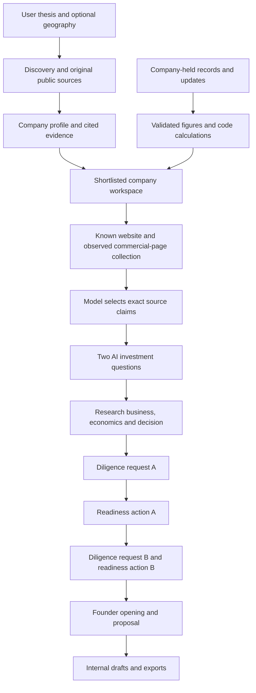

# Session handoff — company preparation MVP

> **FINAL CHECKPOINT — 15 September 2026: [§23, model-authored workflow and freeze](#model-authored-reset). Reliable fresh generation is NOT fixed.** Latest live GoCardless preparation failed in 61.186 seconds/two calls and published zero sections. No complete live v10 pack has been demonstrated. The user asked to stop implementation, thoroughly record the state and push the changes.

> **Read §23 first. Sections 1–22 are a chronological historical record, not current runtime instructions.** Their statements about Paasa/Waybill being complete, v7/v8/v9 being active, service PIDs, remaining untracked files and recommended experiments have been superseded. The user rejected template-assisted company answers and authorized resetting the old companies. Those historical outputs remain evidence, not model-authored successes.

Repository: `/Users/divyangmishra/Desktop/deal_document`. Product contract: [architecture §16.29](deal_automation_architecture.md#1629-mvp-product-contract-and-cleanup-current-priority), with the later model-authorship/reset amendment. No universal accuracy, autonomous investment, or MVP acceptance is claimed. The [v10 evidence index](evals/investment_preparation/section-workflows/v10-model-authored/README.md) and [verification record](evals/investment_preparation/section-workflows/v10-model-authored/verification.json) preserve the final facts.

### Navigation

- [Current state, latest failures, reset and active implementation](#model-authored-reset)
- [Final verification and operational snapshot](#checkpoint-verification)
- [Current next-session prompt](#checkpoint-resume)

The remaining links point into the preserved historical record:

- [Read first and resume checklist](#1-read-this-first)
- [User intent and constraints](#2-what-the-user-wants-and-why-they-are-frustrated)
- [Implemented versus demonstrated](#3-current-result-implemented-versus-demonstrated)
- [Project map and current flow](#4-project-map-and-which-path-is-active)
- [Reliability changes and the calculation gap](#5-implemented-reliability-work-that-should-be-preserved)
- [Services, database, identifiers and API commands](#6-runtime-snapshot-and-operational-commands)
- [Models and reasoning configuration](#7-model-behavior-profiles-and-what-was-not-trained)
- [Evaluation history and corrected diagnoses](#8-evaluation-history-and-how-to-read-the-reports)
- [Tests and reproduction](#9-tests-validation-and-reproduction)
- [Source and compliance boundaries](#10-source-and-compliance-boundaries)
- [Files to preserve and historical traps](#11-repository-preservation-and-historical-document-traps)
- [Proposed next implementation](#12-recommended-next-implementation-sequence--not-yet-implemented)
- [Ready-to-paste next-session prompt](#13-suggested-next-session-prompt)
- [Documentation-only changes](#14-what-this-documentation-turn-changed)

## 1. Read this first

**Historical initial handoff. Current status and instructions are in §23.**

**The product is not MVP-ready.** The UI, persistence, retrieval and retry machinery have improved, but the actual local-model output failed the first-company acceptance milestone. Do not describe functioning endpoints, completed sections, citations or a model review marked `pass` as proof of investor-quality work.

The last work produced a useful, separately authored [Paasa reference pack](evals/investment_preparation/section-workflows/paasa-reference.md) and a [bounded comparison](evals/investment_preparation/section-workflows/paasa-comparison.md). The reference is not an application-generated deliverable, a trained model, a production template, or a successful demonstration of autonomous preparation.

The decisive findings are:

1. The model-based extraction stage can remove the subject and qualifications of a source statement even when given a clean, compact input.
2. The writer then reasons from this weakened evidence, blurs fee plans and invents unsupported conclusions about revenue composition.
3. The writer and reviewer accepted financially invalid comparisons. One request recommended a negative assessment if service fees were much smaller than customers' assets under management.
4. A targeted correction removed that particular comparison, but the section still failed the output contract and retained an inadequate measurement method.
5. This implicates evidence handling, analytical representation and model judgment together. It does **not** prove that every free/local model is incapable, or that buying a stronger model would automatically fix the pipeline.

### First ten minutes of the next session

1. Read this handoff, the reference pack and the comparison. Read §16.29 before changing product scope.
2. Inspect `git status --short`. The workspace is deliberately dirty; several essential runtime files are untracked. Preserve them.
3. Check service health and active jobs with the read-only commands below. PIDs and prior tool session IDs are not durable identifiers.
4. Inspect the two distinct evaluation reports. Do not merge their metrics or confuse the isolated test with the live Paasa workspace.
5. Confirm the user's next requested action. Do not automatically restart benchmarks because an older document says “run this first.”
6. If implementation is requested, begin with evidence preservation and semantic financial-plan validation described in §12 below. Avoid another UI redesign, broad model sweep or prompt-only repair campaign.

## 2. What the user wants, and why they are frustrated

The intended product combines VC/boutique investment-banking preparation with a YC/incubator-style operating model. It should discover companies worth supporting, research them, approach founders, help resolve operating gaps, prepare investment materials and ultimately support fundraising with minimal routine human labor.

The user repeatedly emphasized:

- **AI-first substantive work.** AI should generate company reasoning, proposed engagements, diligence questions and workflows. Code should retrieve, calculate, validate, persist and execute explicitly authorized tool operations.
- **All sectors and regions.** India is an optional pilot, not a restriction. Do not assume every company is software, every metric is ARR, or every source must be YC/Blume.
- **Automatic discovery.** Users should describe their thesis; they should not have to supply company URLs or a local PDF to begin research. Optional advanced URLs and document intake can remain.
- **Useful investor-facing outcomes.** A screen should answer what is known, why it matters, what to do next and what result would change the decision. Generic process lists and “AI analysis prepared” banners are insufficient.
- **Source quality and transparency.** Scraping is acquisition of evidence, not the intelligence itself. Sources, company claims, calculations, hypotheses and unknowns must remain distinguishable.
- **A simple product.** Research, founder approach and readiness should form one company journey. Do not restore separate signals pages, duplicate operation dashboards, verbose technical history as the main experience, or vanity document counts as readiness metrics.
- **No generator branding.** Do not show “Powered by Codex” or “Prepared by Codex” in the main product. Preserve genuine provenance in audit/history; do not erase it or relabel editorial work as unattended model output.
- **Free/local work for now.** No paid inference, source subscription, model download, hosted deployment or weights training was added in the latest work. Existing local-only Phase 0 constraints remain. Paid services require a concrete proposal and explicit authorization; do not infer blanket spend permission from “go ahead.”
- **Stop wasting time on ineffective iterations.** The user was especially frustrated by hours of fixes followed by another vague statement that reasoning was still bad. Updates must report outcomes and evidence, not celebrate incremental machinery as a solved product.

The user’s broad aspiration is extensive automation. The narrower first release contract currently being tested is **discover → shortlist → sourced research memo → founder proposal → diligence/readiness work plan**. Actual outreach, signing, money movement and closing were not authorized or demonstrated. Do not send founders or investors anything during development. Whether the eventual firm also invests its own fund capital remains a separate business decision; do not invent a fund mandate.

## 3. Current result: implemented versus demonstrated

| Area | Current implementation | Practical limit |
| --- | --- | --- |
| Discovery | Natural-language thesis, optional geography, public search and portfolio adapters, per-run results, shortlist/history | Coverage is incomplete and source-biased; this session did not prove representative global discovery |
| Evidence | Source URLs/dates, bounded public-page collection, source selection and literal-span binding | Literal matching does not preserve meaning automatically or verify a claim |
| Company preparation | Nine independently saved sections, linked diligence/readiness work, founder proposal dependency | First-company content acceptance failed |
| Model routing | Local task/complexity routing, optional reasoning, configurable writer/reviewer | Routing weights are heuristics, not trained weights or measured accuracy |
| Reliability | Saved partial results, scoped stop/resume, bounded repairs, stale-state checks | Semantic errors can still receive an automatic review pass |
| Financial figures | Dated company updates, checked extraction, deterministic calculations | Not an accounting integration, audited ledger, universal financial-model engine or complete semantic validator |
| UI/export | Three-step workspace, source details, draft downloads, failed/stale states | A usable UI is not evidence that the analysis is useful |
| Legacy deal documents | Ingestion, field review, research, teaser/CIM/pro-forma and investor records remain | These do not establish company readiness or execute a fundraise |
| Compliance/provenance | Dataset rights metadata, version-bound reviews, authority references and action boundaries | No legal/compliance certification; references and jurisdictional applicability need current verification |
| Model acceptance | Actual failures and independent-from-self-review development audits retained | No model profile promoted; no investor-practitioner acceptance achieved |

### Proposed release gates — not achieved

Architecture §16.29 proposes ten companies across at least three sectors and three regions, traceable material assertions, no invented financials, useful company-specific proposals, nonduplicative evidence requests, at least nine workflows completing without engineering intervention, and practitioner review finding outputs usable with minor edits. Latency must be measured and an acceptable production bound agreed.

The first milestone remains a useful Paasa memo, founder proposal and diligence request **generated through the application**. A manually prepared reference does not meet that milestone. The 20-minute cap in the last experiment was an experiment limit, not a user-approved production service-level target.

## 4. Project map and which path is active

The repository contains several generations of preparation logic. Do not mistake an older route or schema for the current company experience, and do not delete legacy modules just because the latest UI uses a newer one.

| File or group | Responsibility / why to read it |
| --- | --- |
| `deal_automation_architecture.md` | Design history; §16.29 is current product contract, §16.28 describes independent deliverables |
| `CLAUDE.md`, `README.md` | Entry points with historical notes; read their new handoff pointers before older instructions |
| `agents/analyst_pack.py` | **Current protocol v7**: source record, agenda, nine sections, review binding, repairs, persistence/export, preparation source collection |
| `agents/local_models.py` | Local Ollama boundary; `LocalModel`, `AnalystModel`, `PreparationModel`; reasoning and schema handling |
| `agents/model_routing.py` | Default hardware-aware routing from trusted task metadata, input size, retry and quality/latency preferences |
| `agents/inference_queue.py` | FIFO condition-variable queue for individual calls inside one process |
| `agents/web_sources.py` | Public transport/parser, page text and observed links; navigation cleanup |
| `agents/web_discovery.py` | Query planning/search-provider orchestration and bounded automatic discovery |
| `agents/public_directories.py` | Public portfolio/directory discovery, including regional/global source families |
| `agents/company_sourcing.py`, `company_enrichment.py` | Candidate/source processing and bounded company-specific research |
| `agents/research_reasoning.py`, `source_coverage.py`, `geography.py` | Intent/criterion reasoning, structured coverage, geographic handling |
| `agents/datasets.py` | Source registry, access/license metadata, Wikidata connector and dataset ingestion support |
| `agents/operating_workflow.py` | Workspace reconciliation, basis hashes, controls and operating state |
| `agents/operating_research.py`, `business_analysis.py`, `growth_analysis.py` | Supporting research/analysis layers used by existing workflows |
| `agents/company_metrics.py`, `metric_extraction.py` | Company-reported monthly metrics, source validation and code-owned calculations |
| `agents/measurement_plan.py` | Existing symbolic quantity/operation validation; important starting point for the next fix |
| `agents/transaction_workpaper.py` | Source-reviewed financial workpaper and supporting preparation checklist; not current AI authoring engine |
| `agents/company_brief.py`, `investment_case.py`, `preparation_quality.py`, `claim_grounding.py` | Earlier/alternate brief and investment-case pipelines, substantive guards and repairs; still used by legacy/supporting paths |
| `agents/investment_practice.py` | Practitioner methods and teaching context; inference-time guidance, not trained model weights |
| `agents/ingestion_agent.py`, `extraction_agent.py`, `review_checkpoint.py`, `research_agent.py`, `analytics_agent.py`, `compilation_agent.py` | Legacy document ingestion → extraction → review → research → charts/materials |
| `agents/planner_agent.py`, `main.py` | CLI/planner and legacy deal state machine |
| `schemas.py`, `workflow_schemas.py` | Pydantic entities and operating workspace/job state |
| `store.py` | SQLite persistence; tenant-scoped records and optimistic workspace revision checks |
| `api/main.py`, `api/deps.py` | FastAPI app, local CORS, request-scoped Store, tenant/reviewer headers; no production authentication |
| `api/routers/operations.py` | Current and legacy preparation endpoints, metric imports, job lifecycle, exports |
| `api/routers/leads.py` | Sourcing/search endpoints and run snapshots |
| `frontend/src/components/PreparationWorkspace.tsx` | **Current three-step company workspace**, protocol version 7 |
| `frontend/src/pages/Dashboard.tsx`, `Operations.tsx`, `OperationsRecords.tsx` | Company queue, selected workspace routing, supporting records/history |
| `frontend/src/components/WebSourcing.tsx`, `SourceCoverage.tsx`, `ResearchReasoning.tsx` | Discovery inputs/results, coverage and criterion explanations |
| `frontend/src/components/CompanyMetrics.tsx` | Company update/metric intake and calculations UI |
| `frontend/src/pages/deal/*`, `InvestmentCase.tsx` | Legacy deal/document and investment-case views; retained |
| `scripts/serve_local.py` | Stable local API launcher; no auto reload |
| `scripts/check_operations_ui.cjs` | Current isolated browser journey check; mocks APIs and never invokes a model |
| `scripts/evaluate_analyst_workflows.py` | Reusable complete-workflow evaluation runner with optional caps |
| `tests/test_analyst_pack.py`, `test_local_models.py`, `test_reasoning_evaluation.py` | Core generation/review/caching/routing/evaluation regression coverage |

### Current data flow



This is the authoring order, not a claim that all downstream work succeeds. A blocked dependent section can be skipped while other independent sections continue. Each section is validated/reviewed and saved separately. Source retrieval occurs in code; company interpretation and proposed work are model-authored. Actual financial analysis awaits suitable company records.

### Nine v7 sections

| Key | Purpose | Dependency detail |
| --- | --- | --- |
| `research.business` | Offering, customer and problem | Selected source evidence |
| `research.economics` | Payer, charge basis and unknown retained economics | Selected pricing/business evidence |
| `research.decision` | Conditional reason to engage, risk, next decision | Evidence and relevant prior research |
| `diligence.request_a` | First specific founder question and records | First persisted agenda question |
| `readiness.action_a` | Analysis, output and decision from those records | Completed request A |
| `diligence.request_b` | A distinct question and records | Second agenda dimension and first request context |
| `readiness.action_b` | Corresponding distinct analysis | Completed request B |
| `founder.observation` | Source-attributed commercial opening and question | Relevant company evidence |
| `founder.proposal` | Offer concrete assistance and invite discussion | Actual completed first request/action, not a generic template |

The visible journey is **Research → Pitch founders → Investment readiness**. Diligence and its proposed action are paired in readiness. The generation order intentionally differs from the visible tab order so the founder offer can use an actual proposed analysis.

## 5. Implemented reliability work that should be preserved

### Evidence and collection

- `raw_sources` uses bounded source selection: up to 24 evidence entries, at most eight per URL, with navigation-heavy and unsuitable fields filtered.
- `source_passages` retains neighboring context in bounded passages rather than splitting every sentence. Extraction batches contain four passages and can produce up to six literal claims.
- `bind_source_claims` checks contiguous exact text in supplied passages, attaches IDs/URLs/dates in code and retains individually valid claims when another claim in the batch fails.
- This guarantees textual binding only. A literal fragment such as “Its percentage charge…” can still lose its subject; source classification is model-selected and is not independent verification.
- `PageParser` now excludes navigation/menu labels and repeated document titles from body evidence, retains observed links, gives body links priority, and retains substantive footer/service-entity disclosures. Not every login/button string is eliminated.
- `collect_preparation_evidence` reads the known website and an observed same-domain pricing/fee/plan link, bounded to two pages. It retains opening content and closing service terms under a page/block budget. It does not invent URLs or provide exhaustive research.
- A successful refresh replaces only previous `origin=preparation_public_page` snapshots for that successfully fetched URL/redirect alias. Retired records remain in `research.preparation_source_history`; failed-page evidence and other-origin evidence are preserved.
- Preparation-source cache version is still 1. The live Paasa run used cached evidence; the later parser improvements were not proof that that run had cleaner freshly collected inputs.

### Planning and dependencies

- A persisted AI agenda selects two questions in distinct dimensions. Revenue, costs and margins all belong to `unit_economics`, preventing artificial duplicate questions.
- Each diligence question is schema-bound to its selected agenda question.
- Agenda cache validity includes instruction and schema. Unsupported numerical assertions are checked against selected facts.
- An unreviewed planner rationale formerly propagated invented premises into later sections. `why_it_matters` was removed from the agenda model; downstream context is projected through the typed question model.
- Relevant previous sections and evidence are supplied with bounded context. Dependency changes affect downstream input hashes.

### Validation, review and repair

- `validate_section` checks selected references, numerical support, roles, specific semantic pitfalls and output contracts. It is not a universal financial or factual verifier.
- Review objections select actual draft passage IDs and supporting evidence/task IDs. Code binds them to text rather than trusting invented quotations.
- `repairable_fields` targets defective fields; a bad field should not require replacing the whole pack.
- Production has separate bounded schema/validation, review-binding and content-revision handling, within at most four section attempts. The evaluator's stricter optional correction cap is separate.
- Citation-only trailing lists in recognized formats can be normalized without another model call. Unknown IDs or additional prose prevent cleanup. Raw final responses are retained for audit. The current marker parser recognizes forms such as `Sources:`/`References:`/`fact_ids:`; the last correction's `Supported by facts:` was not accepted.
- Proposed lookback/cohort windows and consecutive parenthesized list labels are distinguished from company-reported numerical claims. Unsupported performance metrics remain rejected.
- Current schema validation runs again on publication/export. AI review reuse is fingerprinted from the critic's real contract/configuration rather than every unrelated pipeline edit. Writer instructions/schema and dependency inputs have their own hashes.
- A section status of `complete` means it passed those implemented checks. The development audit demonstrated that this is not sufficient to establish usability.

### Jobs, state and UI

- Preparation persists sections and failures independently. Resume reuses current sections; stop is scoped to tenant, workspace and job ID.
- A cancelled or replaced job must not overwrite a newer job. An in-flight inference may take time to finish after logical cancellation.
- `_queue_prepare` already preserves the selected writer/reviewer/reasoning profile on a plain resume. An earlier suspicion that resume silently switched models was incorrect; the redundant patch was removed and regression coverage added.
- Complete draft status and partial source coverage are distinct. Omitted excerpts remain a visible limitation; they do not automatically fail all otherwise completed drafts.
- Main UI preserves deep links and collapses evidence/history, hides rejected candidate prose, provides current draft exports and shows partial/stale states.
- No “Codex” branding appeared in the live three-step browser check. Editorial history remains in old records; do not delete it.

### Existing arithmetic support and its exact gap

`company_metrics.metrics_report` calculates supported delivery contribution, contribution margin, cash coverage, average completed order value and consecutive-month revenue change. Inputs are dated, historical company-reported figures with currency and source notes. Missing values remain unknown; zero denominators and incompatible periods are handled. These are not audited company accounts.

`transaction_workpaper.py` has calculations based on reviewed document fields, including cash/burn coverage and suitable ARR comparisons. It explicitly warns that ARR is not appropriate to every business.

`measurement_plan.py` already provides `QuantityRecord` and `MeasurementPlan` with dimensions, units, a record name, an operation and a population/window description. It is used by the older `investment_case.py` commercial-test path. **Current v7 `Action` and `Request` still describe their analytical method as free text and do not require this typed plan.**

The existing dimension validator is insufficient even if connected unchanged: fees and AUM can both be `money` in the same currency, so comparing them passes a basic unit check. The next design needs economic roles, entity scope, time basis, stock versus flow, gross/net treatment, denominator and calculation purpose in addition to physical units. Do not recreate a second basic units module and call the problem solved.

## 6. Runtime snapshot and operational commands

### Verified local state

| Component | Verified state at handoff |
| --- | --- |
| FastAPI | `http://127.0.0.1:8000`, PID 52213, `scripts/serve_local.py`, health OK |
| Vite | `http://localhost:5173`, PID 48210, health through `/api` proxy OK |
| Ollama | `127.0.0.1:11434`, PID 28520, version 0.33.3 |
| Loaded model | `qwen3.5:9b`, context 8192, reported VRAM use 5,636,976,802 bytes |
| Model digest | `6488c96fa5faab64bb65cbd30d4289e20e6130ef535a93ef9a49f42eda893ea7` |
| Model quantization | Q4_K_M; reported parameter size 9.7B |
| Machine/runtime | macOS, Python 3.9, 16 GB unified memory; local acceleration was observed, so old “CPU-only” prose is not a reliable runtime description |
| Active workspaces/searches | None in `queued` or `running`, checked across stored rows, not only the selected company |
| Evaluation processes | None running; both latest evaluations are finished/stopped |
| Restart needed now | No. Latest bounded test changed the evaluator/docs/tests, not production runtime code |

Recheck these facts in a new session. Do not kill processes by stale PID or reuse an old tool session ID. The API is deliberately not auto-reloading. An earlier reload interrupted availability while background work was running.

Read-only health commands:

```sh
curl --fail --max-time 5 http://127.0.0.1:8000/api/health
curl --fail --max-time 5 http://localhost:5173/api/health
curl --fail --max-time 5 http://127.0.0.1:11434/api/version
lsof -nP -iTCP:8000 -iTCP:5173 -iTCP:11434 -sTCP:LISTEN
```

Start only missing services, each in its own managed terminal/process:

```sh
# Repository root; stable single API process, no --reload.
PYTHONDONTWRITEBYTECODE=1 python3 scripts/serve_local.py

# Separate terminal, working directory frontend/.
npm run dev
```

Use the existing Ollama installation. Do not automatically run `ollama pull`, launch a second server or change model defaults. After a future backend edit, check active jobs before deliberately restarting the owned API process. Startup text in `api/main.py` still mentions `--reload`; the stable launcher is the current instruction.

### Database and exact Paasa identifiers

- Main database: `deal_automation.db` at repository root. SQLite WAL/SHM companions may exist and are not redundant artifacts.
- Default tenant: `default_tenant`. API uses `X-Tenant-Id`; local default is that tenant. These headers are not real authentication.
- Paasa lead: `lead_ce5b47811d74`.
- Paasa workspace: `workspace_c63410428a00`.
- Last checked revision: **1092**; never hardcode it into a future mutation.
- Last checked basis hash: `0ed5a78474261cfbced4f1e4befb6972e3dba838a335b3980eff0a1b727a36b6`.
- Last live job: `automation_9c71ece30a88`, status `failed`, phase `Generation needs attention`.
- Started `2026-09-14T19:06:38.691931+00:00`; completed `2026-09-14T19:37:19.091662+00:00`.
- UI: `http://localhost:5173/operations?lead=lead_ce5b47811d74&tab=readiness`.
- Live pack: seven sections `complete`; `diligence.request_b=needs_revision`; `readiness.action_b=blocked`.
- **The independent development audit is in the report, not applied as replacement model reviews to the live DB.** Known weak sections can still have `complete`/`pass` in the application. Do not mistake them for audited approvals.

`Store.get_workspace` takes `(tenant_id, workspace_id=...)` or `(tenant_id, lead_id=...)`. `workspace.automation` is a Pydantic object; `workspace.analyst_pack` is a dictionary. Writes use current `expected_revision`. Preserve original evidence, attempts, reviews, events and user data.

Read-only state inspection:

```sh
PYTHONDONTWRITEBYTECODE=1 python3 - <<'PY'
import json
from store import Store
with Store() as s:
    w = s.get_workspace('default_tenant', workspace_id='workspace_c63410428a00')
    print(w.automation.model_dump())
    print({k: v['status'] for k, v in w.analyst_pack['sections'].items()})
    for table in ('operating_workspaces', 'web_sourcing_runs'):
        active = []
        for row in s.conn.execute('SELECT data FROM ' + table):
            item = json.loads(row[0])
            job = item.get('automation') if table == 'operating_workspaces' else item
            if job and job.get('status') in ('running', 'queued'):
                active.append((item.get('id'), item.get('tenant_id'), job.get('status')))
        print(table, active)
PY
```

Other historical user links include Waybill lead `lead_77e309f71b18`, lead `lead_3537892cbb1a`, and deal `deal_b125df996901`. Do not assume a company name for an unchecked identifier. The user mentioned `/Users/divyangmishra/Downloads/company-brief.md`; do not overwrite that downloaded document. Earlier demonstration/test companies remain in the live data and must not be silently purged as code cleanup.

### API map

| Endpoint | Purpose / caution |
| --- | --- |
| `GET /api/health` | Health only; does not prove model/content quality |
| `POST /api/leads/web-runs` | Start discovery from thesis, optional geography and optional seed URLs |
| `GET /api/leads/web-runs/{id}` | Search progress and coverage |
| `GET /api/leads/web-runs/{id}/leads` | That run's lead snapshots, not a global historical list |
| `POST /api/leads/web-runs/{id}/cancel` | Cancel discovery |
| `GET /api/operations/workspaces` | Workspaces; supports summary/lead filtering |
| `POST /api/operations/leads/{lead}/preparation-jobs` | **Current v7 authoring job**; query options include model, thinking, review_model, review_thinking, refresh |
| `POST /api/operations/workspaces/{workspace}/preparation-jobs/{job}/stop` | Scoped current preparation stop |
| `GET /api/operations/workspaces/{workspace}/preparation-pack?document=research` | Markdown export; document may also be founder, diligence or readiness |
| `POST /api/operations/workspaces/{workspace}/metric-imports` | AI-assisted company update intake; mutates records and may regenerate work |
| `POST /api/operations/workspaces/{workspace}/metrics` | Structured/manual metric fallback |
| `GET /api/operations/workspaces/{workspace}/metrics` | Metric export |
| `.../brief-jobs`, `.../readiness-jobs`, `.../prepare-jobs` | Earlier preparation paths; not synonyms for v7 `preparation-jobs` |
| `/deals/:id/review`, `/documents`, `/investors` | Legacy frontend deal record views; preserve |

An explicit reviewer override on the v7 endpoint requires an explicit installed writer model. Plain resume preserves a saved explicit profile. Up to three company jobs may be queued per tenant/current worker. A complete pack can be returned without re-generation; `refresh=true` is a source refresh/mutation, not a read-only check. Avoid starting jobs merely to inspect the UI.

The inference queue is in-process. Separate API/evaluation processes do not share this Python lock and can contend at Ollama. Run one evaluation at a time, check live jobs first, and keep one API worker. Persisted job state is not a durable distributed worker/resume system.

## 7. Model behavior, profiles and what was not trained

Two different routing mechanisms exist:

1. **`PreparationModel` / `RoutingPolicy`:** the default resource-aware router. On this 16 GB machine, code defaults are `phi4-mini` for fast work and `qwen3:8b` for reasoning/review, with no default 14B escalation. Environment overrides can change this; inspect the actual saved route, not a historical documentation table. The dataclass's nominal 14B fields are not the effective under-24-GB environment defaults.
2. **`AnalystModel`:** an explicit installed writer/reviewer profile used for the recent Paasa runs. It routes complex initial sections, agenda and repairs to reasoning without continually swapping model sizes. A saved explicit profile can survive a plain resume independently of global defaults.

The explicit Qwen3.5:9b profile uses 1,024 reasoning tokens when enabled, a total response budget of at least 4,096 for those calls, and 1,800 for fast calls. The recent tests used 8,192 context tokens. Complex sections are currently detected by schema fields such as `reason_to_engage`, `required_input` and `proposed_work`; this is a heuristic, not a learned task-difficulty model. Reviewer thinking is independently configurable.

`LocalModel` calls loopback Ollama only. For thinking calls, it requests an unconstrained final JSON contract, then validates it; grammar-constrained decoding can suppress thinking in some runtime paths. If the bounded thinking phase exhausts its budget, the adapter can continue the final answer with a request-local assistant prefill. Hidden reasoning stays in request memory and is not persisted as business evidence. The adapter checks whether thinking was actually returned and records finish reason, queue time, elapsed time and token counts. Do not describe a requested thinking flag alone as verified reasoning behavior.

Qwen3.5 sampling currently differs between fast and thinking calls: temperatures 0.7 and 1.0 respectively, with family-specific sampling settings. Reports capture these settings. Temperature zero elsewhere is not a truthfulness guarantee. Model “weights” requested by the user were implemented as routing preferences; no neural weights were modified.

No profile qualified for promotion. No paid inference, automatic model download, fine-tuning or distillation happened in the latest work. `evals/investment_preparation/training-seed/` and `scripts/export_preparation_training.py` are historical seed/export infrastructure; their presence is not proof of trained weights or an investor-quality training set. Do not start training from weak self-generated outputs or treat synthetic narrow probes as product acceptance.

## 8. Evaluation history and how to read the reports

### A. Earlier approaches — why not repeat them blindly

Historical documents and reports include small-model probes, larger-model trials and several generations of brief/work-product schemas. The broad observed progression was:

- Narrow JSON/field probes sometimes passed while real-company reasoning failed.
- Larger local models and reasoning modes did not automatically yield useful financial analysis.
- Models invented numerical cutoffs, fees, benefits or causal claims; some guards caught these while reviewers missed others.
- Large response schemas caused length/format failures. Smaller sections and independent persistence improved reliability but did not establish content quality.
- Unreviewed planner rationale introduced invented premises that spread downstream. Removing that rationale from the evidence path addressed one contamination route.
- Reviewers sometimes supplied unsupported objections or even an “objection” whose explanation said the passage was legitimate, consuming time and causing unnecessary rewrites.
- Repeated character/citation/number repair rules did not solve substantive financial reasoning.

The raw historical details are preserved in evaluation artifacts. They are debugging evidence, not a benchmark leaderboard. The user explicitly approved stopping broad development in favor of one reference pack and one bounded comparison. Do not restart all old model probes or resume every old job.

### B. Last full live Paasa run

Report: [acceptance-latest.json](evals/investment_preparation/section-workflows/acceptance-latest.json).

This report corresponds to the live workspace/job in §6. Writer and reviewer were Qwen3.5:9b; complex writing and review used bounded reasoning. It reused existing cached evidence and saved work where eligible. It is not a fresh isolated run from zero.

| Measure | Value / interpretation |
| --- | --- |
| Job duration | 1,840.4 seconds, 30.7 minutes |
| Calls during this job | 21 |
| Correction calls during this job | 4 |
| Inference seconds during this job | 1,826.7 |
| Generated sections complete | 7 of 9 |
| Development-audited usable with minor edits | 2 of 9 |
| Outcome | Failed first-company milestone; no promotion |
| Failed/blocked path | Request B needed revision; action B blocked |

**Metric trap:** `metrics.model_calls=74`, `correction_attempts=18` and `inference_seconds=4830.56` are cumulative retained attempts from multiple prior runs. Use `current_run_*` for this job. Do not report 74 calls as the cost of this single 30.7-minute run. Null independent factual-error/actionability fields are unscored fields, not zero errors.

The audit's two usable sections were the business paragraph and founder proposal, with minor-edit qualifications. The other completed sections still had material issues. Its identified problems included:

- Unclear revenue collection, billing and retained-income relationships.
- Incoherent claims about currency depreciation and customer behavior.
- Specific partner names/payment arrangements not supported by the selected citations.
- A diligence decision that mixed collected fees with expenses in its proposed comparison.
- A founder question that largely repeated the already stated charging mechanism.
- Request B using AUM thresholds missing from its selected citations; its attempted repair retained the problem.

### C. Frozen reference comparison — latest experiment

Read these together:

- [Reference pack](evals/investment_preparation/section-workflows/paasa-reference.md): separately authored target output.
- [Frozen input](evals/investment_preparation/section-workflows/paasa-reference-input.json): five compact **source-checked paraphrases**, not verbatim website excerpts or verified financial records.
- [Comparison](evals/investment_preparation/section-workflows/paasa-comparison.md): readable findings and decision.
- [Actual result](evals/investment_preparation/section-workflows/paasa_reference_test.json): original attempts, evidence selection, reviews, metrics, external correction and audit.

The reference covers business/economics, a conditional reason to engage, a proposed founder email, retained-income/cost reconciliation, and funded-customer/cohort analysis. Proposed periods are requested scope, not historical performance claims. It was not passed to inference: the runner records its SHA-256 only.

The test used the existing production authoring function in a **temporary isolated Store**, not the live Paasa DB. It used the same Qwen3.5:9b writer with task-specific reasoning, but **fast reviewer mode**, unlike the earlier live run's reasoning reviewer. Therefore it is a capability comparison against a reference, not an A/B test attributing improvement or regression to one variable. The curated packet also does not validate automatic discovery/collection.

Predeclared limits: one correction per stage, at most 24 actual model invocations and 1,200 seconds total. The unmodified production validation/review logic remained in use; the evaluation wrapper imposed additional caps. The workflow was stopped once a material error had passed review and propagated, because it could no longer meet the acceptance criterion. No remaining-company sweep followed.

| Measure | Value / interpretation |
| --- | --- |
| Initial pipeline elapsed | 354.81 seconds |
| Initial model invocations | 15, including one interrupted task |
| Generated sections before stopping | Business, economics, decision, request A, action A |
| Unassessed later sections | Request B, action B, founder opening, founder proposal |
| Targeted external correction | One field repair; 61.57 seconds |
| Total elapsed including intervention/correction | 472.34 seconds, 7.9 minutes |
| Total model invocations | 16 |
| Final audit | Failed; no model promotion, no live-data update |

“Model invocation” here is the logical adapter task. A bounded reasoning task can involve two Ollama chat requests for thinking and answer continuation; do not equate this count with raw HTTP requests or billed cloud calls.

#### Exact failure chain

1. The input described Access and Apex separately and included the Apex no-brokerage-markup qualification.
2. Extraction selected an `Its percentage charge...` fragment without the Apex subject and omitted the qualification.
3. Economics blurred plan applicability. The investment argument called asset-based fees the **primary** revenue source without an actual revenue composition record.
4. Request A said: **“A finding that fees collected are significantly below AUM ... would warrant a negative recommendation.”** Fees and customer assets are different economic quantities. This finding is expected under a percentage fee schedule and is not a sound adverse test.
5. The reviewer returned `pass`.
6. Action A compared collected amounts with stated tariff rates and pass-through charges with trading volume without defining valid calculations. It also proposed blanket rejection when any segment's expenses exceeded fee revenue.
7. That action also received `pass`.

#### The one external correction

The pipeline process was deliberately interrupted after the failure. The saved report therefore contains `error: "Interrupted"` plus an explicit `stopped_reason`; this was not an unexplained service crash.

The external correction targeted only request A's `decision` field. It used the production `Request` field schema, selected source facts, existing writer profile and `attempt=1` reasoning path. Feedback explained the wrong fee/AUM comparator and requested a decision based on retained revenue and matched service costs. It did **not** provide the reference answer.

The model removed the direct fee/AUM comparison but retained an unspecified expected-revenue baseline and added a `Supported by facts: ...` suffix with internal IDs. The unchanged production validator rejected this. The standard citation normalizer was also rechecked and did not accept that suffix. The original broader record request still asked a billing ledger for expense allocations and a precomputed cost-to-income ratio, so fixing one sentence would not have made the entire request useful.

The report's `external_correction` retains original content, feedback, raw response, routing and content-audit notes separately from the original pack. This is not a second successful application run and it was not installed into the live workspace. The reproduction command below repeats the ordinary capped workflow; it does **not** automatically inject this external development feedback.

### Corrections to earlier diagnoses — do not repeat these mistakes

- The approximately 2–5% currency-depreciation range in the earlier Paasa material **was present in the captured company profile**. It was incorrectly called invented in an intermediate update and that statement was corrected. The real concern was treating a source-reported generalization as an observed historical condition and inferring churn causation from account data.
- Resume **already preserved** the saved explicit model profile. A suspicion that it switched models was withdrawn after inspection. Do not “fix” it again without a new failing test.
- “Only model reasoning remains” was too narrow. The reference comparison showed lossy evidence selection and inadequate analytical representation as well as weak generation/review.
- Neither a failed 9B profile nor this single-company curated test establishes that all free models are incapable.
- The reference pack is not proof that the product can create it. Editorial or coding-session work must not be presented as unattended output.

## 9. Tests, validation and reproduction

### What was actually checked

The preceding implementation pass reported **269 passing focused regression tests**, plus frontend build/lint and the browser journey checks. The subsequent evaluator-budget change ran **12 tests in `test_reasoning_evaluation.py`**, all passing. This subset overlaps the earlier suite; do not add 269 and 12 and claim 281 distinct tests. The full combined suite was not rerun after the evaluator-only addition.

The full focused command used in the implementation pass was:

```sh
PYTHONDONTWRITEBYTECODE=1 python3 -m pytest \
  tests/test_analyst_pack.py tests/test_global_portfolios.py tests/test_inference_queue.py \
  tests/test_claim_grounding.py tests/test_model_routing.py tests/test_local_models.py \
  tests/test_preparation_quality.py tests/test_investment_case.py tests/test_company_brief.py \
  tests/test_business_analysis.py tests/test_metric_extraction.py tests/test_operating_workflow.py \
  tests/test_research_reasoning.py tests/test_web_sourcing.py tests/test_company_enrichment.py \
  tests/test_web_discovery.py tests/test_source_diversity.py tests/test_reasoning_evaluation.py \
  tests/test_company_metrics.py -q --disable-warnings
```

The latest narrow check:

```sh
PYTHONDONTWRITEBYTECODE=1 python3 -m pytest tests/test_reasoning_evaluation.py -q --disable-warnings
```

Important covered behavior includes source/citation binding, partial claim retention, source refresh history, agenda/dependency caching, field repairs, separate retry budgets, review passage binding, proposed measurement-window handling, preserved model profile, reasoning routing, stale/partial outputs, and evaluator correction/call caps. These are machinery tests; they do not certify content usefulness.

Frontend checks, working directory `frontend/`:

```sh
npm run build
npm run lint
```

Browser journey, from repository root with Playwright installed:

```sh
node scripts/check_operations_ui.cjs
```

An already installed fallback module was used previously:

```sh
DISCOVERY_PLAYWRIGHT_MODULE='/private/tmp/claude-501/-Users-divyangmishra-Desktop-deal-document/a220be07-3472-49e4-8528-ad207cb0bfd6/scratchpad/playwright_check/node_modules/playwright' \
node scripts/check_operations_ui.cjs
```

The `/private/tmp` path is ephemeral; verify it instead of installing dependencies automatically. This script mocks API responses, checks three-step navigation, stop/resume, partial/stale sections, source links, paired request/action rendering, export links and mobile overflow. It never calls a model or mutates live companies.

A separate read-only live browser check visited Paasa research/founder/readiness pages: no page errors, no generator branding, no horizontal overflow at the checked desktop size, and rejected request text hidden. The live Markdown export returned saved readiness content. These checks proved delivery, not financial reasoning. An inspection image existed at `/private/tmp/preparation-live.png`; it is temporary, not a release artifact.

Known test environment warning: Python 3.9's LibreSSL build produces urllib3's `NotOpenSSLWarning`. It was a warning in the observed runs, not the reason the content tests failed. Do not turn this documentation task into an unrelated environment migration.

### Reproduce a bounded workflow only when intentionally requested

Read the report first; do not rerun just to reconstruct its contents. This command starts inference and overwrites the same case-named output in its chosen output directory. Use a fresh temporary output directory if the goal is an intentional new comparison, and do not overwrite the retained audited report.

```sh
PYTHONDONTWRITEBYTECODE=1 python3 scripts/evaluate_analyst_workflows.py \
  --cases evals/investment_preparation/section-workflows/paasa-reference-input.json \
  --output /private/tmp/paasa-next-deliberate-evaluation \
  --model qwen3.5:9b --review-model qwen3.5:9b --no-review-thinking \
  --context 8192 --tokens 1800 \
  --max-corrections 1 --max-calls 24 --max-seconds 1200 \
  --reference evals/investment_preparation/section-workflows/paasa-reference.md
```

The runner uses a temporary DB and never modifies live leads. Its `EvaluationBudget` wraps the existing model boundary, records actual invoked calls separately from denied corrections, and leaves production prompts/answers unchanged. The wall-clock cap uses POSIX signals, fitting this macOS command-line environment; do not assume the runner works unchanged inside a background thread or on Windows.

Input/reference hashes and model/configuration metadata are retained. Sampling is not deterministic; reproducible inputs and an inspectable procedure do not mean identical model text on every run. Case selection/promotion requires complete and separately audited work across the requested case set. No current report qualifies.

## 10. Source and compliance boundaries

Public web discovery already has more than YC. Existing adapters include YC, Blume, Villgro and portfolio families such as Antler, SOSV and Seedcamp, plus search/enrichment for other sources. This does not establish equal coverage by sector/region. DuckDuckGo HTML can return challenges/202 responses; Mwmbl coverage can be sparse. Source fallback should remain explicit. A publisher count is not a completeness score.

Dataful entries in `agents/datasets.py` remain **metadata-only** unless permitted download access is configured. The company-register and aggregate-count sources have different granularity. A public preview is not a complete database; aggregate startup counts are not company revenue or traction. The open Wikidata identity connector is community-maintained and biased toward notable companies; it is not an authoritative startup census. The code contains bounded geography/industry mappings, not universal dataset support.

The prior ITC problem involved unsuitable historical/current-search presentation and an inappropriate notable-company corpus for startup requests. Do not seed company names as a fix. Current per-run result snapshots and startup-directory filtering address parts of this; broad relevance and coverage still need independent evaluation after the preparation milestone.

Public PDFs can be collected in bounded form; inaccessible/scanned/login-protected content remains a limitation. Do not require manual local PDFs as the discovery default or bypass source restrictions to improve apparent coverage.

Company operating claims and registry/partner statements require attribution. Marketing testimonials, funding announcements and directory membership are not proof of rapid operating growth. A source's statement of registration is not a verified compliance conclusion. Company-held statements, invoices, contracts and cohort records are needed for financial diligence; absent public metrics must remain unknown.

Primary references used for the latest reference/comparison:

- [Paasa website and entity disclosures](https://paasa.com/)
- [Paasa pricing](https://paasa.com/pricing)
- [Paasa company profile](https://www.ycombinator.com/companies/paasa)
- [Bessemer: fintech contribution profit](https://www.bvp.com/atlas/fintech-entrepreneurs-guide-to-creating-enterprise-value-starts-with-contribution-profit)
- [YC: seed fundraising guide](https://www.ycombinator.com/blog/how-to-raise-a-seed-round)

These were checked during the preceding work. Financial-method references explain process, not Paasa's actual results. Earlier architecture/practice files contain additional IB/incubator/legal sources and dates. Verify current primary authorities before adding legal conclusions; do not copy old compliance statements into a new jurisdiction without checking applicability.

## 11. Repository preservation and historical-document traps

No commit, reset, rebase or destructive cleanup was performed as part of the last bounded comparison. Earlier cleanup removed 34 redundant newly created artifacts, approximately 2.71 MiB according to the session record. Runtime files, regression tests, user documents, the live database and historical provenance were preserved. Some older evaluation files elsewhere in the repository remain; do not infer that every historical artifact was reviewed for deletion.

**Essential untracked paths at handoff:**

```text
agents/analyst_pack.py
frontend/src/components/PreparationWorkspace.tsx
scripts/evaluate_analyst_workflows.py
tests/test_analyst_pack.py
tests/test_reasoning_evaluation.py
evals/investment_preparation/section-workflows/
```

Untracked does not mean disposable. In particular, `git clean -fd` would delete current runtime and evaluation work. The new handoff/pointer files created by this documentation turn will also be untracked until deliberately committed.

**Tracked modified files observed before documentation additions:**

```text
CLAUDE.md
agents/claim_grounding.py
agents/investment_case.py
agents/local_models.py
agents/model_routing.py
agents/web_sources.py
api/routers/operations.py
deal_automation_architecture.md
evals/investment_preparation/discovery-and-preparation-repair.md
frontend/src/components/InvestmentCase.tsx
frontend/src/pages/Dashboard.tsx
frontend/src/pages/Operations.tsx
frontend/src/pages/OperationsRecords.tsx
scripts/check_investment_case_ui.cjs
scripts/check_operations_ui.cjs
scripts/evaluate_reasoning_route.py
tests/test_local_models.py
tests/test_model_routing.py
tests/test_web_sourcing.py
workflow_schemas.py
```

This includes accumulated user/session work, not solely the last experiment. Inspect the actual diff before editing or committing. Do not claim every file in this list was newly authored in the most recent turn.

Preserve the section-workflow evidence set:

- `README.md` and `audit-rubric.md`: procedure, limits and content criteria.
- `live-workflow-cases.json`: Notpla/UK/materials and SunCulture/Kenya/solar-irrigation plus Paasa-related evaluation inputs; inspect contents rather than assuming it is all freshly collected or a held-out set.
- `paasa-v6-live.json`, `paasa-v6-audit.json`: retained earlier baseline.
- `acceptance-latest.json`: last full live v7 run, separate audit and cumulative attempts.
- `paasa-reference.md`, `paasa-reference-input.json`: reference answer and frozen curated input.
- `paasa_reference_test.json`, `paasa-comparison.md`: bounded experiment and interpretation.

**Historical statements that are superseded or need qualification:**

- “CPU-only” does not describe the observed local acceleration; “no dedicated GPU” and unified-memory acceleration can coexist.
- “No web UI” and “no automated test suite” are stale historical notes.
- An older India default is not the current product scope; geography is configurable and the latest Discover design defaults worldwide.
- Earlier four/five-tab operation layouts are superseded by the three-step company workspace.
- `--reload` launch instructions are superseded by the stable launcher during jobs.
- “Run the benchmark first” is superseded by the user's latest decision to use bounded, hypothesis-driven evaluation.
- Some older documents discuss three work products or a whole-plan schema; current v7 authoring has nine sections.
- The old Waybill editorial rewrite and a user's downloaded brief are historical data, not proof of unattended model quality.
- Generic “mandatory human per-field driving” in older descriptions should not override the user's newer aim of minimal intervention for routine work. External authorization, financial correctness and evidence-based release controls are still real requirements.

## 12. Recommended next implementation sequence — not yet implemented

This section records the concrete implications of the failed comparison. It is a proposed next task, not a claim that these changes already exist or a reason to start another run during a documentation-only request.

### Step 1: preserve complete evidence through selection

Inspect `source_passages`, `bind_source_claims`, `section_facts` and the actual `evidence_record` reaching each writer. Use the preserved input and selected output to reproduce the missing Apex subject/qualification without a live model call.

Prefer AI selection of stable statement/span identifiers with code-owned text and enclosing context. Preserve the original source statement plus any necessary qualification, related plan/product and named subject. Keep classification and model interpretation separate from the evidence text. A source quote should not become more authoritative because the model assigned a category to it.

Required behavior to demonstrate:

- Access and Apex charges stay attached to their respective plans.
- A selected percentage-fee sentence cannot silently lose the plan it applies to.
- The no-markup qualification and separate-brokerage qualification remain available where needed.
- Statements about a partner do not grant that partner's registrations, revenues or obligations to the investment target.
- Source absence in a bounded packet is not represented as absence of public disclosure or business activity.
- Updated evidence properly invalidates only affected downstream work; old evidence remains historical.

Do not solve this by putting Paasa-specific answers into runtime code or always retaining one hardcoded fee paragraph. Generalize the representation and use Paasa only as a regression case.

### Step 2: validate the meaning of financial calculation plans

Inspect and extend/reuse the existing `measurement_plan.py`, `company_metrics.py` and their callers instead of adding a parallel simplistic validator. Connect the chosen representation to the current v7 readiness/request path; leaving it only in legacy `investment_case.py` will not protect the active product.

The AI should propose the question, relevant records and analysis. Code should validate a structured plan before prose can claim the analysis is executable. At minimum, identify:

- The economic quantity: customer assets, billed fees, collected cash, recognized revenue, partner charge, variable service cost, fixed expense, count or rate.
- Entity and service/plan scope, including the investment target versus partners.
- Flow period versus point-in-time stock, currency/unit, comparable population and measurement window.
- Gross/net revenue treatment and whether a partner charge was already deducted.
- Numerator, denominator, operation, expected output type and any contract-derived rate basis.
- Actual input records required, missing-input behavior and whether the proposed decision follows from that calculation.

Useful regression failures include fees compared with AUM as an adverse result, currency amounts compared directly with percentage tariffs, repeated deduction of partner charges from already-net revenue, revenue treated as profit, AUM/GMV treated as revenue, cohort comparisons with unequal exposure windows, and unsupported causal explanations for churn.

Do not blanket-ban every fee/AUM ratio: a correctly defined effective fee yield may be meaningful with aligned balance/time/currency/contract definitions. Likewise, identical units are necessary for some operations but insufficient to justify an investment decision. Model-generated negative recommendations must not bypass this semantic distinction.

When needed records do not exist in the input, the product should return an executable request/plan and an explicit unresolved decision, not fabricated results or an unconditional rejection.

### Step 3: one focused re-evaluation after meaningful changes

Before inference, show deterministic tests that the exact preserved failures are prevented by the new interfaces. Keep the original failed reports; do not overwrite them with repaired evidence and call the past run successful.

Then choose one fixed evaluation question, profile, budget and acceptance contract. Keep the reference outside model inputs. Document whether evidence is curated or automatically collected, whether models/prompts changed, and which previous outputs were reused. Judge actual final content independently of the model's own review.

If the first company passes, evaluate unrelated sectors/regions such as Notpla and SunCulture. Because these cases and the Paasa reference are already known in development, a real release evaluation will also need previously unseen cases and practitioner assessment. Do not claim a held-out benchmark from heavily tuned examples.

If it fails again, make an explicit product/inference decision: narrower reviewed preparation, a stronger-inference evaluation, or further work on a demonstrated interface failure. Paid/hosted inference needs a concrete access/cost/privacy decision; do not silently switch providers. Do not restart model-size sweeps or train on rejected outputs.

### Step 4: only after useful preparation is demonstrated

Return to global discovery representativeness, robust identity resolution and source-rights coverage; real company record ingestion/reconciliation; execution of incubation/GTM tasks; investor matching and materials; durable orchestration, production authentication and multi-user isolation; and authorized external communication. These remain substantial work. No combination of current document counts and generated checklists proves them complete.

## 13. Suggested next-session prompt

The user can paste this with any new instruction:

> Read `SESSION_HANDOFF.md`, `evals/investment_preparation/section-workflows/paasa-reference.md`, and `paasa-comparison.md` before doing anything expensive. Preserve the dirty workspace and essential untracked runtime files. The product must support AI-first company research, founder proposals and investment readiness across sectors/regions. The current v7 pipeline is not MVP-ready. A bounded local-model comparison failed because extraction lost fee-plan qualifications and the writer/reviewer accepted invalid financial comparisons. A single externally guided correction did not make the section usable. Do not launch another model sweep or redesign the UI. Start from the concrete evidence-preservation and semantic calculation-plan gaps in handoff §12, reuse existing modules, and prove those interfaces on the retained failures before one deliberately bounded application evaluation. Do not hardcode Paasa answers or present the reference as application output. No paid services, model downloads or external messages are authorized by this prompt alone.

## 14. What this documentation turn changed

- Created this handoff and a short root `AGENTS.md` pointer so a new coding session can find it.
- Added current handoff/status links to `CLAUDE.md` and `README.md`.
- Appended the bounded comparison result and next engineering gap to the existing architecture, keeping §16.29 as the product contract.
- Rechecked service health, active jobs, live Paasa state and report metrics read-only.
- Did not regenerate company work, alter source data, rewrite model outputs, change model defaults, start benchmarks or make a paid/external call.

The most important next-session rule is practical: **show a useful business deliverable and prove its evidence/analytical method before calling the product ready.**

<a id="v8-latest"></a>

## 15. V8 interface fixes and two-minute budget — latest implementation

The user requested implementation of the handoff fixes with near-immediate, highly accurate output and low compute. Perfect accuracy and instant fresh generation were not promised. When asked what to do with incomplete fresh work, the user explicitly selected **allow up to two minutes for a fuller draft**. This supersedes the previously undefined production latency bound. No paid inference, download or external communication was authorized or performed.

The implementation and exact limitations are recorded in [v8-interface-update.md](evals/investment_preparation/section-workflows/v8-interface-update.md). In particular:

- `agents/analyst_pack.py` and the frontend now use protocol **8**; old packs remain historical. Source selection uses stable IDs with code-owned complete bounded context. Selection caches reuse unchanged passages; section hashes govern downstream reuse. Source collection cache is **2**, with adjacent context and opening/closing coverage. The original source-selection failure is reproduced without inference in `tests/test_preparation_contract.py`.
- `agents/measurement_plan.py` extends the existing module with economic quantities and supported decision methods. The active Request includes an AI-proposed typed plan. Its record request/decision and paired Action are derived from that plan. Legacy generic units-only callers remain compatible. Code checks declared meaning, not the truth of model labels or the sufficiency of actual financial records.
- `agents/preparation_budget.py` provides a shared default 120-second budget, 24 logical calls and 32 raw requests. `PREPARATION_MAX_SECONDS` can lower the limit, but cannot raise it above 120. Queueing and reasoning continuation share it; expiry cancels the local request and saves partial work. Resume is explicit. Validated drafts awaiting review are reused. API collection uses the same remaining budget, subject to bounded transport/DNS and persistence overhead.
- Both readiness actions reuse their reviewed request plans, removing four model tasks from the offline no-retry workflow (20 → 16). Initial agenda generation no longer automatically enables thinking when explicit thinking is false; substantive analysis, requested thinking and repairs retain their reasoning routes. Duplicate source context is omitted from each section input.
- Final validation: **301 passing focused tests**, frontend build/lint, and the isolated browser journey. No new weight training or global source-coverage acceptance occurred.

Two deliberately bounded observations were retained without overwriting the earlier reports:

1. [v8-120s-paasa.json](evals/investment_preparation/section-workflows/v8-120s-paasa.json): one full workflow on the frozen curated input, isolated Store, Qwen3.5:9b, fast reviewer. Stopped at **119.77 seconds** after **8 tasks / 9 HTTP requests**, with **2 of 9** sections saved. Source selection retained the previously lost Apex subject, separate brokerage and no-markup qualification. The typed request was not reached; this is **not a complete acceptance pass**.
2. [v8-agenda-probe.json](evals/investment_preparation/section-workflows/v8-agenda-probe.json): after the full run exposed **59.12 seconds** of agenda reasoning, one targeted call tested the faster initial agenda under 20 seconds and one request. It completed in **11.517 seconds**, with no thinking. It still produced ambiguous financial wording. Schema/citation checks passed, but content quality and the whole workflow were not accepted. The final code includes this routing change; the full-workflow result predates it. No subsequent sweep followed.

[v8-cache-timing.json](evals/investment_preparation/section-workflows/v8-cache-timing.json) records three offline fixture cache hits around **20–21 ms**, with zero model calls. This excludes live model latency, network, startup and large-database performance.

The stable local API was deliberately restarted after checking that no company/search jobs were active. Its new process was **58928**, launched with `PYTHONDONTWRITEBYTECODE=1 python3 scripts/serve_local.py`; recheck rather than relying on this PID. Ollama and Vite were not restarted. The live Paasa data and original rejected outputs were not regenerated or replaced. Old v7 work needs current preparation; historical model review passes remain historical.

New essential files include the budget module, `tests/test_measurement_plan.py`, `tests/test_preparation_budget.py`, `tests/test_preparation_contract.py` and the four v8 result/report files linked above. Preserve them alongside the previously listed untracked runtime files. A temporary targeted probe script existed at `/private/tmp/preparation-v8-agenda-probe.py`; its inputs, output, route and limits are retained in the JSON report.

**Acceptance question at this stage:** can a model produce a financially sensible typed request from preserved evidence, with correctly labelled inputs and a question that matches the calculation purpose, and does its derived action support the actual decision? The subsequent test in §16 failed. Do not claim instant fresh output, perfect confidence, or MVP readiness from the tests or the faster planner. Unsupported calculation methods, arbitrary multi-step finance, reconciliation of company records and general reasoning quality remain open.

<a id="compact-latest"></a>

## 16. Compact diligence interface — latest capability gate

After the user challenged the incomplete fresh output, the proposed next step was a small typed two-plan capability test, followed by a reduced shared-analysis workflow only if the core financial reasoning passed. The user said **“go ahead and fix it.”** This authorized the local implementation/test; it did not authorize paid inference or a model sweep.

The existing measurement module now has a compact representation that declares common entity/service/population/window/exposure once per plan. Operand meanings, units, time bases, records and revenue/cost treatment remain explicit model choices. Expansion runs through the same canonical economic validator; citations and distinct decision dimensions use the existing preparation checks. It does not silently repair the model's choices. The current compact form supports narrow quantitative plans with a shared window, not every qualitative or multi-step financial method. These experimental schemas are not wired into production orchestration.

The existing `scripts/evaluate_analyst_workflows.py` gained `--compact-diligence-only`; no new model-sweep script was introduced. It allows one frozen case, an explicit local model, at most 60 seconds, one logical task and one HTTP request. There is no collection, repair or profile promotion. A fresh output directory is required to protect original reports.

One Qwen3.5:9b fast call used the original five complete source-checked paraphrases. No model was loaded before the call, and no jobs were active. It completed normally in **45.657 seconds**, with **758 generated tokens / 2,504 prompt tokens**. Both proposed plans failed the canonical validators. The first mixed contribution margin with subtraction and contradictory cost treatment; the second compared transactions with customers using invalid time bases. Separate content inspection also found unconfirmed entity scope, insufficient accounting records and a claimed problem-resolution outcome not measured by transfer execution. **0/2 plans accepted.** No derived request/action was published.

Preserve the entire [compact-diligence-gate](evals/investment_preparation/section-workflows/compact-diligence-gate/README.md) directory: frozen contract, original JSON report and separately hashed audit. Regression tests in `tests/test_compact_preparation.py` cover all supported method families, bounded calls, citations/unsupported figures and rejection of both unmodified retained plans.

The proposed reduced-call production workflow was **not integrated**, in accordance with the conditional plan. The API was not restarted and live data were not regenerated. The existing v8 guardrails and two-minute limit remain; neither immediate reliable fresh output nor the full-company milestone is achieved. Do not repeat this same test automatically, weaken checks to accept it, or introduce paid inference. The next justified step is a bounded test of a materially different inference approach, with any required access, cost and privacy decision first. Failure of this one profile is not proof that every model/profile is incapable.

Final verification: 139 focused tests passed, followed by 34 compact/evaluation tests after CLI preflight protection was added. Original report hash, new documentation links and `git diff --check` passed. The stable API returned HTTP 200; a read-only SQLite check confirmed live Paasa version 7/revision 1092 and no active preparation/search jobs.


<a id="v9-latest"></a>

## 17. Shared initial preparation v9 — implemented and running

The user explicitly instructed continued implementation after the earlier failed capability gate, and rejected stopping with “reliable fresh generation is still not fixed.” This authorized continued local fixes and bounded tests. The two-minute fresh-work limit still applies. No paid inference, model download, weight training, external message or fundraising action was used.

The default path in `agents/analyst_pack.py` now calls `agents/shared_preparation.py`. Its normal workflow is three model calls: select sources/services and a first observable customer action; write the founder proposal; review the remaining AI choices/proposal. The installed Qwen3.5:9b runs fast at temperature 0, no presence penalty and context 8192. The shared workflow caps each run at 120 seconds, six logical calls and ten HTTP requests. Queue waits, collection and continuations share the budget. Repairs target invalid fields; explicit resume reuses saved candidates; complete unchanged work requires no inference. `prepare_section_pack` preserves the old section workflow for historical regression tests, not as the default API path.

**Scope is now explicit.** The initial pack asks about contribution after attributable variable costs and first-action customer activation. The AI chooses the service and an observable event (funding, order, booking, delivery, installation, recorded use, service visit or enrollment). It cannot select satisfaction, causal impact or guaranteed returns as an event, or require repeat purchase of a durable product. Existing repeat-use/retention and broader measurement helpers remain available for future explicit work; they are not default initial-pack choices.

Code retains complete supplied excerpts, source qualifications and merged citations; research descriptions and founder opening context are quoted rather than paraphrased. Short explicitly labelled product records survive filtering. Product labels are bound to complete source passages by normalized whole-word matching, which resolves the actual model-number/citation failure without changing a product or inventing support. Derived founder questions retain their request citations. Code supplies registered quantities, entity confirmation, comparable periods/populations, gross/net partner-charge treatment, underlying records, formulas and conditional decisions. Customer counts use the same eligible cohort and ninety-day exposure. No company financial/customer result is invented or calculated without records.

The AI writes the offer, a separately required customer-record request and invitation. The founder writer receives the intended work contract and opening-source choices, avoiding unrelated catalogue claims. Review checks a proposal against the intended work contract, rather than treating a request for missing records as a claim that those records have already been analyzed. Exact source equality protects the opening; the negative-control experiment showed why self-review alone was inadequate. The UI identifies opening text as published context, and **Copy proposal copies only the AI-written offer/record request and invitation**. Exports retain source context for review.

A Qwen3.5 runtime bug was also fixed for explicitly requested reasoning: native nonthinking chat continuation dropped the reasoning prefix. The optional continuation now uses raw completion and shares cancellation/request limits. Private reasoning is not persisted. Default v9 does not need that continuation. Current shared-profile resumes preserve explicit settings; migration from v7/v8 no longer restores the failed long-thinking profile.

### Final measured results

All three final reports use the same implementation hash and were separately inspected against captured sources and the registered methods. See [the acceptance summary](evals/investment_preparation/section-workflows/v9-service-binding/README.md) and [full failure/fix record](evals/investment_preparation/section-workflows/v9-workflow-fix.md).

| Run | Input | Seconds | Sections | Calls / repairs |
| --- | --- | ---: | ---: | ---: |
| Paasa live API | Existing application company, with source collection | 51.449 | 9/9 | 3 / 0 |
| SunCulture | Previously collected public excerpts | 43.11 | 9/9 | 3 / 0 |
| Notpla | Previously collected public excerpts | 41.56 | 9/9 | 3 / 0 |

Three cached API requests took 94.3, 24.1 and 21.8 ms with zero new model calls and the same job/content. The existing POST reconciliation increments metadata revision; no new inference was started. Validation passed **350 focused tests**, frontend build/lint, the isolated browser journey and the actual live research/founder/readiness/mobile pages. Original financial-plan, source-qualification, product-number, false-edibility, impossible-event, deadline and cache regressions remain covered.

### Live state and preservation

The stable API was restarted without reload after confirming no active company/search jobs. Its process is now **80683**, launched with `PYTHONDONTWRITEBYTECODE=1 python3 scripts/serve_local.py`; recheck the process rather than assuming this PID persists. Vite and Ollama were not restarted. The API health check returned 200.

Paasa lead `lead_ce5b47811d74`, workspace `workspace_c63410428a00`, tenant `default_tenant` now has a **complete v9 initial pack** from job `automation_994a7b6d8257`. The job ended at revision 1113; cache verification advanced only metadata to revision **1119**. The original v7 section content was compared and is unchanged in `analyst_pack_history`. `v9-service-binding/live-paasa-before.json` preserves the before snapshot (revision 1092); `live-paasa.json` and `live-paasa.md` preserve the actual new result and source record. No original report was overwritten. No job remains queued/running at the last check.

All `v9-*` evaluation directories, the service-binding snapshot/audits and `agents/shared_preparation.py` are essential untracked files. Do not clean them up. Earlier “final” directory names describe historical trial stages, not accepted results. In particular, `v9-final/notpla_uk.json` contains the false edibility assertion and is a regression fixture; `v9-initial-preparation/sunculture_kenya.json` contains the wrong-citation attempt and is another fixture. Their original failures must remain intact.

### What is proved and what remains

Fresh **initial** preparation now completes through the actual app within the user's two-minute limit on these development cases, and cache reuse is immediate. The source/financial interfaces prevent the concrete retained failures, while original output and audit provenance remain available. This is a materially narrower claim than arbitrary reliable investment reasoning or the full §16.29 MVP gates.

Published claims are not independently verified. Bounded source collection still carries navigation noise and incomplete coverage; the reader-facing source context benefits from editing before external use. Agree exact customer-event/eligibility definitions with founders. The app proposes work; no underlying company ledger/cohort reconciliation, market validation, engagement, outreach or financing has been executed. There is no universal/perfect-accuracy guarantee or unseen-case/practitioner acceptance. Subsequent work should test genuinely unseen companies and actual supplied records, improve source presentation without losing qualifications, and obtain practitioner review. Do not automatically rerun old sweeps or make paid/external calls.


<a id="source-cleanup-latest"></a>

## 18. Source cleanup, unseen cases and confidence — current

The user authorized the proposed source/document cleanup and three unseen-company checks, and asked how confident the system is at AI research and investment handling. The evidence supports **moderate confidence in assisted initial research and low confidence in autonomous investment judgment/execution**. No statistically calibrated accuracy percentage, perfect accuracy, or full MVP acceptance is claimed.

Read [the complete result index](evals/investment_preparation/section-workflows/v9-unseen-source-cleanup/README.md) and [verification](evals/investment_preparation/section-workflows/v9-unseen-source-cleanup/verification.json). BasiGo, Resend and Oddbox had no existing eval/test matches before selection and received only names/homepages, followed by the production public collector. The three first runs took **54.01, 68.23 and 58.21 seconds**, three local calls each, including acquisition. BasiGo/Oddbox were usable for the narrow initial plan with presentation edits; Resend failed because it selected an order event for an email API and its collected pricing was crowded out. This was purposive selection, not a random sample, discovery benchmark or practitioner audit.

The source parser now retains whole HTML blocks and structural navigation exclusions, keeping footer qualifications and monthly/annual price controls. Collection version is **3**. Complete current-format page captures take precedence over old flattened claims at the same URL without deleting original evidence. Page budgets are shared across URLs; opening pricing and closing terms take priority. A primary observed pricing URL survives the link cap and precedes incidental fee calculators. Quotes are separated in the UI, and Markdown exports have one linked source appendix instead of repeating every quote under every action. Some unstructured menus, peripheral contexts and verbose quotations remain; concise relevant research summaries are not yet reliable.

Necessary checks reject unsupported order events and offers that promise contribution analysis with no cost/expense inputs. These checks close demonstrated failures; keyword support does not prove general event semantics or record sufficiency. Saved content is checked against the shared analysis. Literal invitation instruction labels are removed while original raw responses remain in attempts. Offer-only repairs now receive intended work/citation IDs rather than an unrelated opening source page. This fixes a retained repair that copied a price table until its token cap. No model/profile sweep or larger inference cap was introduced. The evaluator includes collection in its deadline and protects existing report paths.

The **Resend development retest took 71.01 seconds/four calls**, with one correction to recorded product use and pricing now retained. It is not an unseen pass: business/opening selection still favoured peripheral footer/testimonial content, so full research acceptance remains unmet. Three intermediate Paasa reports exposed calculator selection, missing cost inputs and the failed repair. They remain unchanged and separately audited. The final live Paasa run took **45.531 seconds/four calls/one targeted repair**, using saved sources collected by the preceding fresh refresh. It contains nine initial sections, exact Access/Apex/annual-monthly/separate-brokerage/no-markup/provider qualifications, and an AI-written offer requesting revenue, supplier/service-cost and customer records. It remains an internal initial plan, not verified performance or investment advice.

**Verified runtime:** API PID **93257**, `PYTHONDONTWRITEBYTECODE=1 python3 scripts/serve_local.py`, no reload. Recheck PID and active jobs before future restart. Vite/Ollama were not restarted. Paasa lead/workspace IDs remain unchanged. Current completed job **automation_d00ca4a2fb2b** ended at revision **1200**; four cache POSTs advanced metadata to **1204** with no new inference/content change. Saved-work GETs took **117.711, 29.751 and 25.993 ms**. No active company/search jobs remained. Original v7 section content matches the preserved original snapshot; historical review statuses differ, so do not claim byte-identical section metadata.

Validation: **362 focused tests passed**, frontend build/lint, isolated browser journey, actual live research/source links, exact Copy proposal including cost inputs, and mobile layout. Temporary screenshots are `/private/tmp/source-cleanup-research.png` and `/private/tmp/source-cleanup-mobile.png`. The before snapshots and every failure/final report are under the new result directory. Tests directly read `resend_us.json` and `paasa-refresh-retest/live-paasa.json`; preserve the entire directory along with all older artifacts. No paid services, training, downloads, outreach, transactions or company-record analysis occurred.

Next justified work is concise relevant source selection/summary acceptance, then actual company-held ledger/cohort reconciliation and practitioner review. The generic contribution/activation scope does not cover valuation, asset financing/default, legal diligence, portfolio construction or executing a raise. Do not automatically launch more sweeps or portray a local critic's pass as investment readiness.

<a id="preparation-error-recovery"></a>
## 19. Preparation error recovery — 15 September 2026

The user reported the incomplete-preparation banner with `Local generation failed (AttributeError)`. At inspection, the live Paasa job was already completed with nine sections; no jobs were queued or running. The previous failed job's traceback was unavailable, so its exact cause remains unproven.

Fixed a reproducible missing-attribute error in `preparation_contexts`: old fetched page objects without `content_blocks` now retain the entire flat text as one block, under the existing omission rules. Added local worker exception-type/stack-location diagnostics that survive restarts without copying source text or model payloads. A failed refresh preserves the saved pack and evidence.

Fixed the stale screen: Operations and Dashboard previously stopped polling failed work and inherited disabled focus refresh. Both now refresh on focus/reconnect, poll active jobs every 2 seconds, failed/interrupted states every 5 seconds, and other states every 30 seconds while visible. These requests only retrieve saved work and never trigger inference.

Verification and limits: [runtime error recovery](evals/investment_preparation/section-workflows/runtime-error-recovery/README.md) and [exact results](evals/investment_preparation/section-workflows/runtime-error-recovery/verification.json). The legacy-page regression failed before the fix and passed after it. 135 focused backend tests, frontend build/lint, and isolated browser regressions passed. The browser test proves a stale failed screen can receive completed work without reload or another preparation POST, on both Operations and Dashboard. A separate read-only live browser check verified all three stages, nine sections, no failure banner, and successful export. Saved-work GET: 70.991 ms; zero new model calls. This is retrieval latency, not fresh generation or a new content-quality evaluation.

All 31 SQLite workspace rows remained byte-identical; Paasa revision remains 1204, job `automation_d00ca4a2fb2b`. No historical output was rewritten. After checking for active jobs, the idle API was gracefully restarted with `scripts/serve_local.py` (no reload): PID 94995, tool session 9803. Vite PID 48210 and Ollama PID 28520 remain unchanged. Recheck PIDs/jobs before future restarts.

<a id="research-reliability-latest"></a>
## 20. Research reliability and financial evidence — 15 September 2026

The user asked to fix the weaknesses behind moderate research confidence and low confidence in autonomous investment handling. The implemented changes and exact limitations are recorded in [research reliability](evals/investment_preparation/section-workflows/v9-research-reliability/README.md). No accuracy percentage, autonomous investment acceptance or practitioner certification is justified by this work.

`agents/research_evidence.py` now supplies short exact business excerpts tied to complete parent records and generic named-plan descriptions. The shared analysis selects an excerpt ID; code validates and renders it in research/founder openings, while the full source remains in details and the export appendix. Whole commercial contexts still preserve pricing and provider qualifications. Combined model review now checks relevance/meaning of the business opening, commercial coverage and founder opening, instead of assuming that literal quoting is sufficient. Its shared evidence is deduplicated within the same review call.

The customer-event schema excludes completed orders when supplied evidence contains no ordering activity; citation-specific validation remains. A real live check then exposed a narrower semantic failure: a managed advisory plan borrowed order-execution support from its neighboring trading plan, and the model reviewer passed it. The generic heading/description interface now binds the selected plan before accepting an order-based activation test. The final live draft uses enrollment. This is a necessary guard against the demonstrated failure, not a complete service ontology or universal semantic validator.

`agents/company_metrics.py` now defers contribution calculations when source wording says variable delivery costs were already deducted or the supplied cost total includes overhead/financing/tax costs. It defers cash coverage for explicitly included restricted/customer funds. Partner netting and explicit exclusions remain usable. Original financial source quotations and blocker reasons now travel through `financial_facts` into inference; the app and metrics export expose unresolved calculations. Recent complete financial records receive a bounded allocation within the same total 14,000-character evidence quota, with omissions declared. This preserves qualifications without establishing that company figures are audited or reconciled. The shared contract hash also includes the evidence and company-metrics modules.

Verification: **200 focused tests passed**, final frontend build/lint, isolated browser journey/context checks and a read-only live browser check. The unchanged frozen Resend evidence produced a corrected short product/customer opening in **70.16 seconds/four calls**. The first live Paasa result completed in **58.451 seconds/three calls** but **failed content acceptance** on the advisory order event despite model review. Preserve it unchanged. Final Paasa completed nine sections in **60.55 seconds/four calls**, after the plan-specific guard caused a targeted correction to enrollment. Saved-work GET: **57.517 ms**, zero inference. Total actual local model calls this turn: **11**, across three bounded runs; no sweeps, downloads, paid services, source refreshes, outreach or financial execution.

The first Resend report predates the final financial-context budget, schema exclusion and managed-plan guard changes. Its separate audit records that limitation; do not relabel it a final-version unseen result. The final Paasa report runs the final implementation. Source evidence is unchanged and the original nine-section content remains in live history (historical review status metadata can differ). Current Paasa revision **1239**, job **automation_cb42d54b1df3**. No active jobs remained after verification. Stable API PID **527**, tool session **50196**, launched with `scripts/serve_local.py` without reload; recheck before restart. Vite/Ollama were not restarted.

Preserve all of `evals/investment_preparation/section-workflows/v9-research-reliability/`: `tests/test_research_evidence.py` directly reads its failed `live-paasa.json`, in addition to the prior Resend artifact. The new directory has frozen input/criteria, every original report, separate development audits, final live export/browser results and implementation hashes.

Remaining scope: define the eligible registration population and actual enrollment event using company records; reconcile actual accounts and costs; improve verbose commercial-source presentation and complete research coverage; obtain independent investment-practitioner evaluation. No actual company-account reconciliation, valuation, portfolio decision or investment execution occurred. A model pass and successful tests must not be presented as high confidence in autonomous investing.


<a id="readable-research-latest"></a>
## 21. Waybill recovery and readable economics — 15 September 2026

The user reported Waybill's `business: Cite the selected excerpt parent fact_id` failure and Paasa's unreadable full pricing-page dump. These exposed real defects after §20. Read [the complete correction record](evals/investment_preparation/section-workflows/v9-readable-research/README.md), [verification](evals/investment_preparation/section-workflows/v9-readable-research/verification.json) and [live browser results](evals/investment_preparation/section-workflows/v9-readable-research/browser-check.json).

**Both exact live pages are now available:** Waybill `lead_77e309f71b18` / `workspace_41fd0152cbe3`, revision **318**, job `automation_33d080715de3`; Paasa `lead_ce5b47811d74` / `workspace_c63410428a00`, revision **1306**, job `automation_bab9cbc6d88f`. All three stages show Draft available, all nine sections are complete, and no failure banner appears. Saved GETs took **29.639 and 45.725 ms**, respectively, with zero inference. The browser checked both exact URLs, expandable complete sources, successful exports, founder/readiness views and mobile layout. Main economics cards are 362/334 px high, with 528/389-character summaries, rather than multi-page pricing dumps.

### Implementation and boundaries

The business inference schema now asks only for an excerpt ID. Code owns the parent citation and founder-opening citation; the original Waybill answer's valid S1 excerpt no longer fails because redundant model metadata says S6/S7. Code also supplies the economics source-attribution label. The existing shared-analysis call writes a brief charging explanation; full original prices and qualifications remain in details and the export appendix. Legacy quoted economics is collapsed instead of dumped into the card.

Narrow source guards reject a supplier-settlement payment being described as a consolidated company fee, omission/confusion of an explicitly annual fee and monthly collection, and a custody role being turned into a custody-fee settlement. These close retained failures; they are not universal semantic validators. The commercial-summary renderer omits whole sentences asserting accounting recognition/results from this field. Raw shared answers and attempts remain unchanged. The actual rendered explanation receives validation and combined review; actual recognized income remains explicitly unresolved pending company records. This boundary does not independently establish the truth of the remaining published terms.

Independent choice and economics defects are collected into one correction. Economics corrections use complete relevant sources and feedback without rejected prose, which a real model repair had copied unchanged. One further targeted correction is allowed if the first exposes a new semantic defect, within the unchanged 120-second/six-logical-call/ten-request budget. No allowance is added to the total deadline.

After a validation-contract update, unchanged company/source facts and model configuration permit reuse of previous analysis/founder prose **as candidates**. Current schema/semantic validation and the current combined review are mandatory before publication; changed source data do not qualify. This avoids rewriting good work. A new contract can still make the UI require review even when text passes deterministic checks: do not conclude the live page is fixed from SQLite status alone. The live browser caught this for Waybill, and one current review resolved it without rewriting its content.

### Evidence and preservation

A fresh empty temporary workspace, with the same Paasa source facts and no saved candidates/review, completed all nine sections in **88.061 seconds/five local calls**. This includes two targeted corrections, founder writing and review. `fresh-current-paasa.json` preserves that proof; it did not mutate the live database or collect new sources. The final live publication used one review call per company, reusing saved candidates. Warm review/cached-read timings are not fresh generation latency.

This correction sequence used **25 local model calls across nine bounded runs**, including failures and the fresh proof. No paid service, download, model sweep, source refresh, outreach or investment execution occurred. 213 focused backend tests, frontend build/lint, isolated browser regressions, actual live browser checks and implementation hashes passed. Original source facts, original raw outputs and original nine-section content remain in live history. No active jobs remained. API PID **7895**, tool session **36854**, stable `scripts/serve_local.py`, no reload. Recheck before restarting; Vite/Ollama were unchanged.

Preserve the entire `v9-readable-research` directory. Tests directly load `waybill-before.json`, `waybill-first-attempt.json`, `final/paasa.json`, `verified/paasa.json` and `accepted/paasa.json`. **Directory names are historical, not acceptance labels:** the latter three Paasa outputs passed model review but failed content inspection on annual collection, invented custody fees and asserted revenue recognition, respectively. Their original errors remain untouched. Final live artifacts are under `live/`; the full failure/result index is in the directory README.

The work remains assisted initial preparation, not independently verified financial research or autonomous investment acceptance. Source coverage is still incomplete, actual ledger/cohort records have not been reconciled, and no practitioner/valuation/portfolio/execution milestone has been achieved. Further work should test the semantic boundaries on different source structures and actual company records; do not run more sweeps automatically or replace source fidelity with a model critic's pass.


<a id="readiness-plain-language"></a>
## 22. Readable readiness checks — 15 September 2026

The user could not understand Waybill's readiness page. The old display duplicated long technical record definitions and formula text. See [the change and verification](evals/investment_preparation/section-workflows/readiness-plain-language/README.md).

The frontend now presents recognized contribution/activation methods as plain questions, record requests, steps and decisions. It keeps the original detailed plan/source text expandable, labels old exports as detailed, and adds copyable requests plus a simple text checklist download. It retains the six-month requested period, income/cost distinction, no double deduction, fixed-overhead exclusion, unique-customer denominator, full ninety-day follow-up and missing-data limits. Event wording follows the saved criterion, so Paasa enrollment stays distinct from Waybill ordering. Unknown, partial or mismatched methods fall back to their original view; no new financial interpretation is guessed.

Only the frontend and existing browser regression changed. `readinessText.ts` and `ReadinessCheck.tsx` are essential new runtime files. The regression directly loads `readiness-plain-language/waybill-before.json`; preserve that file. Build/lint, isolated UI checks and both live readiness pages passed, including source expansion, copying, downloads and mobile layout. The Waybill screenshot was visually checked.

No model calls, source collection, API restart or database changes occurred. All 31 SQLite workspace rows remained byte-identical. Backend contract/reviews remain as in §21; Waybill revision 318 and Paasa revision 1306 remain complete. The update does not establish that readiness checks were executed or passed, and does not change the MVP acceptance limits.

<a id="model-authored-reset"></a>
## 23. Model-authored workflow and explicit company-data reset

The user explicitly rejected all hardcoded company information, required model-driven discovery and drafting, and authorized removing all existing companies and starting over. They selected **companies across sectors worldwide**. They also challenged whether earlier progress was real; the answer was that collection/storage/UI infrastructure is reusable, but reliable independent AI analysis had not been demonstrated and earlier success claims were overstated. Continue to distinguish pipeline checks from factual/business quality.

### Reset and preservation

At 2026-09-15 04:32 UTC, with the API stopped and no active jobs, `scripts/reset_company_workspace.py` made a consistent SQLite backup, checked integrity/counts and cleared every `default_tenant` company/deal-related table. Removed from live data: 233 leads, 34 company profiles, 31 workspaces, 22 searches, seven deals and their dependent records. All previous rows are preserved in `runtime_backups/2026-09-15-ai-reset/company-workspace.sqlite3`; `reset.json` records counts. The directory is git-ignored. No uploaded files, historical evaluation artifacts or model outputs were deleted. Other tenants are outside the reset.

`readinessText.ts` and `ReadinessCheck.tsx` were removed from frontend runtime and archived under `readiness-plain-language/superseded-runtime/`. Earlier §22 is a rejected presentation-only approach, not the current implementation.

### Active path

- `authored_discovery.py`: model writes search queries and individual-company criteria, chooses observed result URLs, selects one company per page and writes its assessment. Result-set coverage goals are separate from company eligibility. No keyword query substitution, preselected company/source catalog or code-written assessment fallback. Exact source spans and observed URLs are validated in code. Search remains bounded, free/public and fallible.
- `authored_preparation.py`: model writes research, chooses two distinct diligence questions and writes records/actions/results/decisions, then writes a founder approach. The two questions are not forced into contribution and activation. A combined model review checks all nine sections. These are narrative work proposals; this does not establish that their calculations have been executed or universally validated.
- `model_authorship.py`: original request/instruction/schema, raw response, parsed answer, route and timing persist for each call. Raw response and accepted object must match. Draft sections are exact projections of those answers. Targeted corrections replace only model-written sections and preserve originals. Manual display edits fail validation. No accounting sentence is silently deleted and no company answer is filled by a template.
- `preparation_sources.py`: source retrieval/binding and metadata only. Existing arithmetic/input validation remains code-owned. UI labels and system state are ordinary code, not generated business conclusions.
- Current protocol is **v10**, `generation_config.mode=model_authored_v1`. API preparation routes share this writer. Legacy signal-sourcing routes return 410. Old modules remain for historical regression material; do not reintroduce their authored templates as the default.
- Discovery can automatically start one separately bounded preparation job for its first company. The frontend enables this. Other result workspaces are accessible without shortlisting. It does not automatically generate every discovered company or send any messages.
- Cached valid work uses no inference. Fresh discovery and preparation each have a 120-second total budget; preparation permits at most six calls/requests. **This is not a demonstrated 120-second combined discovery-plus-preparation SLA.** No paid services, downloads or model training were added.

### Live evidence and current checkpoint

Artifacts: `evals/investment_preparation/section-workflows/v10-model-authored/`.

First run `source_run_9f834e02927b`: failed to establish a company. The model added an unrequested 2024 filter; DuckDuckGo was blocked, and the smaller Mwmbl index returned weak sources. Original response retained. Validation now rejects unrequested years and asks the model to correct them instead of editing queries in code.

Second run `source_run_4513f7e6a177`: model discovered GoCardless (`lead_3f0aee42d7ad`, `workspace_d96892c5c206`). It incorrectly applied result-list sector diversity to an individual company. Discovery reached its 120-second bound. Automatic preparation `automation_345667301958` failed after two research calls (35.058/31.316 seconds). The model ignored attribution/no-rate constraints and confused transaction volume with revenue. Those original answers are in the `*-first-workspace.json` snapshot. They were not manually rewritten or published as accepted sections.

Changes after those failures: separate portfolio coverage from individual criteria; compact extraction avoids redundant quote generation; aggregate research defects and correct only invalid sections using fresh model responses, preserving other prose verbatim. The raw patch chain is checked on read/export.

The third discovery run and two further preparation jobs have now finished; all failed to establish a complete usable pack. The user then explicitly requested a documentation-and-push checkpoint. No inference was started during that checkpoint. The final state and evidence follow.

### Final live results: three searches and three preparations

| Job | Budget elapsed | Actual model calls | Result at freeze |
| --- | ---: | ---: | --- |
| `source_run_9f834e02927b` | 60.928 s | 3 | Partial; no source-supported company passed assessment |
| `source_run_4513f7e6a177` | 120.016 s | 5 | Partial; retained GoCardless; next extraction request cancelled at deadline |
| `source_run_deb9bacc8d62` | 33.173 s | 2 | Failed; no accessible destinations for model-generated queries |
| `automation_345667301958` | 70.268 s | 2 | Automatic preparation of GoCardless failed research validation |
| `automation_d3f0e43f20ce` | 65.188 s | 2 | Explicit fresh preparation failed research validation |
| `automation_26b2f9c3cfc1` | 61.186 s | 2 | Latest fresh preparation failed research validation; zero published sections |

There were **16 actual calls across six bounded jobs**, including one cancelled extraction request. Jobs used different code contracts as fixes accumulated; they are development iterations, not a controlled comparative benchmark or six independent unseen cases. No additional inference was started for the documentation/push request. Budget elapsed includes more than model time and can differ slightly from timestamp-to-timestamp elapsed.

The third search initially demanded at least three industries even though the user requested companies across sectors worldwide. Its model-written repair changed that to one industry rather than eliminating the artificial eligibility requirement. DuckDuckGo remained blocked; Mwmbl returned no usable destinations after transport failures. No new company or automatic preparation resulted. The later code permits an empty criteria list and keeps `coverage_aim` separate from individual eligibility. It also permits the next already-planned query after a transport failure, with a ten-second Mwmbl read timeout; blocked/rate-limited providers remain disabled. **No fresh live discovery was run after these last changes.** Their usefulness on real discovery remains unproved.

The second preparation's two research calls took 30.922 and 34.227 seconds. The repair removed rates but still failed the then-current attribution contract; its investment decision also drifted into a buyer's evaluation of custom plans and hidden fees. That original response remains in `preparation-second-failure.json`. It was not edited into a successful result.

The latest preparation started at **2026-09-15 05:01:13.916608 UTC** and ended at **05:02:15.120338 UTC**. It used Qwen3.5:9b with thinking off, temperature zero and context 8192. Calls took **36.252 and 24.849 seconds**. The first answer:

- Described payment collection via bank transfers **and cards**, although the retained source describes bank payments as an alternative to cards. This is a meaning error, not just formatting.
- Repeated numerical plan rates in a field whose contract requires the charging mechanism in words, with exact rates retained in source details.
- Asked whether the reported processed-payment volume represented revenue, confusing two different financial quantities.
- Introduced cost-of-funds/interchange relevance without establishing it from the supplied evidence.

The first correction feedback targeted only `business` and `economics`: a reported customer count was absent from the selected cited facts, the revenue mechanism contained numerical rates, and transaction volume was treated as possibly company revenue. The original `decision` remained unchanged; this demonstrates why selective repair is not an independent content-quality guarantee.

The second answer still described cards, appended the literal text `Sources S1, S2, S4, S5.` and introduced a `25%` charity discount into the no-rates mechanism field. The final displayed error was:

```text
business: text: Put source references in fact_ids, not in the prose or a record request.
economics: revenue_mechanism: Explain payer, service and charging basis without numerical rates or thresholds. The exact published figures remain in the code-attached source passages.
economics: revenue_mechanism: Remove all numerical rates and price amounts. Explain fee types, payer and charging basis in words; exact rates remain in the source record.
```

The source-ID finding is real in this answer, not a guessed substring false positive. First/second calls used **4,618/4,459 prompt tokens** and **470/300 generated tokens**, respectively, with normal `stop` completion. These records do **not** support a context-overflow diagnosis. The current pack has `status=partial`, empty `authored`, empty `sections`, retained `author_candidates` and two original attempts. The work/founder/review phases were never reached by this live v10 preparation. The partial state is honest; the user-facing product is still unusable for this company's requested complete journey.

### Final implementation details and limits

`agents/model_authorship.py` records instructions, source inputs, output schema, raw response, parsed answer, route/tokens/timing and a response hash. Accepted objects must match the original JSON instead of silently receiving substantive defaults. `response_answer` checks the response hash and raw/parsed agreement. This is local integrity/provenance, not a cryptographic authenticity service or verification that a company assertion is true.

`agents/authored_preparation.py` implements three writing phases followed by combined review: research, two model-chosen work questions, and founder approach. `project` maps their fields into nine sections; it does not add company prose. Repairs persist as `patch_response_ids`; `authored_answer` reconstructs the exact original plus model-written section patches. Read/export validation checks reconstruction, citations, source attribution metadata and review/content/contract hashes. Failure retains original answers and candidate state. The current contract fingerprint covers the authored writer, authorship boundary, source/evidence interfaces, local model routing and analyst-pack validator. A changed evidence/configuration/contract can archive earlier packs; old passes cannot simply be inherited.

Source attribution no longer requires a stock phrase inside every model sentence. The source-backed business/economics sections must carry `evidence_status=source_reported`; the UI displays **“Based on reported sources · not independently verified.”** `analyst_pack.validate_section(..., source_attributed=True)` skips only the redundant phrase requirement for this path. Citation, number and retained economic-meaning guards still run. Model text stays unchanged. Narrow regex guards do not establish general financial semantics or complete source understanding.

The work schema contains narrative records, action, output and decision fields. It does **not require the typed executable measurement plans** tested by `measurement_plan.py`. Those validators and code-owned calculations remain available elsewhere, but this path does not prove that every AI-proposed financial method passes them. No actual ledger/cohort reconciliation, valuation, investment execution or completed operating work has been performed.

One research correction is attempted after validation failure; the code stops if the correction still fails. A normal successful mocked path needs four calls. Review repair and a second review use additional calls; combined validation and review repairs can exhaust the six-call cap before acceptance. Persisted failed `author_candidates` are retained for evidence/patching, but the phase loop generally authors again when the phase was never accepted. Do not promise that every failed candidate is automatically reused on resume. Valid unchanged complete packs are designed to use zero calls; this is covered with mocks, **not demonstrated on a complete live v10 pack**, because none exists.

Current per-task output caps in `agents/local_models.py` are research 1100, work 1400, founder 700, review 600; discovery plan 550, URL selection 250, company extraction 550 and assessment 650. The default installed local model is `qwen3.5:9b` in fast mode, context 8192. Explicit supported thinking overrides remain available; no new profile is accepted as generally reliable. Source preparation keeps whole records within a 14,000-character quota, reserving up to 4,500 characters for financial context and declaring omissions. That quota does not prove complete coverage.

`agents/authored_discovery.py` asks the model for one or two concise queries, chooses only observed result destinations, extracts at most one company per page using exact source-block references, and retains the model's assessment verbatim. Its compact extraction avoids repeating entire source quotes in generated JSON. Company eligibility criteria can be empty for an unrestricted query; result-list coverage is separate. The live GoCardless assessment still contains questionable individual-company diversity reasoning and overstated verification language. Model authorship and literal binding are not assessment accuracy. No deterministic catalogue or handwritten assessment fallback was substituted.

The current `/api/leads/web-runs` API uses the authored discovery writer. Legacy signal-sourcing `/source` and `/source-ib` routes return 410. When requested, discovery releases its search slot and queues one automatic preparation for the first retained lead; `automatic_preparation_lead_id` records it. The Discover frontend enables this. It does not fan out preparation to every company. `/api/operations` preparation queue/worker and synchronous legacy preparation route use the authored writer. Preparation source collection shares that job's 120-second budget. Discovery has a **separate** 120-second/nine-call budget, so the user can still wait more than two minutes from initial search to preparation outcome. The limits bound attempts; they do not guarantee a useful answer.

`operating_workflow.py` initializes minimal workspaces for profiles with `provenance.pipeline=model_authored_v1`; it avoids the historical generated workpaper/work-item path. Metrics and external-action boundaries remain. The frontend renders model records/action pairs, raw-source details and explicit preparation failures. There is no manually supplied readable-readiness narrative in the current path. Existing polling/reconnect fixes remain. `/execute` remains blocked; no external messages or transactions were sent.

<a id="checkpoint-verification"></a>
### Checkpoint verification, services and Git scope

Final focused verification was rerun for the checkpoint: **258 tests passed, 16 warnings, 3.35 seconds**. Frontend production build and lint also passed. No model inference is involved in these checks:

```sh
PYTHONDONTWRITEBYTECODE=1 MPLCONFIGDIR=/private/tmp/deal-document-matplotlib python3 -m pytest -q --disable-warnings \
  tests/test_authored_preparation.py tests/test_authored_discovery.py tests/test_shared_preparation.py \
  tests/test_preparation_contract.py tests/test_analyst_pack.py tests/test_operating_workflow.py \
  tests/test_web_sourcing.py tests/test_model_routing.py tests/test_company_metrics.py \
  tests/test_metric_extraction.py tests/test_measurement_plan.py tests/test_preparation_budget.py \
  tests/test_research_evidence.py tests/test_local_models.py
cd frontend
npm run build
npm run lint
```

Coverage includes exact raw-response projection, tamper rejection, no fallback on failure, partial budget handling, mock cache reuse, section patch preservation, required source-attribution metadata, model-written discovery choices, API automatic-first-company preparation and backed-up tenant reset. Historical v9 tests explicitly select the historical workflow. They are regression checks, not successful current AI-generation demonstrations. The existing isolated browser journey passed earlier, before the final source-attribution label and some discovery wording; it was **not rerun against a successful live v10 pack**. The full repository test suite was not run at this checkpoint. The generated Postman collection is included as existing work; it was not regenerated to certify every latest route behavior.

The final read-only SQLite snapshot has one lead, one company profile, one workspace, three searches and zero deals. Tenant: `default_tenant`; company: GoCardless; lead: `lead_3f0aee42d7ad`; workspace: `workspace_d96892c5c206`; revision **42**. Automation: `automation_26b2f9c3cfc1`, **failed**. No queued/running/cancel-requested search or preparation jobs remained. The latest full snapshot contains both prior failed packs in `analyst_pack_history` and is preserved in `preparation-final-failure.json`.

Stable API PID **22472**, Vite PID **48210**, Ollama PID **28520** were confirmed during the checkpoint. API launcher:

```sh
PYTHONDONTWRITEBYTECODE=1 MPLCONFIGDIR=/private/tmp/deal-document-matplotlib python3 scripts/serve_local.py
```

API: `http://127.0.0.1:8000`; frontend: `http://localhost:5173`; Ollama: `http://127.0.0.1:11434`. Current company URL: `http://localhost:5173/operations?lead=lead_3f0aee42d7ad&tab=research`. Old Paasa/Waybill IDs no longer identify live companies after the authorized reset. Services were left running; no restart was needed for this documentation checkpoint. PIDs and temporary Playwright paths are machine-local and must be rechecked later.

The exact reset time was **2026-09-15 04:32:32.319565 UTC**. The backup manifest records removal of 7 deals, 4 documents, 4 extraction results, 3 research findings, 2 chart artifacts, 3 memo versions, 240 audit rows, 2 investor contacts, 233 leads, 34 profiles, 22 search runs, 1 dataset snapshot and 31 workspaces. All listed tables had zero rows for that tenant immediately after reset. The current GoCardless rows were created subsequently. The reset backup is full and local; do not infer that checked-in evaluation snapshots can restore the entire prior tenant database. Any restoration must stop writers, preserve the newer database first and use a consistent SQLite backup/restore procedure; do not copy over an active WAL database or perform restoration automatically.

Checkpoint branch: **master**; remote: **origin**, `git@github.com:pu1kitsharma/ainvestify.git`; base commit: **f9d861b**. Fetch confirmed zero ahead/behind before committing this accumulated work. The checkpoint includes source, tests, frontend, architecture/entry-point documentation, the existing API collection/exporter and original evaluation material. About 30 MB of new files were inventoried before the final documentation additions; the largest individual original artifact is approximately 2.27 MB. None exceeds GitHub's individual-file limit. Several repeated historical snapshots are retained because tests read them and original failures must not be overwritten.

Databases, WAL files, full reset backup, uploaded documents, generated deal output, dependencies, credentials and other ignored runtime files stay local. A targeted scan of changed/untracked files found no private-key/AWS/GitHub/OpenAI-style token patterns or sensitive credential/database filenames; this is a limited scan, not a security certification. The Git commit/push records identify the final checkpoint revision; do not invent a commit hash inside its own content. The final user response reports the actual pushed SHA after remote verification.

### Outstanding work and next justified checks

1. **Useful model-written research still fails.** Reproduce from the retained raw answers/evidence before proposing another approach. Separate source meaning errors from unsupported-citation errors, schema constraints and the quality of the investment decision. The final failure is not explained by context overflow.
2. **Independent AI analysis is not established.** A passing reviewer is insufficient; historical v9 artifacts contain model-approved financial and source mistakes. Do not regain completion by handwriting replacement company prose or weakening checks.
3. **Research/review contracts need a coherent bounded path.** The current repair budget can end before all phases complete. Resume of unaccepted candidates is not proven efficient. Any future change must demonstrate real useful end-to-end output, count all calls and stay within the user's latency constraints.
4. **Discovery coverage/selection remains weak.** Only one company was retained from three worldwide searches. The last transport/criteria fixes have no fresh live evidence. Broad worldwide intent is not representative coverage, current eligibility calibration or source corroboration.
5. **Readiness is still a proposed narrative.** Typed economic meaning, actual source qualifications, comparable entities/populations/periods and the records needed to execute proposed work remain necessary interfaces. No private financial data or execution result should be invented to fill gaps.
6. **Operational verification is incomplete.** A successful complete live v10 pack, final current-browser journey, independent content audit, unseen-company checks and investment-practitioner acceptance are absent. Passing the current tests or building the frontend does not satisfy these gates.

No further model runs, implementation changes, downloads, paid services, outreach or financial actions should be inferred from this checklist. It records the work remaining after the user requested the freeze.

<a id="checkpoint-resume"></a>
### Ready-to-paste next-session prompt

> Read AGENTS.md and SESSION_HANDOFF.md §23 first. The last request was to log and push the current state. The active v10 pipeline must get substantive discovery/company/draft text from recorded model responses; never add templates or manually promote a company answer. The user selected companies across sectors worldwide and previously allowed up to two minutes for fresh preparation. Old companies were explicitly reset after a verified local backup; current GoCardless preparation failed after 61.186 seconds/two calls with zero published sections. No live v10 complete pack has passed. Inspect the v10 evidence index, verification and final-failure snapshot, and preserve every original response. Read the latest user request before resuming work; do not automatically start another benchmark, inference, reset, download or paid service. If implementation is requested, explain and test a materially justified correction to the actual source/analysis failure, with a bounded real acceptance task and no hardcoded replacement prose. Report demonstrated results and remaining limits separately from passing engineering tests.
