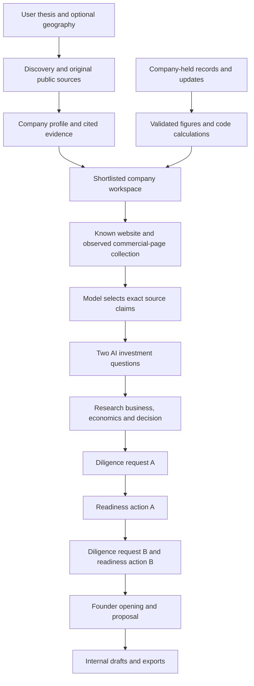

# Session handoff — company preparation MVP

> **Latest direction, 1 October:** Read §56 before following §55's execution order.
> Public KB generation is P1, local-model-only product responses are P2, and live
> Google OIDC is P5. Historical hosted-provider authorizations are superseded.
>
> **Latest implementation, 30 September — runtime continuation:** See §48. Google
> OIDC/session provisioning, durable room jobs, scoped private workers, actual-file
> inspection and the release/download gateway are connected. Live Google login,
> private LibreOffice/UNO qualification and full mandatory validation remain blocked
> or unqualified. This is not L1 acceptance. The controlling plan remains
> [LOCAL_TO_CLOUD_RELEASE_PLAN.md](LOCAL_TO_CLOUD_RELEASE_PLAN.md).

> **Latest, 26 September — shared founder recovery:** Read [handoff §33](#shared-founder-recovery) and the [run/failure record](evals/investment_preparation/section-workflows/founder-recovery-2026-09-26/README.md). CropX and Arable have current reviewed founder proposals. Shared fixes distinguish summary accounts from underlying records, repair review metadata, recover deleted source links and preserve the six-call/two-minute bound with separately counted search turns. The same UI/workflow applies to every company; broader first-pass reliability is not established. Preserve concurrent provider work and check active jobs before restarting.

> **Latest, 26 September — results-first analysis:** Read [handoff §32](#results-first-analysis) and the [evidence/failure index](evals/investment_preparation/section-workflows/analysis-workflow-2026-09-26/README.md). Continued agrotech discovery now shows eight candidates. CropX has a reviewed seven-metric analysis and conditional outlooks, with public lookup gaps assigned to the system and optional user contributions. This required repeated development corrections, not reliable first-pass generation. Legacy research/founder validation still needs attention. Keep the concurrent Anthropic API/deployment work compatible; check active jobs before any restart.

> **Latest, 16 September:** [agrotech source selection](#agrotech-source-selection). The app now shows a model-discovered CropX candidate from an 83-second run, verified in the browser. Coverage is limited; full reliable preparation remains unresolved. Read §25 after the earlier failure records. Check live jobs before any restart.

> **FINAL CHECKPOINT — 15 September 2026: [§23, model-authored workflow and freeze](#model-authored-reset). Reliable fresh generation is NOT fixed.** Latest live GoCardless preparation failed in 61.186 seconds/two calls and published zero sections. No complete live v10 pack has been demonstrated. The user asked to stop implementation, thoroughly record the state and push the changes.

> **Read §23 first. Sections 1–22 are a chronological historical record, not current runtime instructions.** Their statements about Paasa/Waybill being complete, v7/v8/v9 being active, service PIDs, remaining untracked files and recommended experiments have been superseded. The user rejected template-assisted company answers and authorized resetting the old companies. Those historical outputs remain evidence, not model-authored successes.

Repository: `/Users/divyangmishra/Desktop/deal_document`. Product contract: [architecture §16.29](deal_automation_architecture.md#1629-mvp-product-contract-and-cleanup-current-priority), with the later model-authorship/reset amendment. No universal accuracy, autonomous investment, or MVP acceptance is claimed. The [v10 evidence index](evals/investment_preparation/section-workflows/v10-model-authored/README.md) and [verification record](evals/investment_preparation/section-workflows/v10-model-authored/verification.json) preserve the final facts.

### Navigation

- [Current state, latest failures, reset and active implementation](#model-authored-reset)
- [Final verification and operational snapshot](#checkpoint-verification)
- [Current next-session prompt](#checkpoint-resume)

The remaining links point into the preserved historical record:

- [Read first and resume checklist](#1-read-this-first)
- [User intent and constraints](#2-what-the-user-wants-and-why-they-are-frustrated)
- [Implemented versus demonstrated](#3-current-result-implemented-versus-demonstrated)
- [Project map and current flow](#4-project-map-and-which-path-is-active)
- [Reliability changes and the calculation gap](#5-implemented-reliability-work-that-should-be-preserved)
- [Services, database, identifiers and API commands](#6-runtime-snapshot-and-operational-commands)
- [Models and reasoning configuration](#7-model-behavior-profiles-and-what-was-not-trained)
- [Evaluation history and corrected diagnoses](#8-evaluation-history-and-how-to-read-the-reports)
- [Tests and reproduction](#9-tests-validation-and-reproduction)
- [Source and compliance boundaries](#10-source-and-compliance-boundaries)
- [Files to preserve and historical traps](#11-repository-preservation-and-historical-document-traps)
- [Proposed next implementation](#12-recommended-next-implementation-sequence--not-yet-implemented)
- [Ready-to-paste next-session prompt](#13-suggested-next-session-prompt)
- [Documentation-only changes](#14-what-this-documentation-turn-changed)

## 1. Read this first

**Historical initial handoff. Current status and instructions are in §23.**

**The product is not MVP-ready.** The UI, persistence, retrieval and retry machinery have improved, but the actual local-model output failed the first-company acceptance milestone. Do not describe functioning endpoints, completed sections, citations or a model review marked `pass` as proof of investor-quality work.

The last work produced a useful, separately authored [Paasa reference pack](evals/investment_preparation/section-workflows/paasa-reference.md) and a [bounded comparison](evals/investment_preparation/section-workflows/paasa-comparison.md). The reference is not an application-generated deliverable, a trained model, a production template, or a successful demonstration of autonomous preparation.

The decisive findings are:

1. The model-based extraction stage can remove the subject and qualifications of a source statement even when given a clean, compact input.
2. The writer then reasons from this weakened evidence, blurs fee plans and invents unsupported conclusions about revenue composition.
3. The writer and reviewer accepted financially invalid comparisons. One request recommended a negative assessment if service fees were much smaller than customers' assets under management.
4. A targeted correction removed that particular comparison, but the section still failed the output contract and retained an inadequate measurement method.
5. This implicates evidence handling, analytical representation and model judgment together. It does **not** prove that every free/local model is incapable, or that buying a stronger model would automatically fix the pipeline.

### First ten minutes of the next session

1. Read this handoff, the reference pack and the comparison. Read §16.29 before changing product scope.
2. Inspect `git status --short`. The workspace is deliberately dirty; several essential runtime files are untracked. Preserve them.
3. Check service health and active jobs with the read-only commands below. PIDs and prior tool session IDs are not durable identifiers.
4. Inspect the two distinct evaluation reports. Do not merge their metrics or confuse the isolated test with the live Paasa workspace.
5. Confirm the user's next requested action. Do not automatically restart benchmarks because an older document says “run this first.”
6. If implementation is requested, begin with evidence preservation and semantic financial-plan validation described in §12 below. Avoid another UI redesign, broad model sweep or prompt-only repair campaign.

## 2. What the user wants, and why they are frustrated

The intended product combines VC/boutique investment-banking preparation with a YC/incubator-style operating model. It should discover companies worth supporting, research them, approach founders, help resolve operating gaps, prepare investment materials and ultimately support fundraising with minimal routine human labor.

The user repeatedly emphasized:

- **AI-first substantive work.** AI should generate company reasoning, proposed engagements, diligence questions and workflows. Code should retrieve, calculate, validate, persist and execute explicitly authorized tool operations.
- **All sectors and regions.** India is an optional pilot, not a restriction. Do not assume every company is software, every metric is ARR, or every source must be YC/Blume.
- **Automatic discovery.** Users should describe their thesis; they should not have to supply company URLs or a local PDF to begin research. Optional advanced URLs and document intake can remain.
- **Useful investor-facing outcomes.** A screen should answer what is known, why it matters, what to do next and what result would change the decision. Generic process lists and “AI analysis prepared” banners are insufficient.
- **Source quality and transparency.** Scraping is acquisition of evidence, not the intelligence itself. Sources, company claims, calculations, hypotheses and unknowns must remain distinguishable.
- **A simple product.** Research, founder approach and readiness should form one company journey. Do not restore separate signals pages, duplicate operation dashboards, verbose technical history as the main experience, or vanity document counts as readiness metrics.
- **No generator branding.** Do not show “Powered by Codex” or “Prepared by Codex” in the main product. Preserve genuine provenance in audit/history; do not erase it or relabel editorial work as unattended model output.
- **Free/local work for now.** No paid inference, source subscription, model download, hosted deployment or weights training was added in the latest work. Existing local-only Phase 0 constraints remain. Paid services require a concrete proposal and explicit authorization; do not infer blanket spend permission from “go ahead.”
- **Stop wasting time on ineffective iterations.** The user was especially frustrated by hours of fixes followed by another vague statement that reasoning was still bad. Updates must report outcomes and evidence, not celebrate incremental machinery as a solved product.

The user’s broad aspiration is extensive automation. The narrower first release contract currently being tested is **discover → shortlist → sourced research memo → founder proposal → diligence/readiness work plan**. Actual outreach, signing, money movement and closing were not authorized or demonstrated. Do not send founders or investors anything during development. Whether the eventual firm also invests its own fund capital remains a separate business decision; do not invent a fund mandate.

## 3. Current result: implemented versus demonstrated

| Area | Current implementation | Practical limit |
| --- | --- | --- |
| Discovery | Natural-language thesis, optional geography, public search and portfolio adapters, per-run results, shortlist/history | Coverage is incomplete and source-biased; this session did not prove representative global discovery |
| Evidence | Source URLs/dates, bounded public-page collection, source selection and literal-span binding | Literal matching does not preserve meaning automatically or verify a claim |
| Company preparation | Nine independently saved sections, linked diligence/readiness work, founder proposal dependency | First-company content acceptance failed |
| Model routing | Local task/complexity routing, optional reasoning, configurable writer/reviewer | Routing weights are heuristics, not trained weights or measured accuracy |
| Reliability | Saved partial results, scoped stop/resume, bounded repairs, stale-state checks | Semantic errors can still receive an automatic review pass |
| Financial figures | Dated company updates, checked extraction, deterministic calculations | Not an accounting integration, audited ledger, universal financial-model engine or complete semantic validator |
| UI/export | Three-step workspace, source details, draft downloads, failed/stale states | A usable UI is not evidence that the analysis is useful |
| Legacy deal documents | Ingestion, field review, research, teaser/CIM/pro-forma and investor records remain | These do not establish company readiness or execute a fundraise |
| Compliance/provenance | Dataset rights metadata, version-bound reviews, authority references and action boundaries | No legal/compliance certification; references and jurisdictional applicability need current verification |
| Model acceptance | Actual failures and independent-from-self-review development audits retained | No model profile promoted; no investor-practitioner acceptance achieved |

### Proposed release gates — not achieved

Architecture §16.29 proposes ten companies across at least three sectors and three regions, traceable material assertions, no invented financials, useful company-specific proposals, nonduplicative evidence requests, at least nine workflows completing without engineering intervention, and practitioner review finding outputs usable with minor edits. Latency must be measured and an acceptable production bound agreed.

The first milestone remains a useful Paasa memo, founder proposal and diligence request **generated through the application**. A manually prepared reference does not meet that milestone. The 20-minute cap in the last experiment was an experiment limit, not a user-approved production service-level target.

## 4. Project map and which path is active

The repository contains several generations of preparation logic. Do not mistake an older route or schema for the current company experience, and do not delete legacy modules just because the latest UI uses a newer one.

| File or group | Responsibility / why to read it |
| --- | --- |
| `deal_automation_architecture.md` | Design history; §16.29 is current product contract, §16.28 describes independent deliverables |
| `CLAUDE.md`, `README.md` | Entry points with historical notes; read their new handoff pointers before older instructions |
| `agents/analyst_pack.py` | **Current protocol v7**: source record, agenda, nine sections, review binding, repairs, persistence/export, preparation source collection |
| `agents/local_models.py` | Local Ollama boundary; `LocalModel`, `AnalystModel`, `PreparationModel`; reasoning and schema handling |
| `agents/model_routing.py` | Default hardware-aware routing from trusted task metadata, input size, retry and quality/latency preferences |
| `agents/inference_queue.py` | FIFO condition-variable queue for individual calls inside one process |
| `agents/web_sources.py` | Public transport/parser, page text and observed links; navigation cleanup |
| `agents/web_discovery.py` | Query planning/search-provider orchestration and bounded automatic discovery |
| `agents/public_directories.py` | Public portfolio/directory discovery, including regional/global source families |
| `agents/company_sourcing.py`, `company_enrichment.py` | Candidate/source processing and bounded company-specific research |
| `agents/research_reasoning.py`, `source_coverage.py`, `geography.py` | Intent/criterion reasoning, structured coverage, geographic handling |
| `agents/datasets.py` | Source registry, access/license metadata, Wikidata connector and dataset ingestion support |
| `agents/operating_workflow.py` | Workspace reconciliation, basis hashes, controls and operating state |
| `agents/operating_research.py`, `business_analysis.py`, `growth_analysis.py` | Supporting research/analysis layers used by existing workflows |
| `agents/company_metrics.py`, `metric_extraction.py` | Company-reported monthly metrics, source validation and code-owned calculations |
| `agents/measurement_plan.py` | Existing symbolic quantity/operation validation; important starting point for the next fix |
| `agents/transaction_workpaper.py` | Source-reviewed financial workpaper and supporting preparation checklist; not current AI authoring engine |
| `agents/company_brief.py`, `investment_case.py`, `preparation_quality.py`, `claim_grounding.py` | Earlier/alternate brief and investment-case pipelines, substantive guards and repairs; still used by legacy/supporting paths |
| `agents/investment_practice.py` | Practitioner methods and teaching context; inference-time guidance, not trained model weights |
| `agents/ingestion_agent.py`, `extraction_agent.py`, `review_checkpoint.py`, `research_agent.py`, `analytics_agent.py`, `compilation_agent.py` | Legacy document ingestion → extraction → review → research → charts/materials |
| `agents/planner_agent.py`, `main.py` | CLI/planner and legacy deal state machine |
| `schemas.py`, `workflow_schemas.py` | Pydantic entities and operating workspace/job state |
| `store.py` | SQLite persistence; tenant-scoped records and optimistic workspace revision checks |
| `api/main.py`, `api/deps.py` | FastAPI app, local CORS, request-scoped Store, tenant/reviewer headers; no production authentication |
| `api/routers/operations.py` | Current and legacy preparation endpoints, metric imports, job lifecycle, exports |
| `api/routers/leads.py` | Sourcing/search endpoints and run snapshots |
| `frontend/src/components/PreparationWorkspace.tsx` | **Current three-step company workspace**, protocol version 7 |
| `frontend/src/pages/Dashboard.tsx`, `Operations.tsx`, `OperationsRecords.tsx` | Company queue, selected workspace routing, supporting records/history |
| `frontend/src/components/WebSourcing.tsx`, `SourceCoverage.tsx`, `ResearchReasoning.tsx` | Discovery inputs/results, coverage and criterion explanations |
| `frontend/src/components/CompanyMetrics.tsx` | Company update/metric intake and calculations UI |
| `frontend/src/pages/deal/*`, `InvestmentCase.tsx` | Legacy deal/document and investment-case views; retained |
| `scripts/serve_local.py` | Stable local API launcher; no auto reload |
| `scripts/check_operations_ui.cjs` | Current isolated browser journey check; mocks APIs and never invokes a model |
| `scripts/evaluate_analyst_workflows.py` | Reusable complete-workflow evaluation runner with optional caps |
| `tests/test_analyst_pack.py`, `test_local_models.py`, `test_reasoning_evaluation.py` | Core generation/review/caching/routing/evaluation regression coverage |

### Current data flow


```mermaid
flowchart TD
    A[User thesis and optional geography] --> B[Discovery and original public sources]
    B --> C[Company profile and cited evidence]
    C --> D[Shortlisted company workspace]
    D --> E[Known website and observed commercial-page collection]
    E --> F[Model selects exact source claims]
    F --> G[Two AI investment questions]
    G --> H[Research business, economics and decision]
    H --> I[Diligence request A]
    I --> J[Readiness action A]
    J --> K[Diligence request B and readiness action B]
    K --> L[Founder opening and proposal]
    L --> M[Internal drafts and exports]
    N[Company-held records and updates] --> O[Validated figures and code calculations]
    O --> D
```

This is the authoring order, not a claim that all downstream work succeeds. A blocked dependent section can be skipped while other independent sections continue. Each section is validated/reviewed and saved separately. Source retrieval occurs in code; company interpretation and proposed work are model-authored. Actual financial analysis awaits suitable company records.

### Nine v7 sections

| Key | Purpose | Dependency detail |
| --- | --- | --- |
| `research.business` | Offering, customer and problem | Selected source evidence |
| `research.economics` | Payer, charge basis and unknown retained economics | Selected pricing/business evidence |
| `research.decision` | Conditional reason to engage, risk, next decision | Evidence and relevant prior research |
| `diligence.request_a` | First specific founder question and records | First persisted agenda question |
| `readiness.action_a` | Analysis, output and decision from those records | Completed request A |
| `diligence.request_b` | A distinct question and records | Second agenda dimension and first request context |
| `readiness.action_b` | Corresponding distinct analysis | Completed request B |
| `founder.observation` | Source-attributed commercial opening and question | Relevant company evidence |
| `founder.proposal` | Offer concrete assistance and invite discussion | Actual completed first request/action, not a generic template |

The visible journey is **Research → Pitch founders → Investment readiness**. Diligence and its proposed action are paired in readiness. The generation order intentionally differs from the visible tab order so the founder offer can use an actual proposed analysis.

## 5. Implemented reliability work that should be preserved

### Evidence and collection

- `raw_sources` uses bounded source selection: up to 24 evidence entries, at most eight per URL, with navigation-heavy and unsuitable fields filtered.
- `source_passages` retains neighboring context in bounded passages rather than splitting every sentence. Extraction batches contain four passages and can produce up to six literal claims.
- `bind_source_claims` checks contiguous exact text in supplied passages, attaches IDs/URLs/dates in code and retains individually valid claims when another claim in the batch fails.
- This guarantees textual binding only. A literal fragment such as “Its percentage charge…” can still lose its subject; source classification is model-selected and is not independent verification.
- `PageParser` now excludes navigation/menu labels and repeated document titles from body evidence, retains observed links, gives body links priority, and retains substantive footer/service-entity disclosures. Not every login/button string is eliminated.
- `collect_preparation_evidence` reads the known website and an observed same-domain pricing/fee/plan link, bounded to two pages. It retains opening content and closing service terms under a page/block budget. It does not invent URLs or provide exhaustive research.
- A successful refresh replaces only previous `origin=preparation_public_page` snapshots for that successfully fetched URL/redirect alias. Retired records remain in `research.preparation_source_history`; failed-page evidence and other-origin evidence are preserved.
- Preparation-source cache version is still 1. The live Paasa run used cached evidence; the later parser improvements were not proof that that run had cleaner freshly collected inputs.

### Planning and dependencies

- A persisted AI agenda selects two questions in distinct dimensions. Revenue, costs and margins all belong to `unit_economics`, preventing artificial duplicate questions.
- Each diligence question is schema-bound to its selected agenda question.
- Agenda cache validity includes instruction and schema. Unsupported numerical assertions are checked against selected facts.
- An unreviewed planner rationale formerly propagated invented premises into later sections. `why_it_matters` was removed from the agenda model; downstream context is projected through the typed question model.
- Relevant previous sections and evidence are supplied with bounded context. Dependency changes affect downstream input hashes.

### Validation, review and repair

- `validate_section` checks selected references, numerical support, roles, specific semantic pitfalls and output contracts. It is not a universal financial or factual verifier.
- Review objections select actual draft passage IDs and supporting evidence/task IDs. Code binds them to text rather than trusting invented quotations.
- `repairable_fields` targets defective fields; a bad field should not require replacing the whole pack.
- Production has separate bounded schema/validation, review-binding and content-revision handling, within at most four section attempts. The evaluator's stricter optional correction cap is separate.
- Citation-only trailing lists in recognized formats can be normalized without another model call. Unknown IDs or additional prose prevent cleanup. Raw final responses are retained for audit. The current marker parser recognizes forms such as `Sources:`/`References:`/`fact_ids:`; the last correction's `Supported by facts:` was not accepted.
- Proposed lookback/cohort windows and consecutive parenthesized list labels are distinguished from company-reported numerical claims. Unsupported performance metrics remain rejected.
- Current schema validation runs again on publication/export. AI review reuse is fingerprinted from the critic's real contract/configuration rather than every unrelated pipeline edit. Writer instructions/schema and dependency inputs have their own hashes.
- A section status of `complete` means it passed those implemented checks. The development audit demonstrated that this is not sufficient to establish usability.

### Jobs, state and UI

- Preparation persists sections and failures independently. Resume reuses current sections; stop is scoped to tenant, workspace and job ID.
- A cancelled or replaced job must not overwrite a newer job. An in-flight inference may take time to finish after logical cancellation.
- `_queue_prepare` already preserves the selected writer/reviewer/reasoning profile on a plain resume. An earlier suspicion that resume silently switched models was incorrect; the redundant patch was removed and regression coverage added.
- Complete draft status and partial source coverage are distinct. Omitted excerpts remain a visible limitation; they do not automatically fail all otherwise completed drafts.
- Main UI preserves deep links and collapses evidence/history, hides rejected candidate prose, provides current draft exports and shows partial/stale states.
- No “Codex” branding appeared in the live three-step browser check. Editorial history remains in old records; do not delete it.

### Existing arithmetic support and its exact gap

`company_metrics.metrics_report` calculates supported delivery contribution, contribution margin, cash coverage, average completed order value and consecutive-month revenue change. Inputs are dated, historical company-reported figures with currency and source notes. Missing values remain unknown; zero denominators and incompatible periods are handled. These are not audited company accounts.

`transaction_workpaper.py` has calculations based on reviewed document fields, including cash/burn coverage and suitable ARR comparisons. It explicitly warns that ARR is not appropriate to every business.

`measurement_plan.py` already provides `QuantityRecord` and `MeasurementPlan` with dimensions, units, a record name, an operation and a population/window description. It is used by the older `investment_case.py` commercial-test path. **Current v7 `Action` and `Request` still describe their analytical method as free text and do not require this typed plan.**

The existing dimension validator is insufficient even if connected unchanged: fees and AUM can both be `money` in the same currency, so comparing them passes a basic unit check. The next design needs economic roles, entity scope, time basis, stock versus flow, gross/net treatment, denominator and calculation purpose in addition to physical units. Do not recreate a second basic units module and call the problem solved.

## 6. Runtime snapshot and operational commands

### Verified local state

| Component | Verified state at handoff |
| --- | --- |
| FastAPI | `http://127.0.0.1:8000`, PID 52213, `scripts/serve_local.py`, health OK |
| Vite | `http://localhost:5173`, PID 48210, health through `/api` proxy OK |
| Ollama | `127.0.0.1:11434`, PID 28520, version 0.33.3 |
| Loaded model | `qwen3.5:9b`, context 8192, reported VRAM use 5,636,976,802 bytes |
| Model digest | `6488c96fa5faab64bb65cbd30d4289e20e6130ef535a93ef9a49f42eda893ea7` |
| Model quantization | Q4_K_M; reported parameter size 9.7B |
| Machine/runtime | macOS, Python 3.9, 16 GB unified memory; local acceleration was observed, so old “CPU-only” prose is not a reliable runtime description |
| Active workspaces/searches | None in `queued` or `running`, checked across stored rows, not only the selected company |
| Evaluation processes | None running; both latest evaluations are finished/stopped |
| Restart needed now | No. Latest bounded test changed the evaluator/docs/tests, not production runtime code |

Recheck these facts in a new session. Do not kill processes by stale PID or reuse an old tool session ID. The API is deliberately not auto-reloading. An earlier reload interrupted availability while background work was running.

Read-only health commands:

```sh
curl --fail --max-time 5 http://127.0.0.1:8000/api/health
curl --fail --max-time 5 http://localhost:5173/api/health
curl --fail --max-time 5 http://127.0.0.1:11434/api/version
lsof -nP -iTCP:8000 -iTCP:5173 -iTCP:11434 -sTCP:LISTEN
```

Start only missing services, each in its own managed terminal/process:

```sh
# Repository root; stable single API process, no --reload.
PYTHONDONTWRITEBYTECODE=1 python3 scripts/serve_local.py

# Separate terminal, working directory frontend/.
npm run dev
```

Use the existing Ollama installation. Do not automatically run `ollama pull`, launch a second server or change model defaults. After a future backend edit, check active jobs before deliberately restarting the owned API process. Startup text in `api/main.py` still mentions `--reload`; the stable launcher is the current instruction.

### Database and exact Paasa identifiers

- Main database: `deal_automation.db` at repository root. SQLite WAL/SHM companions may exist and are not redundant artifacts.
- Default tenant: `default_tenant`. API uses `X-Tenant-Id`; local default is that tenant. These headers are not real authentication.
- Paasa lead: `lead_ce5b47811d74`.
- Paasa workspace: `workspace_c63410428a00`.
- Last checked revision: **1092**; never hardcode it into a future mutation.
- Last checked basis hash: `0ed5a78474261cfbced4f1e4befb6972e3dba838a335b3980eff0a1b727a36b6`.
- Last live job: `automation_9c71ece30a88`, status `failed`, phase `Generation needs attention`.
- Started `2026-09-14T19:06:38.691931+00:00`; completed `2026-09-14T19:37:19.091662+00:00`.
- UI: `http://localhost:5173/operations?lead=lead_ce5b47811d74&tab=readiness`.
- Live pack: seven sections `complete`; `diligence.request_b=needs_revision`; `readiness.action_b=blocked`.
- **The independent development audit is in the report, not applied as replacement model reviews to the live DB.** Known weak sections can still have `complete`/`pass` in the application. Do not mistake them for audited approvals.

`Store.get_workspace` takes `(tenant_id, workspace_id=...)` or `(tenant_id, lead_id=...)`. `workspace.automation` is a Pydantic object; `workspace.analyst_pack` is a dictionary. Writes use current `expected_revision`. Preserve original evidence, attempts, reviews, events and user data.

Read-only state inspection:

```sh
PYTHONDONTWRITEBYTECODE=1 python3 - <<'PY'
import json
from store import Store
with Store() as s:
    w = s.get_workspace('default_tenant', workspace_id='workspace_c63410428a00')
    print(w.automation.model_dump())
    print({k: v['status'] for k, v in w.analyst_pack['sections'].items()})
    for table in ('operating_workspaces', 'web_sourcing_runs'):
        active = []
        for row in s.conn.execute('SELECT data FROM ' + table):
            item = json.loads(row[0])
            job = item.get('automation') if table == 'operating_workspaces' else item
            if job and job.get('status') in ('running', 'queued'):
                active.append((item.get('id'), item.get('tenant_id'), job.get('status')))
        print(table, active)
PY
```

Other historical user links include Waybill lead `lead_77e309f71b18`, lead `lead_3537892cbb1a`, and deal `deal_b125df996901`. Do not assume a company name for an unchecked identifier. The user mentioned `/Users/divyangmishra/Downloads/company-brief.md`; do not overwrite that downloaded document. Earlier demonstration/test companies remain in the live data and must not be silently purged as code cleanup.

### API map

| Endpoint | Purpose / caution |
| --- | --- |
| `GET /api/health` | Health only; does not prove model/content quality |
| `POST /api/leads/web-runs` | Start discovery from thesis, optional geography and optional seed URLs |
| `GET /api/leads/web-runs/{id}` | Search progress and coverage |
| `GET /api/leads/web-runs/{id}/leads` | That run's lead snapshots, not a global historical list |
| `POST /api/leads/web-runs/{id}/cancel` | Cancel discovery |
| `GET /api/operations/workspaces` | Workspaces; supports summary/lead filtering |
| `POST /api/operations/leads/{lead}/preparation-jobs` | **Current v7 authoring job**; query options include model, thinking, review_model, review_thinking, refresh |
| `POST /api/operations/workspaces/{workspace}/preparation-jobs/{job}/stop` | Scoped current preparation stop |
| `GET /api/operations/workspaces/{workspace}/preparation-pack?document=research` | Markdown export; document may also be founder, diligence or readiness |
| `POST /api/operations/workspaces/{workspace}/metric-imports` | AI-assisted company update intake; mutates records and may regenerate work |
| `POST /api/operations/workspaces/{workspace}/metrics` | Structured/manual metric fallback |
| `GET /api/operations/workspaces/{workspace}/metrics` | Metric export |
| `.../brief-jobs`, `.../readiness-jobs`, `.../prepare-jobs` | Earlier preparation paths; not synonyms for v7 `preparation-jobs` |
| `/deals/:id/review`, `/documents`, `/investors` | Legacy frontend deal record views; preserve |

An explicit reviewer override on the v7 endpoint requires an explicit installed writer model. Plain resume preserves a saved explicit profile. Up to three company jobs may be queued per tenant/current worker. A complete pack can be returned without re-generation; `refresh=true` is a source refresh/mutation, not a read-only check. Avoid starting jobs merely to inspect the UI.

The inference queue is in-process. Separate API/evaluation processes do not share this Python lock and can contend at Ollama. Run one evaluation at a time, check live jobs first, and keep one API worker. Persisted job state is not a durable distributed worker/resume system.

## 7. Model behavior, profiles and what was not trained

Two different routing mechanisms exist:

1. **`PreparationModel` / `RoutingPolicy`:** the default resource-aware router. On this 16 GB machine, code defaults are `phi4-mini` for fast work and `qwen3:8b` for reasoning/review, with no default 14B escalation. Environment overrides can change this; inspect the actual saved route, not a historical documentation table. The dataclass's nominal 14B fields are not the effective under-24-GB environment defaults.
2. **`AnalystModel`:** an explicit installed writer/reviewer profile used for the recent Paasa runs. It routes complex initial sections, agenda and repairs to reasoning without continually swapping model sizes. A saved explicit profile can survive a plain resume independently of global defaults.

The explicit Qwen3.5:9b profile uses 1,024 reasoning tokens when enabled, a total response budget of at least 4,096 for those calls, and 1,800 for fast calls. The recent tests used 8,192 context tokens. Complex sections are currently detected by schema fields such as `reason_to_engage`, `required_input` and `proposed_work`; this is a heuristic, not a learned task-difficulty model. Reviewer thinking is independently configurable.

`LocalModel` calls loopback Ollama only. For thinking calls, it requests an unconstrained final JSON contract, then validates it; grammar-constrained decoding can suppress thinking in some runtime paths. If the bounded thinking phase exhausts its budget, the adapter can continue the final answer with a request-local assistant prefill. Hidden reasoning stays in request memory and is not persisted as business evidence. The adapter checks whether thinking was actually returned and records finish reason, queue time, elapsed time and token counts. Do not describe a requested thinking flag alone as verified reasoning behavior.

Qwen3.5 sampling currently differs between fast and thinking calls: temperatures 0.7 and 1.0 respectively, with family-specific sampling settings. Reports capture these settings. Temperature zero elsewhere is not a truthfulness guarantee. Model “weights” requested by the user were implemented as routing preferences; no neural weights were modified.

No profile qualified for promotion. No paid inference, automatic model download, fine-tuning or distillation happened in the latest work. `evals/investment_preparation/training-seed/` and `scripts/export_preparation_training.py` are historical seed/export infrastructure; their presence is not proof of trained weights or an investor-quality training set. Do not start training from weak self-generated outputs or treat synthetic narrow probes as product acceptance.

## 8. Evaluation history and how to read the reports

### A. Earlier approaches — why not repeat them blindly

Historical documents and reports include small-model probes, larger-model trials and several generations of brief/work-product schemas. The broad observed progression was:

- Narrow JSON/field probes sometimes passed while real-company reasoning failed.
- Larger local models and reasoning modes did not automatically yield useful financial analysis.
- Models invented numerical cutoffs, fees, benefits or causal claims; some guards caught these while reviewers missed others.
- Large response schemas caused length/format failures. Smaller sections and independent persistence improved reliability but did not establish content quality.
- Unreviewed planner rationale introduced invented premises that spread downstream. Removing that rationale from the evidence path addressed one contamination route.
- Reviewers sometimes supplied unsupported objections or even an “objection” whose explanation said the passage was legitimate, consuming time and causing unnecessary rewrites.
- Repeated character/citation/number repair rules did not solve substantive financial reasoning.

The raw historical details are preserved in evaluation artifacts. They are debugging evidence, not a benchmark leaderboard. The user explicitly approved stopping broad development in favor of one reference pack and one bounded comparison. Do not restart all old model probes or resume every old job.

### B. Last full live Paasa run

Report: [acceptance-latest.json](evals/investment_preparation/section-workflows/acceptance-latest.json).

This report corresponds to the live workspace/job in §6. Writer and reviewer were Qwen3.5:9b; complex writing and review used bounded reasoning. It reused existing cached evidence and saved work where eligible. It is not a fresh isolated run from zero.

| Measure | Value / interpretation |
| --- | --- |
| Job duration | 1,840.4 seconds, 30.7 minutes |
| Calls during this job | 21 |
| Correction calls during this job | 4 |
| Inference seconds during this job | 1,826.7 |
| Generated sections complete | 7 of 9 |
| Development-audited usable with minor edits | 2 of 9 |
| Outcome | Failed first-company milestone; no promotion |
| Failed/blocked path | Request B needed revision; action B blocked |

**Metric trap:** `metrics.model_calls=74`, `correction_attempts=18` and `inference_seconds=4830.56` are cumulative retained attempts from multiple prior runs. Use `current_run_*` for this job. Do not report 74 calls as the cost of this single 30.7-minute run. Null independent factual-error/actionability fields are unscored fields, not zero errors.

The audit's two usable sections were the business paragraph and founder proposal, with minor-edit qualifications. The other completed sections still had material issues. Its identified problems included:

- Unclear revenue collection, billing and retained-income relationships.
- Incoherent claims about currency depreciation and customer behavior.
- Specific partner names/payment arrangements not supported by the selected citations.
- A diligence decision that mixed collected fees with expenses in its proposed comparison.
- A founder question that largely repeated the already stated charging mechanism.
- Request B using AUM thresholds missing from its selected citations; its attempted repair retained the problem.

### C. Frozen reference comparison — latest experiment

Read these together:

- [Reference pack](evals/investment_preparation/section-workflows/paasa-reference.md): separately authored target output.
- [Frozen input](evals/investment_preparation/section-workflows/paasa-reference-input.json): five compact **source-checked paraphrases**, not verbatim website excerpts or verified financial records.
- [Comparison](evals/investment_preparation/section-workflows/paasa-comparison.md): readable findings and decision.
- [Actual result](evals/investment_preparation/section-workflows/paasa_reference_test.json): original attempts, evidence selection, reviews, metrics, external correction and audit.

The reference covers business/economics, a conditional reason to engage, a proposed founder email, retained-income/cost reconciliation, and funded-customer/cohort analysis. Proposed periods are requested scope, not historical performance claims. It was not passed to inference: the runner records its SHA-256 only.

The test used the existing production authoring function in a **temporary isolated Store**, not the live Paasa DB. It used the same Qwen3.5:9b writer with task-specific reasoning, but **fast reviewer mode**, unlike the earlier live run's reasoning reviewer. Therefore it is a capability comparison against a reference, not an A/B test attributing improvement or regression to one variable. The curated packet also does not validate automatic discovery/collection.

Predeclared limits: one correction per stage, at most 24 actual model invocations and 1,200 seconds total. The unmodified production validation/review logic remained in use; the evaluation wrapper imposed additional caps. The workflow was stopped once a material error had passed review and propagated, because it could no longer meet the acceptance criterion. No remaining-company sweep followed.

| Measure | Value / interpretation |
| --- | --- |
| Initial pipeline elapsed | 354.81 seconds |
| Initial model invocations | 15, including one interrupted task |
| Generated sections before stopping | Business, economics, decision, request A, action A |
| Unassessed later sections | Request B, action B, founder opening, founder proposal |
| Targeted external correction | One field repair; 61.57 seconds |
| Total elapsed including intervention/correction | 472.34 seconds, 7.9 minutes |
| Total model invocations | 16 |
| Final audit | Failed; no model promotion, no live-data update |

“Model invocation” here is the logical adapter task. A bounded reasoning task can involve two Ollama chat requests for thinking and answer continuation; do not equate this count with raw HTTP requests or billed cloud calls.

#### Exact failure chain

1. The input described Access and Apex separately and included the Apex no-brokerage-markup qualification.
2. Extraction selected an `Its percentage charge...` fragment without the Apex subject and omitted the qualification.
3. Economics blurred plan applicability. The investment argument called asset-based fees the **primary** revenue source without an actual revenue composition record.
4. Request A said: **“A finding that fees collected are significantly below AUM ... would warrant a negative recommendation.”** Fees and customer assets are different economic quantities. This finding is expected under a percentage fee schedule and is not a sound adverse test.
5. The reviewer returned `pass`.
6. Action A compared collected amounts with stated tariff rates and pass-through charges with trading volume without defining valid calculations. It also proposed blanket rejection when any segment's expenses exceeded fee revenue.
7. That action also received `pass`.

#### The one external correction

The pipeline process was deliberately interrupted after the failure. The saved report therefore contains `error: "Interrupted"` plus an explicit `stopped_reason`; this was not an unexplained service crash.

The external correction targeted only request A's `decision` field. It used the production `Request` field schema, selected source facts, existing writer profile and `attempt=1` reasoning path. Feedback explained the wrong fee/AUM comparator and requested a decision based on retained revenue and matched service costs. It did **not** provide the reference answer.

The model removed the direct fee/AUM comparison but retained an unspecified expected-revenue baseline and added a `Supported by facts: ...` suffix with internal IDs. The unchanged production validator rejected this. The standard citation normalizer was also rechecked and did not accept that suffix. The original broader record request still asked a billing ledger for expense allocations and a precomputed cost-to-income ratio, so fixing one sentence would not have made the entire request useful.

The report's `external_correction` retains original content, feedback, raw response, routing and content-audit notes separately from the original pack. This is not a second successful application run and it was not installed into the live workspace. The reproduction command below repeats the ordinary capped workflow; it does **not** automatically inject this external development feedback.

### Corrections to earlier diagnoses — do not repeat these mistakes

- The approximately 2–5% currency-depreciation range in the earlier Paasa material **was present in the captured company profile**. It was incorrectly called invented in an intermediate update and that statement was corrected. The real concern was treating a source-reported generalization as an observed historical condition and inferring churn causation from account data.
- Resume **already preserved** the saved explicit model profile. A suspicion that it switched models was withdrawn after inspection. Do not “fix” it again without a new failing test.
- “Only model reasoning remains” was too narrow. The reference comparison showed lossy evidence selection and inadequate analytical representation as well as weak generation/review.
- Neither a failed 9B profile nor this single-company curated test establishes that all free models are incapable.
- The reference pack is not proof that the product can create it. Editorial or coding-session work must not be presented as unattended output.

## 9. Tests, validation and reproduction

### What was actually checked

The preceding implementation pass reported **269 passing focused regression tests**, plus frontend build/lint and the browser journey checks. The subsequent evaluator-budget change ran **12 tests in `test_reasoning_evaluation.py`**, all passing. This subset overlaps the earlier suite; do not add 269 and 12 and claim 281 distinct tests. The full combined suite was not rerun after the evaluator-only addition.

The full focused command used in the implementation pass was:

```sh
PYTHONDONTWRITEBYTECODE=1 python3 -m pytest \
  tests/test_analyst_pack.py tests/test_global_portfolios.py tests/test_inference_queue.py \
  tests/test_claim_grounding.py tests/test_model_routing.py tests/test_local_models.py \
  tests/test_preparation_quality.py tests/test_investment_case.py tests/test_company_brief.py \
  tests/test_business_analysis.py tests/test_metric_extraction.py tests/test_operating_workflow.py \
  tests/test_research_reasoning.py tests/test_web_sourcing.py tests/test_company_enrichment.py \
  tests/test_web_discovery.py tests/test_source_diversity.py tests/test_reasoning_evaluation.py \
  tests/test_company_metrics.py -q --disable-warnings
```

The latest narrow check:

```sh
PYTHONDONTWRITEBYTECODE=1 python3 -m pytest tests/test_reasoning_evaluation.py -q --disable-warnings
```

Important covered behavior includes source/citation binding, partial claim retention, source refresh history, agenda/dependency caching, field repairs, separate retry budgets, review passage binding, proposed measurement-window handling, preserved model profile, reasoning routing, stale/partial outputs, and evaluator correction/call caps. These are machinery tests; they do not certify content usefulness.

Frontend checks, working directory `frontend/`:

```sh
npm run build
npm run lint
```

Browser journey, from repository root with Playwright installed:

```sh
node scripts/check_operations_ui.cjs
```

An already installed fallback module was used previously:

```sh
DISCOVERY_PLAYWRIGHT_MODULE='/private/tmp/claude-501/-Users-divyangmishra-Desktop-deal-document/a220be07-3472-49e4-8528-ad207cb0bfd6/scratchpad/playwright_check/node_modules/playwright' \
node scripts/check_operations_ui.cjs
```

The `/private/tmp` path is ephemeral; verify it instead of installing dependencies automatically. This script mocks API responses, checks three-step navigation, stop/resume, partial/stale sections, source links, paired request/action rendering, export links and mobile overflow. It never calls a model or mutates live companies.

A separate read-only live browser check visited Paasa research/founder/readiness pages: no page errors, no generator branding, no horizontal overflow at the checked desktop size, and rejected request text hidden. The live Markdown export returned saved readiness content. These checks proved delivery, not financial reasoning. An inspection image existed at `/private/tmp/preparation-live.png`; it is temporary, not a release artifact.

Known test environment warning: Python 3.9's LibreSSL build produces urllib3's `NotOpenSSLWarning`. It was a warning in the observed runs, not the reason the content tests failed. Do not turn this documentation task into an unrelated environment migration.

### Reproduce a bounded workflow only when intentionally requested

Read the report first; do not rerun just to reconstruct its contents. This command starts inference and overwrites the same case-named output in its chosen output directory. Use a fresh temporary output directory if the goal is an intentional new comparison, and do not overwrite the retained audited report.

```sh
PYTHONDONTWRITEBYTECODE=1 python3 scripts/evaluate_analyst_workflows.py \
  --cases evals/investment_preparation/section-workflows/paasa-reference-input.json \
  --output /private/tmp/paasa-next-deliberate-evaluation \
  --model qwen3.5:9b --review-model qwen3.5:9b --no-review-thinking \
  --context 8192 --tokens 1800 \
  --max-corrections 1 --max-calls 24 --max-seconds 1200 \
  --reference evals/investment_preparation/section-workflows/paasa-reference.md
```

The runner uses a temporary DB and never modifies live leads. Its `EvaluationBudget` wraps the existing model boundary, records actual invoked calls separately from denied corrections, and leaves production prompts/answers unchanged. The wall-clock cap uses POSIX signals, fitting this macOS command-line environment; do not assume the runner works unchanged inside a background thread or on Windows.

Input/reference hashes and model/configuration metadata are retained. Sampling is not deterministic; reproducible inputs and an inspectable procedure do not mean identical model text on every run. Case selection/promotion requires complete and separately audited work across the requested case set. No current report qualifies.

## 10. Source and compliance boundaries

Public web discovery already has more than YC. Existing adapters include YC, Blume, Villgro and portfolio families such as Antler, SOSV and Seedcamp, plus search/enrichment for other sources. This does not establish equal coverage by sector/region. DuckDuckGo HTML can return challenges/202 responses; Mwmbl coverage can be sparse. Source fallback should remain explicit. A publisher count is not a completeness score.

Dataful entries in `agents/datasets.py` remain **metadata-only** unless permitted download access is configured. The company-register and aggregate-count sources have different granularity. A public preview is not a complete database; aggregate startup counts are not company revenue or traction. The open Wikidata identity connector is community-maintained and biased toward notable companies; it is not an authoritative startup census. The code contains bounded geography/industry mappings, not universal dataset support.

The prior ITC problem involved unsuitable historical/current-search presentation and an inappropriate notable-company corpus for startup requests. Do not seed company names as a fix. Current per-run result snapshots and startup-directory filtering address parts of this; broad relevance and coverage still need independent evaluation after the preparation milestone.

Public PDFs can be collected in bounded form; inaccessible/scanned/login-protected content remains a limitation. Do not require manual local PDFs as the discovery default or bypass source restrictions to improve apparent coverage.

Company operating claims and registry/partner statements require attribution. Marketing testimonials, funding announcements and directory membership are not proof of rapid operating growth. A source's statement of registration is not a verified compliance conclusion. Company-held statements, invoices, contracts and cohort records are needed for financial diligence; absent public metrics must remain unknown.

Primary references used for the latest reference/comparison:

- [Paasa website and entity disclosures](https://paasa.com/)
- [Paasa pricing](https://paasa.com/pricing)
- [Paasa company profile](https://www.ycombinator.com/companies/paasa)
- [Bessemer: fintech contribution profit](https://www.bvp.com/atlas/fintech-entrepreneurs-guide-to-creating-enterprise-value-starts-with-contribution-profit)
- [YC: seed fundraising guide](https://www.ycombinator.com/blog/how-to-raise-a-seed-round)

These were checked during the preceding work. Financial-method references explain process, not Paasa's actual results. Earlier architecture/practice files contain additional IB/incubator/legal sources and dates. Verify current primary authorities before adding legal conclusions; do not copy old compliance statements into a new jurisdiction without checking applicability.

## 11. Repository preservation and historical-document traps

No commit, reset, rebase or destructive cleanup was performed as part of the last bounded comparison. Earlier cleanup removed 34 redundant newly created artifacts, approximately 2.71 MiB according to the session record. Runtime files, regression tests, user documents, the live database and historical provenance were preserved. Some older evaluation files elsewhere in the repository remain; do not infer that every historical artifact was reviewed for deletion.

**Essential untracked paths at handoff:**

```text
agents/analyst_pack.py
frontend/src/components/PreparationWorkspace.tsx
scripts/evaluate_analyst_workflows.py
tests/test_analyst_pack.py
tests/test_reasoning_evaluation.py
evals/investment_preparation/section-workflows/
```

Untracked does not mean disposable. In particular, `git clean -fd` would delete current runtime and evaluation work. The new handoff/pointer files created by this documentation turn will also be untracked until deliberately committed.

**Tracked modified files observed before documentation additions:**

```text
CLAUDE.md
agents/claim_grounding.py
agents/investment_case.py
agents/local_models.py
agents/model_routing.py
agents/web_sources.py
api/routers/operations.py
deal_automation_architecture.md
evals/investment_preparation/discovery-and-preparation-repair.md
frontend/src/components/InvestmentCase.tsx
frontend/src/pages/Dashboard.tsx
frontend/src/pages/Operations.tsx
frontend/src/pages/OperationsRecords.tsx
scripts/check_investment_case_ui.cjs
scripts/check_operations_ui.cjs
scripts/evaluate_reasoning_route.py
tests/test_local_models.py
tests/test_model_routing.py
tests/test_web_sourcing.py
workflow_schemas.py
```

This includes accumulated user/session work, not solely the last experiment. Inspect the actual diff before editing or committing. Do not claim every file in this list was newly authored in the most recent turn.

Preserve the section-workflow evidence set:

- `README.md` and `audit-rubric.md`: procedure, limits and content criteria.
- `live-workflow-cases.json`: Notpla/UK/materials and SunCulture/Kenya/solar-irrigation plus Paasa-related evaluation inputs; inspect contents rather than assuming it is all freshly collected or a held-out set.
- `paasa-v6-live.json`, `paasa-v6-audit.json`: retained earlier baseline.
- `acceptance-latest.json`: last full live v7 run, separate audit and cumulative attempts.
- `paasa-reference.md`, `paasa-reference-input.json`: reference answer and frozen curated input.
- `paasa_reference_test.json`, `paasa-comparison.md`: bounded experiment and interpretation.

**Historical statements that are superseded or need qualification:**

- “CPU-only” does not describe the observed local acceleration; “no dedicated GPU” and unified-memory acceleration can coexist.
- “No web UI” and “no automated test suite” are stale historical notes.
- An older India default is not the current product scope; geography is configurable and the latest Discover design defaults worldwide.
- Earlier four/five-tab operation layouts are superseded by the three-step company workspace.
- `--reload` launch instructions are superseded by the stable launcher during jobs.
- “Run the benchmark first” is superseded by the user's latest decision to use bounded, hypothesis-driven evaluation.
- Some older documents discuss three work products or a whole-plan schema; current v7 authoring has nine sections.
- The old Waybill editorial rewrite and a user's downloaded brief are historical data, not proof of unattended model quality.
- Generic “mandatory human per-field driving” in older descriptions should not override the user's newer aim of minimal intervention for routine work. External authorization, financial correctness and evidence-based release controls are still real requirements.

## 12. Recommended next implementation sequence — not yet implemented

This section records the concrete implications of the failed comparison. It is a proposed next task, not a claim that these changes already exist or a reason to start another run during a documentation-only request.

### Step 1: preserve complete evidence through selection

Inspect `source_passages`, `bind_source_claims`, `section_facts` and the actual `evidence_record` reaching each writer. Use the preserved input and selected output to reproduce the missing Apex subject/qualification without a live model call.

Prefer AI selection of stable statement/span identifiers with code-owned text and enclosing context. Preserve the original source statement plus any necessary qualification, related plan/product and named subject. Keep classification and model interpretation separate from the evidence text. A source quote should not become more authoritative because the model assigned a category to it.

Required behavior to demonstrate:

- Access and Apex charges stay attached to their respective plans.
- A selected percentage-fee sentence cannot silently lose the plan it applies to.
- The no-markup qualification and separate-brokerage qualification remain available where needed.
- Statements about a partner do not grant that partner's registrations, revenues or obligations to the investment target.
- Source absence in a bounded packet is not represented as absence of public disclosure or business activity.
- Updated evidence properly invalidates only affected downstream work; old evidence remains historical.

Do not solve this by putting Paasa-specific answers into runtime code or always retaining one hardcoded fee paragraph. Generalize the representation and use Paasa only as a regression case.

### Step 2: validate the meaning of financial calculation plans

Inspect and extend/reuse the existing `measurement_plan.py`, `company_metrics.py` and their callers instead of adding a parallel simplistic validator. Connect the chosen representation to the current v7 readiness/request path; leaving it only in legacy `investment_case.py` will not protect the active product.

The AI should propose the question, relevant records and analysis. Code should validate a structured plan before prose can claim the analysis is executable. At minimum, identify:

- The economic quantity: customer assets, billed fees, collected cash, recognized revenue, partner charge, variable service cost, fixed expense, count or rate.
- Entity and service/plan scope, including the investment target versus partners.
- Flow period versus point-in-time stock, currency/unit, comparable population and measurement window.
- Gross/net revenue treatment and whether a partner charge was already deducted.
- Numerator, denominator, operation, expected output type and any contract-derived rate basis.
- Actual input records required, missing-input behavior and whether the proposed decision follows from that calculation.

Useful regression failures include fees compared with AUM as an adverse result, currency amounts compared directly with percentage tariffs, repeated deduction of partner charges from already-net revenue, revenue treated as profit, AUM/GMV treated as revenue, cohort comparisons with unequal exposure windows, and unsupported causal explanations for churn.

Do not blanket-ban every fee/AUM ratio: a correctly defined effective fee yield may be meaningful with aligned balance/time/currency/contract definitions. Likewise, identical units are necessary for some operations but insufficient to justify an investment decision. Model-generated negative recommendations must not bypass this semantic distinction.

When needed records do not exist in the input, the product should return an executable request/plan and an explicit unresolved decision, not fabricated results or an unconditional rejection.

### Step 3: one focused re-evaluation after meaningful changes

Before inference, show deterministic tests that the exact preserved failures are prevented by the new interfaces. Keep the original failed reports; do not overwrite them with repaired evidence and call the past run successful.

Then choose one fixed evaluation question, profile, budget and acceptance contract. Keep the reference outside model inputs. Document whether evidence is curated or automatically collected, whether models/prompts changed, and which previous outputs were reused. Judge actual final content independently of the model's own review.

If the first company passes, evaluate unrelated sectors/regions such as Notpla and SunCulture. Because these cases and the Paasa reference are already known in development, a real release evaluation will also need previously unseen cases and practitioner assessment. Do not claim a held-out benchmark from heavily tuned examples.

If it fails again, make an explicit product/inference decision: narrower reviewed preparation, a stronger-inference evaluation, or further work on a demonstrated interface failure. Paid/hosted inference needs a concrete access/cost/privacy decision; do not silently switch providers. Do not restart model-size sweeps or train on rejected outputs.

### Step 4: only after useful preparation is demonstrated

Return to global discovery representativeness, robust identity resolution and source-rights coverage; real company record ingestion/reconciliation; execution of incubation/GTM tasks; investor matching and materials; durable orchestration, production authentication and multi-user isolation; and authorized external communication. These remain substantial work. No combination of current document counts and generated checklists proves them complete.

## 13. Suggested next-session prompt

The user can paste this with any new instruction:

> Read `SESSION_HANDOFF.md`, `evals/investment_preparation/section-workflows/paasa-reference.md`, and `paasa-comparison.md` before doing anything expensive. Preserve the dirty workspace and essential untracked runtime files. The product must support AI-first company research, founder proposals and investment readiness across sectors/regions. The current v7 pipeline is not MVP-ready. A bounded local-model comparison failed because extraction lost fee-plan qualifications and the writer/reviewer accepted invalid financial comparisons. A single externally guided correction did not make the section usable. Do not launch another model sweep or redesign the UI. Start from the concrete evidence-preservation and semantic calculation-plan gaps in handoff §12, reuse existing modules, and prove those interfaces on the retained failures before one deliberately bounded application evaluation. Do not hardcode Paasa answers or present the reference as application output. No paid services, model downloads or external messages are authorized by this prompt alone.

## 14. What this documentation turn changed

- Created this handoff and a short root `AGENTS.md` pointer so a new coding session can find it.
- Added current handoff/status links to `CLAUDE.md` and `README.md`.
- Appended the bounded comparison result and next engineering gap to the existing architecture, keeping §16.29 as the product contract.
- Rechecked service health, active jobs, live Paasa state and report metrics read-only.
- Did not regenerate company work, alter source data, rewrite model outputs, change model defaults, start benchmarks or make a paid/external call.

The most important next-session rule is practical: **show a useful business deliverable and prove its evidence/analytical method before calling the product ready.**

<a id="v8-latest"></a>

## 15. V8 interface fixes and two-minute budget — latest implementation

The user requested implementation of the handoff fixes with near-immediate, highly accurate output and low compute. Perfect accuracy and instant fresh generation were not promised. When asked what to do with incomplete fresh work, the user explicitly selected **allow up to two minutes for a fuller draft**. This supersedes the previously undefined production latency bound. No paid inference, download or external communication was authorized or performed.

The implementation and exact limitations are recorded in [v8-interface-update.md](evals/investment_preparation/section-workflows/v8-interface-update.md). In particular:

- `agents/analyst_pack.py` and the frontend now use protocol **8**; old packs remain historical. Source selection uses stable IDs with code-owned complete bounded context. Selection caches reuse unchanged passages; section hashes govern downstream reuse. Source collection cache is **2**, with adjacent context and opening/closing coverage. The original source-selection failure is reproduced without inference in `tests/test_preparation_contract.py`.
- `agents/measurement_plan.py` extends the existing module with economic quantities and supported decision methods. The active Request includes an AI-proposed typed plan. Its record request/decision and paired Action are derived from that plan. Legacy generic units-only callers remain compatible. Code checks declared meaning, not the truth of model labels or the sufficiency of actual financial records.
- `agents/preparation_budget.py` provides a shared default 120-second budget, 24 logical calls and 32 raw requests. `PREPARATION_MAX_SECONDS` can lower the limit, but cannot raise it above 120. Queueing and reasoning continuation share it; expiry cancels the local request and saves partial work. Resume is explicit. Validated drafts awaiting review are reused. API collection uses the same remaining budget, subject to bounded transport/DNS and persistence overhead.
- Both readiness actions reuse their reviewed request plans, removing four model tasks from the offline no-retry workflow (20 → 16). Initial agenda generation no longer automatically enables thinking when explicit thinking is false; substantive analysis, requested thinking and repairs retain their reasoning routes. Duplicate source context is omitted from each section input.
- Final validation: **301 passing focused tests**, frontend build/lint, and the isolated browser journey. No new weight training or global source-coverage acceptance occurred.

Two deliberately bounded observations were retained without overwriting the earlier reports:

1. [v8-120s-paasa.json](evals/investment_preparation/section-workflows/v8-120s-paasa.json): one full workflow on the frozen curated input, isolated Store, Qwen3.5:9b, fast reviewer. Stopped at **119.77 seconds** after **8 tasks / 9 HTTP requests**, with **2 of 9** sections saved. Source selection retained the previously lost Apex subject, separate brokerage and no-markup qualification. The typed request was not reached; this is **not a complete acceptance pass**.
2. [v8-agenda-probe.json](evals/investment_preparation/section-workflows/v8-agenda-probe.json): after the full run exposed **59.12 seconds** of agenda reasoning, one targeted call tested the faster initial agenda under 20 seconds and one request. It completed in **11.517 seconds**, with no thinking. It still produced ambiguous financial wording. Schema/citation checks passed, but content quality and the whole workflow were not accepted. The final code includes this routing change; the full-workflow result predates it. No subsequent sweep followed.

[v8-cache-timing.json](evals/investment_preparation/section-workflows/v8-cache-timing.json) records three offline fixture cache hits around **20–21 ms**, with zero model calls. This excludes live model latency, network, startup and large-database performance.

The stable local API was deliberately restarted after checking that no company/search jobs were active. Its new process was **58928**, launched with `PYTHONDONTWRITEBYTECODE=1 python3 scripts/serve_local.py`; recheck rather than relying on this PID. Ollama and Vite were not restarted. The live Paasa data and original rejected outputs were not regenerated or replaced. Old v7 work needs current preparation; historical model review passes remain historical.

New essential files include the budget module, `tests/test_measurement_plan.py`, `tests/test_preparation_budget.py`, `tests/test_preparation_contract.py` and the four v8 result/report files linked above. Preserve them alongside the previously listed untracked runtime files. A temporary targeted probe script existed at `/private/tmp/preparation-v8-agenda-probe.py`; its inputs, output, route and limits are retained in the JSON report.

**Acceptance question at this stage:** can a model produce a financially sensible typed request from preserved evidence, with correctly labelled inputs and a question that matches the calculation purpose, and does its derived action support the actual decision? The subsequent test in §16 failed. Do not claim instant fresh output, perfect confidence, or MVP readiness from the tests or the faster planner. Unsupported calculation methods, arbitrary multi-step finance, reconciliation of company records and general reasoning quality remain open.

<a id="compact-latest"></a>

## 16. Compact diligence interface — latest capability gate

After the user challenged the incomplete fresh output, the proposed next step was a small typed two-plan capability test, followed by a reduced shared-analysis workflow only if the core financial reasoning passed. The user said **“go ahead and fix it.”** This authorized the local implementation/test; it did not authorize paid inference or a model sweep.

The existing measurement module now has a compact representation that declares common entity/service/population/window/exposure once per plan. Operand meanings, units, time bases, records and revenue/cost treatment remain explicit model choices. Expansion runs through the same canonical economic validator; citations and distinct decision dimensions use the existing preparation checks. It does not silently repair the model's choices. The current compact form supports narrow quantitative plans with a shared window, not every qualitative or multi-step financial method. These experimental schemas are not wired into production orchestration.

The existing `scripts/evaluate_analyst_workflows.py` gained `--compact-diligence-only`; no new model-sweep script was introduced. It allows one frozen case, an explicit local model, at most 60 seconds, one logical task and one HTTP request. There is no collection, repair or profile promotion. A fresh output directory is required to protect original reports.

One Qwen3.5:9b fast call used the original five complete source-checked paraphrases. No model was loaded before the call, and no jobs were active. It completed normally in **45.657 seconds**, with **758 generated tokens / 2,504 prompt tokens**. Both proposed plans failed the canonical validators. The first mixed contribution margin with subtraction and contradictory cost treatment; the second compared transactions with customers using invalid time bases. Separate content inspection also found unconfirmed entity scope, insufficient accounting records and a claimed problem-resolution outcome not measured by transfer execution. **0/2 plans accepted.** No derived request/action was published.

Preserve the entire [compact-diligence-gate](evals/investment_preparation/section-workflows/compact-diligence-gate/README.md) directory: frozen contract, original JSON report and separately hashed audit. Regression tests in `tests/test_compact_preparation.py` cover all supported method families, bounded calls, citations/unsupported figures and rejection of both unmodified retained plans.

The proposed reduced-call production workflow was **not integrated**, in accordance with the conditional plan. The API was not restarted and live data were not regenerated. The existing v8 guardrails and two-minute limit remain; neither immediate reliable fresh output nor the full-company milestone is achieved. Do not repeat this same test automatically, weaken checks to accept it, or introduce paid inference. The next justified step is a bounded test of a materially different inference approach, with any required access, cost and privacy decision first. Failure of this one profile is not proof that every model/profile is incapable.

Final verification: 139 focused tests passed, followed by 34 compact/evaluation tests after CLI preflight protection was added. Original report hash, new documentation links and `git diff --check` passed. The stable API returned HTTP 200; a read-only SQLite check confirmed live Paasa version 7/revision 1092 and no active preparation/search jobs.


<a id="v9-latest"></a>

## 17. Shared initial preparation v9 — implemented and running

The user explicitly instructed continued implementation after the earlier failed capability gate, and rejected stopping with “reliable fresh generation is still not fixed.” This authorized continued local fixes and bounded tests. The two-minute fresh-work limit still applies. No paid inference, model download, weight training, external message or fundraising action was used.

The default path in `agents/analyst_pack.py` now calls `agents/shared_preparation.py`. Its normal workflow is three model calls: select sources/services and a first observable customer action; write the founder proposal; review the remaining AI choices/proposal. The installed Qwen3.5:9b runs fast at temperature 0, no presence penalty and context 8192. The shared workflow caps each run at 120 seconds, six logical calls and ten HTTP requests. Queue waits, collection and continuations share the budget. Repairs target invalid fields; explicit resume reuses saved candidates; complete unchanged work requires no inference. `prepare_section_pack` preserves the old section workflow for historical regression tests, not as the default API path.

**Scope is now explicit.** The initial pack asks about contribution after attributable variable costs and first-action customer activation. The AI chooses the service and an observable event (funding, order, booking, delivery, installation, recorded use, service visit or enrollment). It cannot select satisfaction, causal impact or guaranteed returns as an event, or require repeat purchase of a durable product. Existing repeat-use/retention and broader measurement helpers remain available for future explicit work; they are not default initial-pack choices.

Code retains complete supplied excerpts, source qualifications and merged citations; research descriptions and founder opening context are quoted rather than paraphrased. Short explicitly labelled product records survive filtering. Product labels are bound to complete source passages by normalized whole-word matching, which resolves the actual model-number/citation failure without changing a product or inventing support. Derived founder questions retain their request citations. Code supplies registered quantities, entity confirmation, comparable periods/populations, gross/net partner-charge treatment, underlying records, formulas and conditional decisions. Customer counts use the same eligible cohort and ninety-day exposure. No company financial/customer result is invented or calculated without records.

The AI writes the offer, a separately required customer-record request and invitation. The founder writer receives the intended work contract and opening-source choices, avoiding unrelated catalogue claims. Review checks a proposal against the intended work contract, rather than treating a request for missing records as a claim that those records have already been analyzed. Exact source equality protects the opening; the negative-control experiment showed why self-review alone was inadequate. The UI identifies opening text as published context, and **Copy proposal copies only the AI-written offer/record request and invitation**. Exports retain source context for review.

A Qwen3.5 runtime bug was also fixed for explicitly requested reasoning: native nonthinking chat continuation dropped the reasoning prefix. The optional continuation now uses raw completion and shares cancellation/request limits. Private reasoning is not persisted. Default v9 does not need that continuation. Current shared-profile resumes preserve explicit settings; migration from v7/v8 no longer restores the failed long-thinking profile.

### Final measured results

All three final reports use the same implementation hash and were separately inspected against captured sources and the registered methods. See [the acceptance summary](evals/investment_preparation/section-workflows/v9-service-binding/README.md) and [full failure/fix record](evals/investment_preparation/section-workflows/v9-workflow-fix.md).

| Run | Input | Seconds | Sections | Calls / repairs |
| --- | --- | ---: | ---: | ---: |
| Paasa live API | Existing application company, with source collection | 51.449 | 9/9 | 3 / 0 |
| SunCulture | Previously collected public excerpts | 43.11 | 9/9 | 3 / 0 |
| Notpla | Previously collected public excerpts | 41.56 | 9/9 | 3 / 0 |

Three cached API requests took 94.3, 24.1 and 21.8 ms with zero new model calls and the same job/content. The existing POST reconciliation increments metadata revision; no new inference was started. Validation passed **350 focused tests**, frontend build/lint, the isolated browser journey and the actual live research/founder/readiness/mobile pages. Original financial-plan, source-qualification, product-number, false-edibility, impossible-event, deadline and cache regressions remain covered.

### Live state and preservation

The stable API was restarted without reload after confirming no active company/search jobs. Its process is now **80683**, launched with `PYTHONDONTWRITEBYTECODE=1 python3 scripts/serve_local.py`; recheck the process rather than assuming this PID persists. Vite and Ollama were not restarted. The API health check returned 200.

Paasa lead `lead_ce5b47811d74`, workspace `workspace_c63410428a00`, tenant `default_tenant` now has a **complete v9 initial pack** from job `automation_994a7b6d8257`. The job ended at revision 1113; cache verification advanced only metadata to revision **1119**. The original v7 section content was compared and is unchanged in `analyst_pack_history`. `v9-service-binding/live-paasa-before.json` preserves the before snapshot (revision 1092); `live-paasa.json` and `live-paasa.md` preserve the actual new result and source record. No original report was overwritten. No job remains queued/running at the last check.

All `v9-*` evaluation directories, the service-binding snapshot/audits and `agents/shared_preparation.py` are essential untracked files. Do not clean them up. Earlier “final” directory names describe historical trial stages, not accepted results. In particular, `v9-final/notpla_uk.json` contains the false edibility assertion and is a regression fixture; `v9-initial-preparation/sunculture_kenya.json` contains the wrong-citation attempt and is another fixture. Their original failures must remain intact.

### What is proved and what remains

Fresh **initial** preparation now completes through the actual app within the user's two-minute limit on these development cases, and cache reuse is immediate. The source/financial interfaces prevent the concrete retained failures, while original output and audit provenance remain available. This is a materially narrower claim than arbitrary reliable investment reasoning or the full §16.29 MVP gates.

Published claims are not independently verified. Bounded source collection still carries navigation noise and incomplete coverage; the reader-facing source context benefits from editing before external use. Agree exact customer-event/eligibility definitions with founders. The app proposes work; no underlying company ledger/cohort reconciliation, market validation, engagement, outreach or financing has been executed. There is no universal/perfect-accuracy guarantee or unseen-case/practitioner acceptance. Subsequent work should test genuinely unseen companies and actual supplied records, improve source presentation without losing qualifications, and obtain practitioner review. Do not automatically rerun old sweeps or make paid/external calls.


<a id="source-cleanup-latest"></a>

## 18. Source cleanup, unseen cases and confidence — current

The user authorized the proposed source/document cleanup and three unseen-company checks, and asked how confident the system is at AI research and investment handling. The evidence supports **moderate confidence in assisted initial research and low confidence in autonomous investment judgment/execution**. No statistically calibrated accuracy percentage, perfect accuracy, or full MVP acceptance is claimed.

Read [the complete result index](evals/investment_preparation/section-workflows/v9-unseen-source-cleanup/README.md) and [verification](evals/investment_preparation/section-workflows/v9-unseen-source-cleanup/verification.json). BasiGo, Resend and Oddbox had no existing eval/test matches before selection and received only names/homepages, followed by the production public collector. The three first runs took **54.01, 68.23 and 58.21 seconds**, three local calls each, including acquisition. BasiGo/Oddbox were usable for the narrow initial plan with presentation edits; Resend failed because it selected an order event for an email API and its collected pricing was crowded out. This was purposive selection, not a random sample, discovery benchmark or practitioner audit.

The source parser now retains whole HTML blocks and structural navigation exclusions, keeping footer qualifications and monthly/annual price controls. Collection version is **3**. Complete current-format page captures take precedence over old flattened claims at the same URL without deleting original evidence. Page budgets are shared across URLs; opening pricing and closing terms take priority. A primary observed pricing URL survives the link cap and precedes incidental fee calculators. Quotes are separated in the UI, and Markdown exports have one linked source appendix instead of repeating every quote under every action. Some unstructured menus, peripheral contexts and verbose quotations remain; concise relevant research summaries are not yet reliable.

Necessary checks reject unsupported order events and offers that promise contribution analysis with no cost/expense inputs. These checks close demonstrated failures; keyword support does not prove general event semantics or record sufficiency. Saved content is checked against the shared analysis. Literal invitation instruction labels are removed while original raw responses remain in attempts. Offer-only repairs now receive intended work/citation IDs rather than an unrelated opening source page. This fixes a retained repair that copied a price table until its token cap. No model/profile sweep or larger inference cap was introduced. The evaluator includes collection in its deadline and protects existing report paths.

The **Resend development retest took 71.01 seconds/four calls**, with one correction to recorded product use and pricing now retained. It is not an unseen pass: business/opening selection still favoured peripheral footer/testimonial content, so full research acceptance remains unmet. Three intermediate Paasa reports exposed calculator selection, missing cost inputs and the failed repair. They remain unchanged and separately audited. The final live Paasa run took **45.531 seconds/four calls/one targeted repair**, using saved sources collected by the preceding fresh refresh. It contains nine initial sections, exact Access/Apex/annual-monthly/separate-brokerage/no-markup/provider qualifications, and an AI-written offer requesting revenue, supplier/service-cost and customer records. It remains an internal initial plan, not verified performance or investment advice.

**Verified runtime:** API PID **93257**, `PYTHONDONTWRITEBYTECODE=1 python3 scripts/serve_local.py`, no reload. Recheck PID and active jobs before future restart. Vite/Ollama were not restarted. Paasa lead/workspace IDs remain unchanged. Current completed job **automation_d00ca4a2fb2b** ended at revision **1200**; four cache POSTs advanced metadata to **1204** with no new inference/content change. Saved-work GETs took **117.711, 29.751 and 25.993 ms**. No active company/search jobs remained. Original v7 section content matches the preserved original snapshot; historical review statuses differ, so do not claim byte-identical section metadata.

Validation: **362 focused tests passed**, frontend build/lint, isolated browser journey, actual live research/source links, exact Copy proposal including cost inputs, and mobile layout. Temporary screenshots are `/private/tmp/source-cleanup-research.png` and `/private/tmp/source-cleanup-mobile.png`. The before snapshots and every failure/final report are under the new result directory. Tests directly read `resend_us.json` and `paasa-refresh-retest/live-paasa.json`; preserve the entire directory along with all older artifacts. No paid services, training, downloads, outreach, transactions or company-record analysis occurred.

Next justified work is concise relevant source selection/summary acceptance, then actual company-held ledger/cohort reconciliation and practitioner review. The generic contribution/activation scope does not cover valuation, asset financing/default, legal diligence, portfolio construction or executing a raise. Do not automatically launch more sweeps or portray a local critic's pass as investment readiness.

<a id="preparation-error-recovery"></a>
## 19. Preparation error recovery — 15 September 2026

The user reported the incomplete-preparation banner with `Local generation failed (AttributeError)`. At inspection, the live Paasa job was already completed with nine sections; no jobs were queued or running. The previous failed job's traceback was unavailable, so its exact cause remains unproven.

Fixed a reproducible missing-attribute error in `preparation_contexts`: old fetched page objects without `content_blocks` now retain the entire flat text as one block, under the existing omission rules. Added local worker exception-type/stack-location diagnostics that survive restarts without copying source text or model payloads. A failed refresh preserves the saved pack and evidence.

Fixed the stale screen: Operations and Dashboard previously stopped polling failed work and inherited disabled focus refresh. Both now refresh on focus/reconnect, poll active jobs every 2 seconds, failed/interrupted states every 5 seconds, and other states every 30 seconds while visible. These requests only retrieve saved work and never trigger inference.

Verification and limits: [runtime error recovery](evals/investment_preparation/section-workflows/runtime-error-recovery/README.md) and [exact results](evals/investment_preparation/section-workflows/runtime-error-recovery/verification.json). The legacy-page regression failed before the fix and passed after it. 135 focused backend tests, frontend build/lint, and isolated browser regressions passed. The browser test proves a stale failed screen can receive completed work without reload or another preparation POST, on both Operations and Dashboard. A separate read-only live browser check verified all three stages, nine sections, no failure banner, and successful export. Saved-work GET: 70.991 ms; zero new model calls. This is retrieval latency, not fresh generation or a new content-quality evaluation.

All 31 SQLite workspace rows remained byte-identical; Paasa revision remains 1204, job `automation_d00ca4a2fb2b`. No historical output was rewritten. After checking for active jobs, the idle API was gracefully restarted with `scripts/serve_local.py` (no reload): PID 94995, tool session 9803. Vite PID 48210 and Ollama PID 28520 remain unchanged. Recheck PIDs/jobs before future restarts.

<a id="research-reliability-latest"></a>
## 20. Research reliability and financial evidence — 15 September 2026

The user asked to fix the weaknesses behind moderate research confidence and low confidence in autonomous investment handling. The implemented changes and exact limitations are recorded in [research reliability](evals/investment_preparation/section-workflows/v9-research-reliability/README.md). No accuracy percentage, autonomous investment acceptance or practitioner certification is justified by this work.

`agents/research_evidence.py` now supplies short exact business excerpts tied to complete parent records and generic named-plan descriptions. The shared analysis selects an excerpt ID; code validates and renders it in research/founder openings, while the full source remains in details and the export appendix. Whole commercial contexts still preserve pricing and provider qualifications. Combined model review now checks relevance/meaning of the business opening, commercial coverage and founder opening, instead of assuming that literal quoting is sufficient. Its shared evidence is deduplicated within the same review call.

The customer-event schema excludes completed orders when supplied evidence contains no ordering activity; citation-specific validation remains. A real live check then exposed a narrower semantic failure: a managed advisory plan borrowed order-execution support from its neighboring trading plan, and the model reviewer passed it. The generic heading/description interface now binds the selected plan before accepting an order-based activation test. The final live draft uses enrollment. This is a necessary guard against the demonstrated failure, not a complete service ontology or universal semantic validator.

`agents/company_metrics.py` now defers contribution calculations when source wording says variable delivery costs were already deducted or the supplied cost total includes overhead/financing/tax costs. It defers cash coverage for explicitly included restricted/customer funds. Partner netting and explicit exclusions remain usable. Original financial source quotations and blocker reasons now travel through `financial_facts` into inference; the app and metrics export expose unresolved calculations. Recent complete financial records receive a bounded allocation within the same total 14,000-character evidence quota, with omissions declared. This preserves qualifications without establishing that company figures are audited or reconciled. The shared contract hash also includes the evidence and company-metrics modules.

Verification: **200 focused tests passed**, final frontend build/lint, isolated browser journey/context checks and a read-only live browser check. The unchanged frozen Resend evidence produced a corrected short product/customer opening in **70.16 seconds/four calls**. The first live Paasa result completed in **58.451 seconds/three calls** but **failed content acceptance** on the advisory order event despite model review. Preserve it unchanged. Final Paasa completed nine sections in **60.55 seconds/four calls**, after the plan-specific guard caused a targeted correction to enrollment. Saved-work GET: **57.517 ms**, zero inference. Total actual local model calls this turn: **11**, across three bounded runs; no sweeps, downloads, paid services, source refreshes, outreach or financial execution.

The first Resend report predates the final financial-context budget, schema exclusion and managed-plan guard changes. Its separate audit records that limitation; do not relabel it a final-version unseen result. The final Paasa report runs the final implementation. Source evidence is unchanged and the original nine-section content remains in live history (historical review status metadata can differ). Current Paasa revision **1239**, job **automation_cb42d54b1df3**. No active jobs remained after verification. Stable API PID **527**, tool session **50196**, launched with `scripts/serve_local.py` without reload; recheck before restart. Vite/Ollama were not restarted.

Preserve all of `evals/investment_preparation/section-workflows/v9-research-reliability/`: `tests/test_research_evidence.py` directly reads its failed `live-paasa.json`, in addition to the prior Resend artifact. The new directory has frozen input/criteria, every original report, separate development audits, final live export/browser results and implementation hashes.

Remaining scope: define the eligible registration population and actual enrollment event using company records; reconcile actual accounts and costs; improve verbose commercial-source presentation and complete research coverage; obtain independent investment-practitioner evaluation. No actual company-account reconciliation, valuation, portfolio decision or investment execution occurred. A model pass and successful tests must not be presented as high confidence in autonomous investing.


<a id="readable-research-latest"></a>
## 21. Waybill recovery and readable economics — 15 September 2026

The user reported Waybill's `business: Cite the selected excerpt parent fact_id` failure and Paasa's unreadable full pricing-page dump. These exposed real defects after §20. Read [the complete correction record](evals/investment_preparation/section-workflows/v9-readable-research/README.md), [verification](evals/investment_preparation/section-workflows/v9-readable-research/verification.json) and [live browser results](evals/investment_preparation/section-workflows/v9-readable-research/browser-check.json).

**Both exact live pages are now available:** Waybill `lead_77e309f71b18` / `workspace_41fd0152cbe3`, revision **318**, job `automation_33d080715de3`; Paasa `lead_ce5b47811d74` / `workspace_c63410428a00`, revision **1306**, job `automation_bab9cbc6d88f`. All three stages show Draft available, all nine sections are complete, and no failure banner appears. Saved GETs took **29.639 and 45.725 ms**, respectively, with zero inference. The browser checked both exact URLs, expandable complete sources, successful exports, founder/readiness views and mobile layout. Main economics cards are 362/334 px high, with 528/389-character summaries, rather than multi-page pricing dumps.

### Implementation and boundaries

The business inference schema now asks only for an excerpt ID. Code owns the parent citation and founder-opening citation; the original Waybill answer's valid S1 excerpt no longer fails because redundant model metadata says S6/S7. Code also supplies the economics source-attribution label. The existing shared-analysis call writes a brief charging explanation; full original prices and qualifications remain in details and the export appendix. Legacy quoted economics is collapsed instead of dumped into the card.

Narrow source guards reject a supplier-settlement payment being described as a consolidated company fee, omission/confusion of an explicitly annual fee and monthly collection, and a custody role being turned into a custody-fee settlement. These close retained failures; they are not universal semantic validators. The commercial-summary renderer omits whole sentences asserting accounting recognition/results from this field. Raw shared answers and attempts remain unchanged. The actual rendered explanation receives validation and combined review; actual recognized income remains explicitly unresolved pending company records. This boundary does not independently establish the truth of the remaining published terms.

Independent choice and economics defects are collected into one correction. Economics corrections use complete relevant sources and feedback without rejected prose, which a real model repair had copied unchanged. One further targeted correction is allowed if the first exposes a new semantic defect, within the unchanged 120-second/six-logical-call/ten-request budget. No allowance is added to the total deadline.

After a validation-contract update, unchanged company/source facts and model configuration permit reuse of previous analysis/founder prose **as candidates**. Current schema/semantic validation and the current combined review are mandatory before publication; changed source data do not qualify. This avoids rewriting good work. A new contract can still make the UI require review even when text passes deterministic checks: do not conclude the live page is fixed from SQLite status alone. The live browser caught this for Waybill, and one current review resolved it without rewriting its content.

### Evidence and preservation

A fresh empty temporary workspace, with the same Paasa source facts and no saved candidates/review, completed all nine sections in **88.061 seconds/five local calls**. This includes two targeted corrections, founder writing and review. `fresh-current-paasa.json` preserves that proof; it did not mutate the live database or collect new sources. The final live publication used one review call per company, reusing saved candidates. Warm review/cached-read timings are not fresh generation latency.

This correction sequence used **25 local model calls across nine bounded runs**, including failures and the fresh proof. No paid service, download, model sweep, source refresh, outreach or investment execution occurred. 213 focused backend tests, frontend build/lint, isolated browser regressions, actual live browser checks and implementation hashes passed. Original source facts, original raw outputs and original nine-section content remain in live history. No active jobs remained. API PID **7895**, tool session **36854**, stable `scripts/serve_local.py`, no reload. Recheck before restarting; Vite/Ollama were unchanged.

Preserve the entire `v9-readable-research` directory. Tests directly load `waybill-before.json`, `waybill-first-attempt.json`, `final/paasa.json`, `verified/paasa.json` and `accepted/paasa.json`. **Directory names are historical, not acceptance labels:** the latter three Paasa outputs passed model review but failed content inspection on annual collection, invented custody fees and asserted revenue recognition, respectively. Their original errors remain untouched. Final live artifacts are under `live/`; the full failure/result index is in the directory README.

The work remains assisted initial preparation, not independently verified financial research or autonomous investment acceptance. Source coverage is still incomplete, actual ledger/cohort records have not been reconciled, and no practitioner/valuation/portfolio/execution milestone has been achieved. Further work should test the semantic boundaries on different source structures and actual company records; do not run more sweeps automatically or replace source fidelity with a model critic's pass.


<a id="readiness-plain-language"></a>
## 22. Readable readiness checks — 15 September 2026

The user could not understand Waybill's readiness page. The old display duplicated long technical record definitions and formula text. See [the change and verification](evals/investment_preparation/section-workflows/readiness-plain-language/README.md).

The frontend now presents recognized contribution/activation methods as plain questions, record requests, steps and decisions. It keeps the original detailed plan/source text expandable, labels old exports as detailed, and adds copyable requests plus a simple text checklist download. It retains the six-month requested period, income/cost distinction, no double deduction, fixed-overhead exclusion, unique-customer denominator, full ninety-day follow-up and missing-data limits. Event wording follows the saved criterion, so Paasa enrollment stays distinct from Waybill ordering. Unknown, partial or mismatched methods fall back to their original view; no new financial interpretation is guessed.

Only the frontend and existing browser regression changed. `readinessText.ts` and `ReadinessCheck.tsx` are essential new runtime files. The regression directly loads `readiness-plain-language/waybill-before.json`; preserve that file. Build/lint, isolated UI checks and both live readiness pages passed, including source expansion, copying, downloads and mobile layout. The Waybill screenshot was visually checked.

No model calls, source collection, API restart or database changes occurred. All 31 SQLite workspace rows remained byte-identical. Backend contract/reviews remain as in §21; Waybill revision 318 and Paasa revision 1306 remain complete. The update does not establish that readiness checks were executed or passed, and does not change the MVP acceptance limits.

<a id="model-authored-reset"></a>
## 23. Model-authored workflow and explicit company-data reset

The user explicitly rejected all hardcoded company information, required model-driven discovery and drafting, and authorized removing all existing companies and starting over. They selected **companies across sectors worldwide**. They also challenged whether earlier progress was real; the answer was that collection/storage/UI infrastructure is reusable, but reliable independent AI analysis had not been demonstrated and earlier success claims were overstated. Continue to distinguish pipeline checks from factual/business quality.

### Reset and preservation

At 2026-09-15 04:32 UTC, with the API stopped and no active jobs, `scripts/reset_company_workspace.py` made a consistent SQLite backup, checked integrity/counts and cleared every `default_tenant` company/deal-related table. Removed from live data: 233 leads, 34 company profiles, 31 workspaces, 22 searches, seven deals and their dependent records. All previous rows are preserved in `runtime_backups/2026-09-15-ai-reset/company-workspace.sqlite3`; `reset.json` records counts. The directory is git-ignored. No uploaded files, historical evaluation artifacts or model outputs were deleted. Other tenants are outside the reset.

`readinessText.ts` and `ReadinessCheck.tsx` were removed from frontend runtime and archived under `readiness-plain-language/superseded-runtime/`. Earlier §22 is a rejected presentation-only approach, not the current implementation.

### Active path

- `authored_discovery.py`: model writes search queries and individual-company criteria, chooses observed result URLs, selects one company per page and writes its assessment. Result-set coverage goals are separate from company eligibility. No keyword query substitution, preselected company/source catalog or code-written assessment fallback. Exact source spans and observed URLs are validated in code. Search remains bounded, free/public and fallible.
- `authored_preparation.py`: model writes research, chooses two distinct diligence questions and writes records/actions/results/decisions, then writes a founder approach. The two questions are not forced into contribution and activation. A combined model review checks all nine sections. These are narrative work proposals; this does not establish that their calculations have been executed or universally validated.
- `model_authorship.py`: original request/instruction/schema, raw response, parsed answer, route and timing persist for each call. Raw response and accepted object must match. Draft sections are exact projections of those answers. Targeted corrections replace only model-written sections and preserve originals. Manual display edits fail validation. No accounting sentence is silently deleted and no company answer is filled by a template.
- `preparation_sources.py`: source retrieval/binding and metadata only. Existing arithmetic/input validation remains code-owned. UI labels and system state are ordinary code, not generated business conclusions.
- Current protocol is **v10**, `generation_config.mode=model_authored_v1`. API preparation routes share this writer. Legacy signal-sourcing routes return 410. Old modules remain for historical regression material; do not reintroduce their authored templates as the default.
- Discovery can automatically start one separately bounded preparation job for its first company. The frontend enables this. Other result workspaces are accessible without shortlisting. It does not automatically generate every discovered company or send any messages.
- Cached valid work uses no inference. Fresh discovery and preparation each have a 120-second total budget; preparation permits at most six calls/requests. **This is not a demonstrated 120-second combined discovery-plus-preparation SLA.** No paid services, downloads or model training were added.

### Live evidence and current checkpoint

Artifacts: `evals/investment_preparation/section-workflows/v10-model-authored/`.

First run `source_run_9f834e02927b`: failed to establish a company. The model added an unrequested 2024 filter; DuckDuckGo was blocked, and the smaller Mwmbl index returned weak sources. Original response retained. Validation now rejects unrequested years and asks the model to correct them instead of editing queries in code.

Second run `source_run_4513f7e6a177`: model discovered GoCardless (`lead_3f0aee42d7ad`, `workspace_d96892c5c206`). It incorrectly applied result-list sector diversity to an individual company. Discovery reached its 120-second bound. Automatic preparation `automation_345667301958` failed after two research calls (35.058/31.316 seconds). The model ignored attribution/no-rate constraints and confused transaction volume with revenue. Those original answers are in the `*-first-workspace.json` snapshot. They were not manually rewritten or published as accepted sections.

Changes after those failures: separate portfolio coverage from individual criteria; compact extraction avoids redundant quote generation; aggregate research defects and correct only invalid sections using fresh model responses, preserving other prose verbatim. The raw patch chain is checked on read/export.

The third discovery run and two further preparation jobs have now finished; all failed to establish a complete usable pack. The user then explicitly requested a documentation-and-push checkpoint. No inference was started during that checkpoint. The final state and evidence follow.

### Final live results: three searches and three preparations

| Job | Budget elapsed | Actual model calls | Result at freeze |
| --- | ---: | ---: | --- |
| `source_run_9f834e02927b` | 60.928 s | 3 | Partial; no source-supported company passed assessment |
| `source_run_4513f7e6a177` | 120.016 s | 5 | Partial; retained GoCardless; next extraction request cancelled at deadline |
| `source_run_deb9bacc8d62` | 33.173 s | 2 | Failed; no accessible destinations for model-generated queries |
| `automation_345667301958` | 70.268 s | 2 | Automatic preparation of GoCardless failed research validation |
| `automation_d3f0e43f20ce` | 65.188 s | 2 | Explicit fresh preparation failed research validation |
| `automation_26b2f9c3cfc1` | 61.186 s | 2 | Latest fresh preparation failed research validation; zero published sections |

There were **16 actual calls across six bounded jobs**, including one cancelled extraction request. Jobs used different code contracts as fixes accumulated; they are development iterations, not a controlled comparative benchmark or six independent unseen cases. No additional inference was started for the documentation/push request. Budget elapsed includes more than model time and can differ slightly from timestamp-to-timestamp elapsed.

The third search initially demanded at least three industries even though the user requested companies across sectors worldwide. Its model-written repair changed that to one industry rather than eliminating the artificial eligibility requirement. DuckDuckGo remained blocked; Mwmbl returned no usable destinations after transport failures. No new company or automatic preparation resulted. The later code permits an empty criteria list and keeps `coverage_aim` separate from individual eligibility. It also permits the next already-planned query after a transport failure, with a ten-second Mwmbl read timeout; blocked/rate-limited providers remain disabled. **No fresh live discovery was run after these last changes.** Their usefulness on real discovery remains unproved.

The second preparation's two research calls took 30.922 and 34.227 seconds. The repair removed rates but still failed the then-current attribution contract; its investment decision also drifted into a buyer's evaluation of custom plans and hidden fees. That original response remains in `preparation-second-failure.json`. It was not edited into a successful result.

The latest preparation started at **2026-09-15 05:01:13.916608 UTC** and ended at **05:02:15.120338 UTC**. It used Qwen3.5:9b with thinking off, temperature zero and context 8192. Calls took **36.252 and 24.849 seconds**. The first answer:

- Described payment collection via bank transfers **and cards**, although the retained source describes bank payments as an alternative to cards. This is a meaning error, not just formatting.
- Repeated numerical plan rates in a field whose contract requires the charging mechanism in words, with exact rates retained in source details.
- Asked whether the reported processed-payment volume represented revenue, confusing two different financial quantities.
- Introduced cost-of-funds/interchange relevance without establishing it from the supplied evidence.

The first correction feedback targeted only `business` and `economics`: a reported customer count was absent from the selected cited facts, the revenue mechanism contained numerical rates, and transaction volume was treated as possibly company revenue. The original `decision` remained unchanged; this demonstrates why selective repair is not an independent content-quality guarantee.

The second answer still described cards, appended the literal text `Sources S1, S2, S4, S5.` and introduced a `25%` charity discount into the no-rates mechanism field. The final displayed error was:

```text
business: text: Put source references in fact_ids, not in the prose or a record request.
economics: revenue_mechanism: Explain payer, service and charging basis without numerical rates or thresholds. The exact published figures remain in the code-attached source passages.
economics: revenue_mechanism: Remove all numerical rates and price amounts. Explain fee types, payer and charging basis in words; exact rates remain in the source record.
```

The source-ID finding is real in this answer, not a guessed substring false positive. First/second calls used **4,618/4,459 prompt tokens** and **470/300 generated tokens**, respectively, with normal `stop` completion. These records do **not** support a context-overflow diagnosis. The current pack has `status=partial`, empty `authored`, empty `sections`, retained `author_candidates` and two original attempts. The work/founder/review phases were never reached by this live v10 preparation. The partial state is honest; the user-facing product is still unusable for this company's requested complete journey.

### Final implementation details and limits

`agents/model_authorship.py` records instructions, source inputs, output schema, raw response, parsed answer, route/tokens/timing and a response hash. Accepted objects must match the original JSON instead of silently receiving substantive defaults. `response_answer` checks the response hash and raw/parsed agreement. This is local integrity/provenance, not a cryptographic authenticity service or verification that a company assertion is true.

`agents/authored_preparation.py` implements three writing phases followed by combined review: research, two model-chosen work questions, and founder approach. `project` maps their fields into nine sections; it does not add company prose. Repairs persist as `patch_response_ids`; `authored_answer` reconstructs the exact original plus model-written section patches. Read/export validation checks reconstruction, citations, source attribution metadata and review/content/contract hashes. Failure retains original answers and candidate state. The current contract fingerprint covers the authored writer, authorship boundary, source/evidence interfaces, local model routing and analyst-pack validator. A changed evidence/configuration/contract can archive earlier packs; old passes cannot simply be inherited.

Source attribution no longer requires a stock phrase inside every model sentence. The source-backed business/economics sections must carry `evidence_status=source_reported`; the UI displays **“Based on reported sources · not independently verified.”** `analyst_pack.validate_section(..., source_attributed=True)` skips only the redundant phrase requirement for this path. Citation, number and retained economic-meaning guards still run. Model text stays unchanged. Narrow regex guards do not establish general financial semantics or complete source understanding.

The work schema contains narrative records, action, output and decision fields. It does **not require the typed executable measurement plans** tested by `measurement_plan.py`. Those validators and code-owned calculations remain available elsewhere, but this path does not prove that every AI-proposed financial method passes them. No actual ledger/cohort reconciliation, valuation, investment execution or completed operating work has been performed.

One research correction is attempted after validation failure; the code stops if the correction still fails. A normal successful mocked path needs four calls. Review repair and a second review use additional calls; combined validation and review repairs can exhaust the six-call cap before acceptance. Persisted failed `author_candidates` are retained for evidence/patching, but the phase loop generally authors again when the phase was never accepted. Do not promise that every failed candidate is automatically reused on resume. Valid unchanged complete packs are designed to use zero calls; this is covered with mocks, **not demonstrated on a complete live v10 pack**, because none exists.

Current per-task output caps in `agents/local_models.py` are research 1100, work 1400, founder 700, review 600; discovery plan 550, URL selection 250, company extraction 550 and assessment 650. The default installed local model is `qwen3.5:9b` in fast mode, context 8192. Explicit supported thinking overrides remain available; no new profile is accepted as generally reliable. Source preparation keeps whole records within a 14,000-character quota, reserving up to 4,500 characters for financial context and declaring omissions. That quota does not prove complete coverage.

`agents/authored_discovery.py` asks the model for one or two concise queries, chooses only observed result destinations, extracts at most one company per page using exact source-block references, and retains the model's assessment verbatim. Its compact extraction avoids repeating entire source quotes in generated JSON. Company eligibility criteria can be empty for an unrestricted query; result-list coverage is separate. The live GoCardless assessment still contains questionable individual-company diversity reasoning and overstated verification language. Model authorship and literal binding are not assessment accuracy. No deterministic catalogue or handwritten assessment fallback was substituted.

The current `/api/leads/web-runs` API uses the authored discovery writer. Legacy signal-sourcing `/source` and `/source-ib` routes return 410. When requested, discovery releases its search slot and queues one automatic preparation for the first retained lead; `automatic_preparation_lead_id` records it. The Discover frontend enables this. It does not fan out preparation to every company. `/api/operations` preparation queue/worker and synchronous legacy preparation route use the authored writer. Preparation source collection shares that job's 120-second budget. Discovery has a **separate** 120-second/nine-call budget, so the user can still wait more than two minutes from initial search to preparation outcome. The limits bound attempts; they do not guarantee a useful answer.

`operating_workflow.py` initializes minimal workspaces for profiles with `provenance.pipeline=model_authored_v1`; it avoids the historical generated workpaper/work-item path. Metrics and external-action boundaries remain. The frontend renders model records/action pairs, raw-source details and explicit preparation failures. There is no manually supplied readable-readiness narrative in the current path. Existing polling/reconnect fixes remain. `/execute` remains blocked; no external messages or transactions were sent.

<a id="checkpoint-verification"></a>
### Checkpoint verification, services and Git scope

Final focused verification was rerun for the checkpoint: **258 tests passed, 16 warnings, 3.35 seconds**. Frontend production build and lint also passed. No model inference is involved in these checks:

```sh
PYTHONDONTWRITEBYTECODE=1 MPLCONFIGDIR=/private/tmp/deal-document-matplotlib python3 -m pytest -q --disable-warnings \
  tests/test_authored_preparation.py tests/test_authored_discovery.py tests/test_shared_preparation.py \
  tests/test_preparation_contract.py tests/test_analyst_pack.py tests/test_operating_workflow.py \
  tests/test_web_sourcing.py tests/test_model_routing.py tests/test_company_metrics.py \
  tests/test_metric_extraction.py tests/test_measurement_plan.py tests/test_preparation_budget.py \
  tests/test_research_evidence.py tests/test_local_models.py
cd frontend
npm run build
npm run lint
```

Coverage includes exact raw-response projection, tamper rejection, no fallback on failure, partial budget handling, mock cache reuse, section patch preservation, required source-attribution metadata, model-written discovery choices, API automatic-first-company preparation and backed-up tenant reset. Historical v9 tests explicitly select the historical workflow. They are regression checks, not successful current AI-generation demonstrations. The existing isolated browser journey passed earlier, before the final source-attribution label and some discovery wording; it was **not rerun against a successful live v10 pack**. The full repository test suite was not run at this checkpoint. The generated Postman collection is included as existing work; it was not regenerated to certify every latest route behavior.

The final read-only SQLite snapshot has one lead, one company profile, one workspace, three searches and zero deals. Tenant: `default_tenant`; company: GoCardless; lead: `lead_3f0aee42d7ad`; workspace: `workspace_d96892c5c206`; revision **42**. Automation: `automation_26b2f9c3cfc1`, **failed**. No queued/running/cancel-requested search or preparation jobs remained. The latest full snapshot contains both prior failed packs in `analyst_pack_history` and is preserved in `preparation-final-failure.json`.

Stable API PID **22472**, Vite PID **48210**, Ollama PID **28520** were confirmed during the checkpoint. API launcher:

```sh
PYTHONDONTWRITEBYTECODE=1 MPLCONFIGDIR=/private/tmp/deal-document-matplotlib python3 scripts/serve_local.py
```

API: `http://127.0.0.1:8000`; frontend: `http://localhost:5173`; Ollama: `http://127.0.0.1:11434`. Current company URL: `http://localhost:5173/operations?lead=lead_3f0aee42d7ad&tab=research`. Old Paasa/Waybill IDs no longer identify live companies after the authorized reset. Services were left running; no restart was needed for this documentation checkpoint. PIDs and temporary Playwright paths are machine-local and must be rechecked later.

The exact reset time was **2026-09-15 04:32:32.319565 UTC**. The backup manifest records removal of 7 deals, 4 documents, 4 extraction results, 3 research findings, 2 chart artifacts, 3 memo versions, 240 audit rows, 2 investor contacts, 233 leads, 34 profiles, 22 search runs, 1 dataset snapshot and 31 workspaces. All listed tables had zero rows for that tenant immediately after reset. The current GoCardless rows were created subsequently. The reset backup is full and local; do not infer that checked-in evaluation snapshots can restore the entire prior tenant database. Any restoration must stop writers, preserve the newer database first and use a consistent SQLite backup/restore procedure; do not copy over an active WAL database or perform restoration automatically.

Checkpoint branch: **master**; remote: **origin**, `git@github.com:pu1kitsharma/ainvestify.git`; base commit: **f9d861b**. Fetch confirmed zero ahead/behind before committing this accumulated work. The checkpoint includes source, tests, frontend, architecture/entry-point documentation, the existing API collection/exporter and original evaluation material. About 30 MB of new files were inventoried before the final documentation additions; the largest individual original artifact is approximately 2.27 MB. None exceeds GitHub's individual-file limit. Several repeated historical snapshots are retained because tests read them and original failures must not be overwritten.

Databases, WAL files, full reset backup, uploaded documents, generated deal output, dependencies, credentials and other ignored runtime files stay local. A targeted scan of changed/untracked files found no private-key/AWS/GitHub/OpenAI-style token patterns or sensitive credential/database filenames; this is a limited scan, not a security certification. The Git commit/push records identify the final checkpoint revision; do not invent a commit hash inside its own content. The final user response reports the actual pushed SHA after remote verification.

### Outstanding work and next justified checks

1. **Useful model-written research still fails.** Reproduce from the retained raw answers/evidence before proposing another approach. Separate source meaning errors from unsupported-citation errors, schema constraints and the quality of the investment decision. The final failure is not explained by context overflow.
2. **Independent AI analysis is not established.** A passing reviewer is insufficient; historical v9 artifacts contain model-approved financial and source mistakes. Do not regain completion by handwriting replacement company prose or weakening checks.
3. **Research/review contracts need a coherent bounded path.** The current repair budget can end before all phases complete. Resume of unaccepted candidates is not proven efficient. Any future change must demonstrate real useful end-to-end output, count all calls and stay within the user's latency constraints.
4. **Discovery coverage/selection remains weak.** Only one company was retained from three worldwide searches. The last transport/criteria fixes have no fresh live evidence. Broad worldwide intent is not representative coverage, current eligibility calibration or source corroboration.
5. **Readiness is still a proposed narrative.** Typed economic meaning, actual source qualifications, comparable entities/populations/periods and the records needed to execute proposed work remain necessary interfaces. No private financial data or execution result should be invented to fill gaps.
6. **Operational verification is incomplete.** A successful complete live v10 pack, final current-browser journey, independent content audit, unseen-company checks and investment-practitioner acceptance are absent. Passing the current tests or building the frontend does not satisfy these gates.

No further model runs, implementation changes, downloads, paid services, outreach or financial actions should be inferred from this checklist. It records the work remaining after the user requested the freeze.

<a id="checkpoint-resume"></a>
### Ready-to-paste next-session prompt

> Read AGENTS.md and SESSION_HANDOFF.md §23 first. The last request was to log and push the current state. The active v10 pipeline must get substantive discovery/company/draft text from recorded model responses; never add templates or manually promote a company answer. The user selected companies across sectors worldwide and previously allowed up to two minutes for fresh preparation. Old companies were explicitly reset after a verified local backup; current GoCardless preparation failed after 61.186 seconds/two calls with zero published sections. No live v10 complete pack has passed. Inspect the v10 evidence index, verification and final-failure snapshot, and preserve every original response. Read the latest user request before resuming work; do not automatically start another benchmark, inference, reset, download or paid service. If implementation is requested, explain and test a materially justified correction to the actual source/analysis failure, with a bounded real acceptance task and no hardcoded replacement prose. Report demonstrated results and remaining limits separately from passing engineering tests.

<a id="agrotech-search-recovery"></a>
## 24. Agrotech search outage and bounded recovery — 16 September 2026 IST

After asking to boot the app, the user reported `source_run_e44ceb8e96b5` for `agrotech`: DuckDuckGo HTTP 202 and two Mwmbl timeouts, zero company pages. The full [failure/fix record](evals/investment_preparation/section-workflows/v10-agrotech-search/README.md) preserves the original run and the new bounded retest. This user report authorized investigation and a targeted search correction after the earlier freeze; it does not authorize another general model sweep.

Current changes add one deadline-bound transient GET retry per provider, preserve both failed and successful source outcomes, stop repeated outages and keep blocks/rate limits/TLS failures non-retryable. The AI may now write a one-word sector query; its first query must have at most four words. Overlong queries require model correction, never code-authored replacements. Unavailable search services are distinguished from a responding index with no pages. No company or sector answer was hardcoded.

**Partial technical result, not discovery acceptance:** live `source_run_5e4668ef629e` recovered an actual Mwmbl timeout on its single retry, but retained zero companies in 60.767 seconds/three model calls. The two-page test selected weak sources; extraction chose irrelevant Jio Financial Services sector facts from a news-topic page and was rejected. The third selected software-directory page was not reached under that test's two-page cap. No company assessment/preparation ran. Useful agrotech discovery, reliable source relevance and fresh preparation remain unresolved. Do not present successful search HTTP responses as a successful company search.

61 focused tests passed, then 28 sourcing/transport tests after two new classification cases; these sets overlap. `git diff --check` passed. No frontend code changed. Stable API was restarted only after no active jobs were confirmed: PID 29090, tool session 29178, `scripts/serve_local.py`, no reload. Vite and Ollama were left running. Original run/data remain preserved. These changes are local follow-up work after pushed checkpoint `b3945b6`; no follow-up push was requested or performed in this turn.


<a id="agrotech-source-selection"></a>
## 25. Source selection now produces an agrotech candidate — 16 September 2026 IST

The user's follow-up authorized continuing the discovery correction. Read the [source-selection follow-up](evals/investment_preparation/section-workflows/v10-agrotech-search/README.md#source-selection-follow-up-one-real-candidate-now-reaches-the-app) and [verification](evals/investment_preparation/section-workflows/v10-agrotech-search/adaptive-verification.json). Search snippets were being discarded before model selection; the selector had only titles and no bounded way to change queries. Snippets now remain unverified navigation context, and the model can choose a single refinement round. Source URLs remain observed-only; actual company evidence still comes from original fetched pages. No substantive company text was hand-written into the app.

Live `source_run_fd105db2c459` returned CropX (`lead_5d58877abb93`) in 83.028 seconds/five calls, verified on the real browser page. Coverage remains partial; no official website or location was established, no independent verification occurred, and the source's one-rating count is not company growth evidence. The model wrote its own assessment. This controlled test did not start preparation. 50 focused tests and the read-only live browser check passed; original responses, failed URL binding and snapshot are retained.

API PID 29998, tool session 14330, stable launcher. A separate user/app-triggered preparation `automation_6435d6bd2820` in `workspace_9558c2ea5574` was running at the final read-only inspection; do not restart or cancel it based on earlier no-active-job snapshots. These follow-up changes remain local. Full reliable preparation and representative global discovery are not established by this one result.

<a id="local-first-recovery"></a>
## 26. Local-first clarification and response recovery — 24 September 2026

The user asked whether AWS would fix the product, requested web research, then clarified that local context, avoiding API bills, fixed output format and first-iteration quality are core requirements. They have Claude Pro and delegated its role. Chosen direction: local storage and normal inference; Pro for development and a bounded comparison using public evidence after sign-in. Do not implement the paid-provider proposal as though spending were approved. Read [the researched decision and later amendment](RECOVERY_DECISION_2026-09-24.md).

Read-only live SQLite inspection found two companies, two workspaces and no completed preparation pack. GoCardless's latest saved job is `automation_10c031a8d61c`, failed after about 30 seconds on a 400-character `economics.unknown_economics` answer exceeding its 350-character contract, with zero sections. CropX's latest saved job is `automation_eb590e208dd8`, failed on a step-number validator defect with three saved sections. These supersede earlier run/PID statements, but do not establish the services' present liveness. No new live model run or service restart occurred in this September 24 work.

The working tree already contained September 16 discovery and preparation changes. Additional September 24 changes in `model_authorship.py` and `authored_preparation.py` retain schema-invalid JSON as an unaccepted candidate, preserve exact original responses, support nested model patches and revalidate the reconstructed response before acceptance. Missing fields trigger a full model replacement rather than invented defaults. Strict response reads still reject failed candidates. Changed/tampered raw text and invalid source IDs cannot be published. Existing local-only model transport, time/call ceilings and no-template rule remain.

`generation_metrics` reports calls by phase, writing repair calls and `first_attempt_contract_pass`. This is contract/review completion, not factual-accuracy certification. Cached output must not be counted as a new successful generation. A success requiring correction has this first-attempt flag false.

Verification: **107 focused tests passed**, with 15 existing dependency warnings: `tests/test_authored_preparation.py`, `tests/test_authored_discovery.py`, `tests/test_local_models.py`, `tests/test_preparation_contract.py`, `tests/test_preparation_budget.py`, `tests/test_analyst_pack.py`. New regressions cover overlong-field repair, failed-patch resume, preservation of neighbouring fields, missing-field replacement, raw-response integrity and citation rejection. Injected responses verify engineering behavior; they are not live model quality results.

Claude Code 2.1.203 is installed. The CLI authentication check reported no signed-in session in this environment. The official `claude auth login --claudeai` flow was opened in the user's native Terminal (window 796) so the user can complete sign-in privately; the final auth-status check still reported not signed in. Do not ask for authorization codes in chat. No Pro inference, paid API calls, model download, training, company reset or manual company-answer changes occurred. Current reliable fresh generation remains unproved. Changes remain local/uncommitted; do not describe this as a deployed or pushed fix.

<a id="pro-first-pass-diagnostic"></a>
## 27. Pro authenticated; first-pass comparison still fails — 24 September 2026

After the user completed sign-in, the unsandboxed official CLI check confirmed `loggedIn: true`, `authMethod: claude.ai`, `subscriptionType: pro`. The sandboxed check still says not signed in because it cannot access the credential store; do not repeatedly ask the user to log in based only on that check.

The authorized bounded public-evidence comparison is recorded in [this evidence index](evals/investment_preparation/section-workflows/pro-subscription-diagnostic-2026-09-24/README.md) and `audit.json`. One GoCardless case, same first research task/schema/input, fresh isolated stores, zero repairs, 120-second/four-call ceilings. Actual Sonnet 5 via Pro got through research but failed work-question length limits (192/199 versus 170) in 41.084 seconds/two application calls. Local Qwen3.5:9b failed research JSON parsing in 39.369 seconds/one call and again confused payment volume with revenue. Neither completed a pack. Pro's raw work also has citation/method defects; it is not an accepted reference answer. No more companies were tested after this failed first gate.

The Pro CLI also reported auxiliary Haiku usage: application-call counts are not total underlying LLM requests. Its API-equivalent estimate ($0.154738) is not an invoice. No API key, paid fallback, company-record upload, model download or production-provider switch occurred. Six public website passages were supplied explicitly with CLI tools/customizations disabled.

Ollama was initially stopped. The first local attempt was a connection failure with no inference; that artifact remains. The local service was then started with `OLLAMA_HOST=127.0.0.1:11434 OLLAMA_NO_CLOUD=1` (tool session 84548; recheck liveness before relying on it). Metal reported an Apple M5 and 11.8 GiB available inference memory. The stable API and frontend were not restarted. Live SQLite company workspaces were not changed.

Follow-up fixes: first-attempt counters exclude explicitly denied calls, and plain consecutive inline numbered steps no longer count as company figures. Original reports retain their original counters; the audit has corrected executed-call counts. 108 focused tests passed after the metric fix; 65 affected tests passed after the list-label fix. All changes and evaluation artifacts remain local/uncommitted. Reliable first-pass preparation remains unresolved.

<a id="parser-context-review-recovery"></a>
## 28. Parser, source context and review corrections — 24 September 2026

The user asked “so were do we go from here? fix it”, authorizing implementation and bounded verification. Read the [new evidence index](evals/investment_preparation/section-workflows/local-contract-recovery-2026-09-24/README.md) and its `audit.json` before inference. Six targeted runs used the same public GoCardless snapshot, isolated temporary stores, a 120-second ceiling per run and no repair calls. None is independently accepted as reliable company preparation. No live answers were manually changed, no models downloaded, no API billing fallback or production-provider switch enabled.

Production-path engineering corrections: content regex checks remain enforced after JSON generation but no longer enter the decoder grammar; only exact adjacent repeated source blocks are compacted for inference (12,648 → 9,726 characters in this case; raw sources unchanged); sole JSON Markdown fences are parsed without changing substantive content or raw response provenance; financial prompts distinguish payment volume, earned revenue and costs; nested errors render readably in the UI. Review corrections now target the underlying field, including `required_input` → `records_to_request`. Older configurations missing optional settings remain eligible for reuse as candidates, with current validation and review required.

An opt-in coordinated draft/review profile was implemented and tested. It writes all nine sections as exact projections of one model response and requires per-section source/method review checks. **It is not the default API workflow.** The default remains local three-phase preparation. The natural-reasoning option is also diagnostic-only; no new local profile was promoted.

Observed results: local 9B three-phase run produced candidates in 109.9 seconds but failed review; coordinated local 9B took 106.5 seconds with incorrect critic judgments; local 4B natural reasoning exhausted its output budget after 80.7 seconds. Pro coordinated generation mechanically completed in 35.8 seconds, but independent audit found citation/method defects; this is not an accepted success. A subsequent Pro answer failed because of JSON fences (parser then fixed). The final recorded Pro comparison took 72.4 seconds, retained nine candidates and rejected an invented reporting year; its reviewer also falsely objected to founder/research alignment. Final instructions correct that false-positive class, but no successful final-code model rerun was claimed.

118 focused tests passed before the final backwards-compatible configuration adjustment; all 26 authored-preparation tests passed after that adjustment. The frontend build and isolated browser journey passed, including nested errors, retained failures, exports and mobile layout. These are engineering checks, not investment-quality certification. The entire repository suite was not run.

Both live companies remain unchanged: GoCardless and CropX, latest preparation jobs failed. No search or preparation job was active before starting services. Vite was started on 127.0.0.1:5173 (tool session 35579); the API uses `scripts/serve_local.py` without reload. Recheck current process state instead of trusting old PIDs. Ollama remains local. Original reports, SQLite and workspace history are retained. All new changes remain local/uncommitted after `b3945b6`.

Final service verification: stable API PID 15381/tool session 89493, frontend session 35579. A read-only browser visit to the actual GoCardless research route loaded without JavaScript errors; all three stages still show **Not prepared**, as expected from the retained failed live job. This confirms app liveness, not fresh preparation success. No generation was triggered by that check. `git diff --check` passed.

Next work must address source-qualified economic reasoning and critic calibration on unseen companies before claiming a reliable generator. Do not repeat the same one-case prompt experiments indefinitely, import the mechanically complete Pro draft as a live success, or move the same failing model to AWS and call the problem solved. The user’s local-context/no-recurring-API intent remains in force; any production remote-inference path needs a concrete product decision.

<a id="public-pro-working-path"></a>
## 29. Approved public-evidence Pro provider and bounded recovery — 24 September 2026

The user asked to fix reliable fresh generation and explicitly selected **“Use Claude Pro for public-evidence drafts (recommended)”**. This authorizes the application path, not merely development assistance. Earlier local-only production notices are superseded for public website evidence. Private notes, uploads, financial records and storage stay local. Discovery remains local and still depends on fallible public search; no AWS deployment, API key, paid fallback, model download, new subscription, company reset, external message or investment execution was performed.

### Provider and privacy boundary

`agents/subscription_model.py` implements `ClaudeProModel`, selected by default through `PREPARATION_PROVIDER=claude_pro_public`; `PREPARATION_PROVIDER=local` or an explicit supported local model remains available. The API queue and worker share this factory, including preparation following discovery. A saved failed local profile cannot silently override the newly approved default. Private financial-import jobs keep their local model path.

Authentication uses the official `claude auth status --json`, requiring `claude.ai`/Pro. The official CLI owns the credentials; no tokens were read or copied. Sandboxed auth checks can incorrectly appear signed out because they cannot access the keychain. The running local API needs the same official CLI/sign-in access as the user's terminal.

The CLI runs in an empty temporary directory with safe mode, empty setting sources, no tools/MCP/browser/slash commands, no session persistence, explicit Sonnet and medium effort. `ANTHROPIC_*`/`CLAUDE_*` overrides are removed from the child environment. The actual route/model and CLI usage are recorded. Pro quota still applies; dollar values in CLI output are API-equivalent estimates, not invoices, and auxiliary CLI model usage means logical application calls are not total underlying model requests.

Only allowlisted collected public origins with acceptable public HTTP(S) URLs enter the remote source manifest. Private financial facts and workspace thesis/events are excluded. Every remote payload must match the approved company/facts manifest and an empty private request. Corrective drafts are recorded model outputs from the same public workflow. The client displays the public-evidence/private-record boundary. Tests inject private sentinels and confirm they never enter remote prompts.

### Generation, correction and validation changes

Pro writes research, work and founder sections in one coordinated response, projected exactly into nine displayed sections. Review checks every section and maps financial inputs to exact spans in the model's record requests. Missing method inputs cause model-authored correction. This is an explicit methodological gate for certain plan types, not a universal financial semantics engine or an executed typed measurement plan.

Source records now preserve the discovery model's selected exact claim alongside the full original passage. This corrected a real directory-boundary error: CropX's preceding listing mentioned electronic trading and apps; the target company is described by its soil-sensor platform entry. No passage was manually rewritten or reduced to a supplied company answer. Draft/review instructions explicitly separate adjacent entries and avoid treating directory ratings as adoption. A narrow validator also rejects describing outbound payments as collected.

Corrections across multiple phases share one recorded response, with phase-specific patch references checked on reconstruction. Unchanged content remains byte-equivalent to its original model response. Invalid review JSON receives a recorded correction; invalid field corrections can use one further attempt within the existing budget. Targeted correction instructions override whole-draft word targets, which otherwise caused a short-field correction to become too long. Budget-denied attempts are marked non-invoked rather than inheriting the previous route's invocation flag.

Every fresh/resumed preparation retains the 120-second/six-call/six-request ceiling. High-effort review exceeded that ceiling, so medium effort is used. All retries share the ceiling; timeout/cancellation terminates and reaps the CLI process group. No automatic unbounded restart is scheduled. Source collection shares the preparation job budget; discovery has a separate budget. Existing complete packs return without inference. Changing the contract requires current validation/review; old passes are not silently grandfathered in.

### Measured evidence and honest limits

Read the [complete evidence index](evals/investment_preparation/section-workflows/generation-quality-2026-09-24/README.md). It includes every successful and failed diagnostic and live checkpoint, not just the final output. Contracts changed between development iterations, so their pass count is not an independent benchmark or accuracy estimate.

Fresh CropX completed its nine-section live pack in **102.028 seconds / five calls** after source-attribution and correction changes. Its charging model, customer numbers, retention and financial results remain unknown. Fresh isolated GoCardless completed in **99.214 seconds / four calls**, including one combined correction and two reviews. The latter still has an arbitrary example fiscal year and imprecise payment-rail wording; it is evidence of mechanical completion, not an independently accepted investment-quality reference. It was not imported into the live workspace.

At the first final live checkpoint, GoCardless's retained draft completed after a **38.544-second/two-call resume**, including a model-written payment-direction correction; CropX's same draft passed **30.876-second/one-call contract revalidation**. These are not fresh-generation timings. Both actual pages displayed all three stages as **Draft available**. Real browser checks covered all six company/tab combinations without JavaScript errors, and eight document exports returned successfully. Research/readiness screenshots were visually inspected.

Two real cached preparation requests took **40.49 ms and 19.21 ms**, keeping the same job IDs and identical model-attempt records. That demonstrates zero-inference reuse on this machine; it does not promise a universal latency SLA. Original company evidence, failed drafts, response hashes and workspace histories remain in SQLite. No model-authored company text was edited by hand or replaced with a template.

The final bounded-correction change required one more contract review of the retained live drafts; final service/job/cache verification follows below. Do not conflate this with another fresh company test.

### Verification and remaining scope

**321 focused/regression tests passed, 16 warnings, 5.33 seconds**, covering authored preparation/discovery, source handling, public payload restrictions, actual subprocess deadline cleanup, invalid correction retention, combined patches, API job integration, budget accounting, cache reuse and existing financial/measurement validators. The frontend production build and lint passed. The isolated browser journey passed failure recovery, stop/resume, sources, downloads and mobile layout. The full repository suite was not run. Passing deterministic tests does not measure investment correctness.

The supported result is model-authored initial research, founder discussion and proposed diligence drafts based on retained public claims. Financial analysis has not been executed and source claims have not been independently verified. Review can miss substantive defects and raise false positives. Public-source discovery and company attribution remain limiting factors. Two companies with bounded repairs do not establish universal first-pass success, near-instant uncached output or a justified accuracy percentage. Do not remove failed reports or promote the mechanically complete fresh GoCardless diagnostic to a golden answer.

Keep follow-up evaluation varied and source-qualified; do not repeat the same company until a lucky answer is obtained. If expanding financial autonomy, implement and evaluate typed calculation inputs/units/accounting treatment against actual authorized records rather than declaring narrative plans equivalent to completed diligence. No external fundraising or investment actions are authorized.

Changes remain local/uncommitted after `b3945b6`. This turn did not push. Runtime databases, backups, credentials, uploads and local service artifacts must remain uncommitted. The stable API uses `scripts/serve_local.py` without reload. Check active jobs before any restart; historical PIDs above are superseded.

Final service recheck exposed one additional recovery defect: after its second review round rejected a wording ambiguity, GoCardless stopped and a resume would repeat the review rather than act on the retained objection. The writer now records `pending_review` with content/contract hashes. Resume applies that recorded feedback first, then reviews the model's correction. An older rejection can be reused only when its exact input, instruction and schema match; old passes are never inherited across contracts. A regression proves resume uses a correction plus review, rather than an extra redundant review. The failed recheck and CropX's successful schema-review recovery are preserved in `contract-recheck-*.json`.

The next GoCardless resume did apply the recorded objection directly. Its final check exposed an audit false positive: the exact quote **“the revenue ledger with recognition policy for an agreed period in GBP”** was classified only as a ledger, so the validator claimed policy was missing despite its explicit presence. `preparation_review.py` now recognizes this precise compound request as both inputs; a regression rejects the contrasting “without recognition policy.” This changes validation of a declared record request, not company prose. `resume-recheck-gocardless.json` preserves the failure; no model answer was edited to mask it.

The subsequent GoCardless review passed, while CropX exposed an additional reviewer-annotation failure: it labeled “subscription billing records” as transactions, alongside an already valid separate quote of “individual transaction records with amounts and plan terms.” The strict label check stopped the run even though the company request included the necessary inputs. Rather than deleting the invalid annotation or relaxing the role check, `ReviewInputError` now triggers one bounded **model-written review correction**. The company prose stays unchanged. This is separate from correction of an actual missing company record request. `input-annotation-*.json` preserves both outcomes; the new regression verifies review-only correction and unchanged original draft projections.

### Final deployed checkpoint — 25 September IST / 24 September UTC

The final API is running as PID **19430**, tool session **8469**, on `127.0.0.1:8000`; Vite remains on `127.0.0.1:5173`. Both actual workspaces have **nine complete sections / three Draft available stages**, with no active preparation/search jobs at verification. Recheck liveness/jobs next session rather than trusting these process IDs.

| Company | Final job | Final operation | Time / calls | Cached request |
| --- | --- | --- | --- | --- |
| GoCardless, `lead_3f0aee42d7ad` | `automation_8ce0f699c07e` | Contract review of retained model-written draft | 32.208 s / 1 | 51.26 ms / zero inference |
| CropX, `lead_5d58877abb93` | `automation_5182ab8fbd9d` | Contract review of retained model-written draft | 39.507 s / 1 | 27.58 ms / zero inference |

`deployed-gocardless.json`, `deployed-cropx.json` and `deployed-check.json` preserve the final public-only packs, job IDs, call/time budgets, identical attempt records across cached requests, and all eight successful exports. `deployed-browser-check.json` and `deployed-*.png` record all six real company/tab views, three available stages each, no incomplete banner and no JavaScript errors. Earlier screenshots/checkpoints remain; later files do not overwrite them. The separate content inspection in this section is Codex's review of the sources and original outputs, not external human financial certification.

No new inference is needed to open either saved company page. New companies still require collection/generation and can fail the bounded gate. Keep the distinction between a working prepared draft, broad first-pass reliability and autonomous investment quality explicit. Final `git diff --check` passed; no commit or push was made.

<a id="product-quality-rejection"></a>

## 30. Product quality rejection — 25 September

The user said results were very bad and clarified that all three problems apply:
generic analysis, confusing language, and incorrect/unsupported information. They
also identified `source_run_25b0f737e2a4`, an agrotech search with one vague result.
The subsequent read-only review **rejects the current output as a useful research
product**, superseding any implication of product recovery from §29's engineering
completion.

The [full audit](evals/investment_preparation/section-workflows/generation-quality-2026-09-24/PRODUCT_QUALITY_REJECTION.md)
records exact run/provider/timing, browser findings, source limitations, current
draft defects and primary-source checks. Discovery still uses local Qwen; it got
three search hits, one relevant directory, and explicitly extracted at most one
company per page. CropX's official identity remained unresolved. Its new live
preparation `automation_2f14aee105ce` completed but still uses one short directory
passage and proposes unsupported tariff components. Do not confuse this new job
with the earlier deployed checkpoint in §29.

GoCardless's draft missed Mollie's official 1 September 2026 announcement of the
completed acquisition. The code's two-page homepage/pricing collector neither
checks current ownership nor expires its evidence cache. CropX's official about
page offers relevant primary research not collected by the app. Both companies
receive similar accounting proposals; repeated financial-method instructions and
sparse inputs are likely contributors. Improving the model alone did not fix this.

No production changes, model calls or restarts were made in this audit. Only this
record and the evaluation document were added. Next implementation must address
discovery breadth, source quality/currentness, company-specific usefulness and an
independent content acceptance check. No company-specific facts from this review
may be inserted as hardcoded production answers. Original drafts and failed runs
remain preserved; no commit or push was made.


<a id="public-research-repair"></a>

## 31. Public research and preparation repair — 26 September IST

The user explicitly asked to fix all issues identified in §30. Their prior approval
of Claude Pro for public-evidence discovery/drafts still applies. This authorized
implementation and bounded live checks; no paid API, AWS deployment, private-record
transmission or company prose written by hand was used.

Read the [full evidence index](evals/investment_preparation/section-workflows/public-research-2026-09-25/README.md).
Production discovery now uses recorded Pro WebSearch results and batched selection,
with up to five companies across six locally fetched pages. Only structured search
links establish observed destinations. Multiple companies can come from a directory,
but names, exact claims, source blocks and citations must still bind independently.
Complete sentence/paragraph blocks replace arbitrary 600-character boundaries that
had rejected legitimate quoted claims. One source correction is model-authored and
recorded. Cards expose their rationale and open question without expansion.

Preparation now researches the official business/product pages and current ownership
news; company identity must be supported by a fetched official page and another
substantive page. Collection expires after 24 hours, and its cache cannot silently
reuse a failed or stale collection. Up to six pages are fetched concurrently, with
source URLs and dates included in the model context. The source gate establishes
coverage, not independent verification. Old evidence and collection histories remain.

The new source collection found GoCardless's completed Mollie acquisition and official
CropX product/technology pages plus acquisition reporting. Prompt/review instructions
prioritize company-specific decisions and material ownership changes. Accounting work
is conditional on the question, not a mandatory template. Specific checks distinguish
ARR from earned revenue, require consistent organic/acquired growth definitions, and
require meaningful dated cohorts for before/after comparisons. These are proposed
analyses, not executed financial diligence.

Live checks found further defects. Semantic method corrections initially changed an
action while leaving incompatible records/output; both single-phase and combined
corrections can now rewrite the entire affected model-authored plan. Length-only
repairs still touch only the indicated fields. Malformed patch responses are retained,
but resume rolls its candidate pointer back to the last reconstructable model answer.
A narrow numeric-validation normalization handles genuine inline list labels while
preserving company prose and rejecting unsupported prices/figures.

The native StructuredOutput experiment repeatedly produced invalid wrappers,
$FUNCTION_NAME/$PARAMETER_NAME keys and incomplete tool inputs. It is now OFF by
default. Direct JSON generation exposes no tools and must originate in one recorded
assistant response; schema, source binding, authorship hashes and semantic review
remain enforced. Native-mode regression fixtures remain as failed experimental
material. Do not describe native formatting as reliable or re-enable it by default.
A dropped connection receives at most one recorded retry of the identical request;
both attempts count toward the original budget. Authentication/quota failures and
ordinary invalid answers do not use this transport retry. A remaining invalid prose
correction can use one further bounded model correction, never a code-authored answer.

Several diagnostics failed, including a dropped connection and native generation
exhausting the 120-second limit. The four-candidate 79.437-second discovery result is
real, but is an intermediate-contract result, not a universal success rate. Later
failures remain preserved. Each preparation job shares a 120-second/six-call/six-main-
request budget; discovery has a separate 120-second/four-call/six-request budget.
Repeated explicit development jobs are cumulative compute, not a single two-minute
end-to-end success. No unattended retry loop or benchmark was scheduled.

Final live results and verification are recorded below after the last bounded check.


### Final deployed verification — 26 September IST

Both workspaces have nine complete model-authored draft sections and three “Draft
available” stages. These are initial public-evidence research and proposed-work
outputs, not completed diligence or a certification of investment accuracy.

| Company | Final job | Operation | Measured budget | Saved request |
| --- | --- | --- | --- | --- |
| GoCardless | `automation_d15342d01f23` | Retained-draft correction and review | 42.211 s; 2 calls / 2 requests | 90.59 ms; zero inference |
| CropX | `automation_36baba8d8d12` | Fresh collection, fresh draft and review with annotation repair | 79.004 s; 4 calls / 6 requests | 107.86 ms; zero inference |

CropX's final fresh pack contains three drafting/review response records; the fourth
logical call was public navigation in the collection record. Its two main tasks
now cover an acquisition-adjusted recurring-revenue comparison and integration
milestones against the stated future profitability target. GoCardless explicitly
recognizes its completed acquisition and defers treating it as an independent
fundraising prospect. These replace the old directory-only/generic-fee-audit output.
Both still have partial source coverage and require company records for proposed
financial work. The plans retain terms such as ARR and EBITDA and are not a fully
typed executable financial model. Further plain-language quality and first-pass
reliability across unrelated companies remain unestablished.

The final agrotech search is `source_run_e9bc7930c9a7`: CropX, Cropin, Trace AgTech and
AGCO Corporation in 58.948 seconds. It is marked partial rather than claiming a fifth
result or verified investment suitability. GoCardless research, CropX readiness and
all four discovery cards were inspected in the real browser. The generated prose
and source links are displayed; neither company has the incomplete-preparation
banner. Zero-inference cache checks compared identical saved job IDs and full model
attempt records before/after POSTs, rather than assuming a fast response was cached.

`deployed-gocardless.json`, `deployed-cropx.json` and `deployed-check.json` preserve
final public output, source collection, exact responses, budget and cache evidence.
The preceding checkpoint files preserve failed intermediate work. A cache-check
script initially assumed internal attempts were exposed by the public API and
raised KeyError; the corrected check uses read-only SQLite for provenance and the
API for the actual request. That was a verification-script error, not another
preparation failure.

Final focused/regression suite: **233 passed, 15 warnings, 19.20 seconds**. Frontend
build/lint passed; no frontend changes followed that check. The stable API is
PID24389/tool session27840 on127.0.0.1:8000, with Vite on5173. Recheck liveness and
active jobs rather than trusting these historical IDs. No unattended model jobs
remain at this checkpoint. Changes remain uncommitted; no push was made this turn.


<a id="results-first-analysis"></a>
## 32. Executing analysis and results-first UI — 26 September 2026

The user asked why discovery showed four companies, rejected provider/privacy
implementation banners and generic founder downloads, and requested an executing
research/financial-analysis workflow with official records and future outlooks.
They then clarified: human intervention must not mean asking them to research,
provide every metric or write the analysis. A separate session is adding Anthropic
API/deployment support; the user explicitly said to keep both sets compatible.
These later instructions expand the earlier narrative-only readiness contract.

Read the [full implementation, evidence and failure record](evals/investment_preparation/section-workflows/analysis-workflow-2026-09-26/README.md)
before changing this workflow or starting inference. The original database,
responses and failed reports remain intact. No company prose was manually entered.

### Current deliverables

- `source_run_9d225ce15412`: four additional model-discovered agrotech companies in
  67.401 seconds; the continued search combines these with the prior four and
  visibly shows eight. This is limited source coverage, not an exhaustive market.
- CropX `lead_5d58877abb93`, workspace `workspace_9558c2ea5574`: model analysis
  available, seven source-linked metrics, findings and three conditional outlooks.
  Job `automation_4445f087ab5e` corrected retained work and reviewed it in 97.765
  seconds/two new calls. It is NOT a fresh first-pass success.
- [Analysis UI](http://localhost:5173/operations?lead=lead_5d58877abb93&tab=readiness)
  shows results before forms. Two public lookup gaps belong to the system; one
  private-financial-record request is shown. Private records, source links and
  manually chosen growth scenarios are optional collapsed controls. No provider
  name/privacy implementation banner remains in the primary product flow.
- `cropx-analysis.md` contains metrics, exact passages, narrative citations,
  conditional outlooks and unresolved inputs. Cached download was 125 ms with no
  model call. Founder filenames are company-specific and include this appendix.

### Active modules and contracts

`agents/company_analysis.py` handles collection, source-selected numbers/dates,
model-written analysis, evidence-bound review, targeted model patches, public gap
research, private-record requests and deterministic scenario arithmetic. Published
prose is an exact, replayable projection of recorded draft/patch responses, with
source and final-review checks. Old rejection reuse avoids repeating an already
recorded exact review. A failed update retains the last verified report for display,
clearly identified as the previous analysis.

New endpoints: lead `analysis-jobs` (including `research_gaps`), workspace
`analysis-inputs`, `analysis-scenarios`, `analysis-report`. Existing local metric
imports calculate supported results without remotely regenerating the public
pack. Public-source and identity questions are system research tasks; human notes
are local responses, not proof or completed diligence. The public-gap search takes
its query targets from model-authored tasks without asking the user for URLs.
This targeted branch is regression-tested; no live claim of complete government
coverage is justified.

Source collection actually obtained official company news/homepage evidence.
The Israeli registrar lookup timed out; no government filing was verified. Private
accounts are absent. CropX's ARR is a bound, not eligible as an exact numeric
forecast baseline. Conditional outlooks are not predicted returns. Do not claim
all metrics, completed financial diligence, a calibrated accuracy rate, or an
investment banker replacement.

### Failures and remaining work

Ten analysis snapshots retain the attempted sequence, including one interrupted
concurrent job. Failures include copied-value/date/length/schema errors, wrong
metric classes, ungrounded reviews, JSON fencing, an encoded citation-list patch
and timeouts. Repeated explicit development attempts consumed over thirteen
minutes of analysis inference; the two-minute per-job cap is not an end-to-end
reliability claim. Reviewer latency remains poor (85.632 seconds in the successful
resumed run). No unattended retries or benchmark were scheduled.

A concurrent CropX job started before a restart. The agent batched checking and
restarting and incorrectly proceeded despite the active result, interrupting that
job. Its partial report is preserved in snapshot 07 and the user was told. Later
restart commands check immediately and refuse to stop an active worker. Recheck
live jobs now; do not use an old PID blindly.

Attempt 03 had mutable prompt-input metadata; subsequent updates changed earlier
recorded inputs. Raw responses remain original, but that snapshot is not a pristine
prompt audit. Recording now deep-copies input payloads. The parser now accepts a
sole unclosed Markdown fence only when the entire remaining JSON is complete; it
never repairs JSON content, removes fields or clips company prose.

Legacy research/founder draft review is still unresolved after the concurrent
provider/parser contract changes. Revalidation `automation_e754962b8c2f` failed on
an unsupported method-input role annotation. Those two stages show Needs attention;
the separate analysis is valid and available. Founder export still has unvalidated
legacy-section notices plus the new analysis appendix. Do not present it as a
repaired founder proposal. GoCardless's older pack was not revalidated here.

228 focused regression tests passed; after final export/cancellation changes,
40 affected tests passed. Frontend build/lint and diff whitespace checks passed.
The API transport compatibility fixture was updated for period candidates and
passes. Live runs here used Pro; no credentials, provider defaults or deployment
files from the concurrent session were replaced. No new cloud deployment, external
message or investment action was taken. Changes remain uncommitted in this task.

<a id="shared-founder-recovery"></a>
## 33. Shared founder review, source recovery and cross-company checks — 26 September

The user asked to fix the remaining founder-proposal failure and whether the
workflow works for companies other than CropX. The fixes are shared runtime code,
with no company names, IDs, URL lists or substantive answers added to production.
See the [complete run/failure record](evals/investment_preparation/section-workflows/founder-recovery-2026-09-26/README.md).

The reviewer had mislabeled summary profit-and-loss accounts as revenue ledgers
and then underlying cost records, and an ARR bridge as customer-cohort analysis.
The review schema now has a distinct summary-account role, method distinctions,
aggregate annotation feedback and content-field-only issue targets. Invalid audit
metadata is corrected by the model, never used to force unrelated draft rewrites.
Summary accounts still cannot satisfy detailed contribution-analysis inputs.
Unreviewed document downloads return HTTP 409 rather than placeholder exports.

CropX's initial recovery completed in 17.853 seconds/one new review. Its final
contract revalidation `automation_67d344380d73` completed in 16.762 seconds/one call.
Research and founder proposals now display Draft available. The original model
prose was retained and provenance checked, not manually rewritten.

Arable (`lead_776f1e84a658`, `workspace_33438c5c87d0`) was selected to test a company
with no preparation. The initial attempt failed on deleted indexed pages. A shared
bounded fallback now lets the model select up to three alternatives from actual
HTML links and unused structured search results, with exact URL checks. In the
live retry it obtained Arable's current company page and a Mississippi State
University project announcement. The writer generated and corrected its draft,
but the former six-request cap blocked review at 68.425 seconds. Those original
failures remain in the evidence directory and database.

Preparation and analysis remain bounded at 120 seconds and six task calls.
The request cap is now eight to allow the navigation task's two additional search
tool turns. Explicitly smaller passed budgets are still respected. The clock and
used call counters are never reset to conceal earlier work. Arable's retained
draft then passed its review in 14.728 seconds/one new call, job
`automation_5b2ab7229abd`. This is a development recovery, not a fresh first-pass
success. Both founder exports returned substantive, reviewed company-specific
Markdown without unavailable-section notices, and were verified in the browser.

Review cache identity no longer changes merely because navigation or provider
transport implementation changed. Writing, provenance, evidence validation,
actual source inputs and model configuration still determine validity. The
analysis component resets its form state when changing workspace. A failed
separate analysis no longer marks a completed founder pack as incomplete.

The same workflow is available for all saved companies. A company with no saved
work still needs a first generation; opening it does not run all stages or all
companies automatically. GoCardless's historical pack was not revalidated in this
turn. No universal company coverage, investment accuracy or first-pass guarantee
is established. No private data was sent, no production company prose was
hand-authored, no outbound founder communication occurred, and concurrent
Anthropic API/deployment changes were preserved. Changes remain uncommitted.

Verification: 289 focused tests passed before final budget alignment, followed by
68 affected tests and 17 analysis tests. The additional correction-loop fixes
passed 29 analysis/API tests. Build, lint and whitespace checks passed.
Recheck live jobs before a restart; historical service PIDs are not authority to
interrupt work. New analysis follow-up results are recorded in the evidence index.

The cross-company analysis check exposed further recovery defects: a metric
explanation could be corrected while its inconsistent headline survived, and
format-repair feedback did not include the actual rejected replacement. New
observation patches must include both label and meaning; rejected patches are
sent back verbatim with their validation errors and unchanged base. At most three
patch attempts share the existing six-call/eight-request/120-second budget. Old
reviewed patch histories replay unchanged. Strict schemas, financial meaning,
source binding and length limits were not relaxed. The evidence index records
the timeouts, format failures, substantive rejections and final live outcome.

**Final cross-company limit:** Arable's founder/research pack is complete, but its
separate analysis is still unpublished. Six explicit development analysis jobs
used about 592 seconds cumulatively. The latest, `automation_60a69ad7e8c3`, saved
target-label/citation corrections but reached the 120-second deadline in review
(budget elapsed 120.630 seconds, three calls). Original sources, candidate and
patches remain saved in the database and `arable-analysis-timeout-06.json`.
No full Arable analysis success or reliable unseen-company first pass is claimed.
The founder-review fix is app-wide; that does not establish that every new
company's entire analysis completes reliably. No further model retry was started
at the checkpoint. Keep these results separate in the next user update.


<a id="analysis-correction-loop"></a>
## 34. Sonnet 5 and automatic analysis correction — 26 September 2026

This checkpoint supersedes §33's final Arable-unpublished status and the historical
single-pass/no-automatic-retry restriction. The user explicitly requested a retry
loop after resetting capacity, prohibited Opus, and then approved **Sonnet 5**
after the exact Sonnet 5.5 request returned unavailable/inaccessible. No fallback
model is silently selected. The official CLI is pinned to `claude-sonnet-5`, and
recorded primary response model IDs are checked against that exact identifier.
Concurrent Anthropic API/deployment work remains intact; the live local app uses
the Pro subscription path. Private financial records and notes remain local.

### Execution and recovery contract

`agents/company_analysis.py::run_analysis_loop` now owns automatic continuation
for the API analysis job and isolated evaluation script. Each pass allows at most
120 seconds, six task calls and eight provider requests. A job permits at most
three passes. Cumulative passes/calls/requests/elapsed time are recorded under
`retry_loop` and displayed in the UI; the clock is not represented as a single
two-minute success. Two unchanged checkpoints stop continuation. Cancellation,
changed input/job ownership, subscription quota, authentication and unavailable
models stop work rather than consume more correction attempts. Process-local
workers still require resume after a crash/restart; this is not a durable queue.

A continuation reuses sources and model-authored candidates/patches. Pending JSON
formatting survives a pass deadline. A changed review contract triggers review
without a fresh writer. Malformed saved reviewer quotations now trigger review
repair without dropping the candidate. Accepted patches clear obsolete objections
before another review. No company text is hand-authored to make a run pass.

Search response length/schema failures reuse observed search links in tool-free
correction calls. Extra forbidden writer fields are removed only by recorded model
formatting instructions. The same bounded mechanism now repairs extra forbidden
patch fields, replaying the original raw patch plus exact model-declared removals;
valid schema fields cannot be removed. Patches retain paired observation labels
and meanings, and independently reviewed final responses retain exact provenance.
Subscription errors are not misclassified as JSON errors.

Numerical parsing preserves scale after a plus sign, e.g. “5+ billion”. Review
binding accepts a real citation-list member while rejecting invented paths and
quotes. Last reviewed analysis remains available after a failed refresh in the UI
and downloadable Markdown. With no reviewed answer, download returns HTTP 409
rather than an empty success. Research/founder pack validation remains separate.

### Live evidence and verification

The detailed run ledger, original failures and final verification are in
[analysis-loop-2026-09-26](evals/investment_preparation/section-workflows/analysis-loop-2026-09-26/README.md).
The earlier [analysis-recovery record](evals/investment_preparation/section-workflows/analysis-recovery-2026-09-26/README.md)
contains the intervening successful Arable/CropX recoveries, fresh CropX draft and
failed diagnostics; keep those failures. This work is checkpoint recovery and
limited live testing, not broad first-pass reliability or investment certification.

GoCardless job `automation_757bb4fa6f73` published reviewed analysis in 74.867
seconds (74.610 pass budget), four calls in one pass. It reused a saved draft;
every new response reported Sonnet 5. The browser shows analysis and outlooks.
Its older research/founder pack still needs separate revalidation. Only one metric
card appears despite financial facts in prose: the 120-candidate extraction cap
was exhausted by its first source. This unresolved quality defect is documented.

Arable job `automation_a31f913f920f` automatically executed three passes in
191.592 seconds/ten calls. It exposed malformed-review checkpoint loss: pass two
failed without inference and pass three rewrote the draft. The shared bug was fixed
and regression-tested. Job `automation_4d7e8fa8c1fb` then retained its writer and
automatically ran three passes, but failed after 76.710 seconds/twelve calls on
repeated extra patch keys. Both failures are preserved. The subsequent patch
formatting fix requires a model-declared removal list and strict schema/provenance
checks; it does not discard keys silently or weaken semantic review.

155 focused backend tests passed, including provider compatibility, public privacy,
checkpoint timeout continuation, cancellation/no-progress/quota stops, malformed
review recovery, patch formatting provenance and failed-refresh downloads.
Frontend production build and lint passed. Existing urllib3 LibreSSL and plotting
library deprecation warnings remain. Changes are local and uncommitted.

Final Arable job `automation_bb66c0b1ddb5` published eight metrics and three
conditional outlooks in 47.026 seconds / three calls, all Sonnet 5: patch,
model-authored patch cleanup and approving review. No writer/search rerun occurred
in this final recovery. The earlier 191.592s and 76.710s failures are separate and
retained. Final API checks returned substantive analysis downloads for all three
companies and founder downloads for Arable/CropX; GoCardless founder remains 409.
No live jobs remained after verification.

### Blockers and next session

Read the [complete blocker inventory](evals/investment_preparation/section-workflows/analysis-loop-2026-09-26/BLOCKERS.md)
before claiming readiness: provider limits, variable latency, inconsistent model
reviews, incomplete/blocked official evidence, limited discovery breadth/duplicate
entities, numeric candidate starvation, absent private actuals, conditional rather
than validated forecasts, incomplete executable diligence, process-local workers,
and outstanding cross-sector expert acceptance/hosted validation. AWS alone does
not resolve these quality defects. Check active jobs before restarting services.

Final browser inspection confirmed Arable displays all three steps as available,
eight metric cards and the 47-second recovery counter. It also exposed substantive
remaining quality defects: unsupported universal absence language (“no public ...
disclosures exist”), financing coverage regressing to 2020 despite a 2022 event in
earlier retained research, and operational unit labels rendered as unspecified.
Model review approval is therefore not expert acceptance. These examples are in
the blocker inventory; no content was manually rewritten to hide them. Eight
additional preparation-budget tests passed after neutralizing obsolete error text.


<a id="discovery-breadth-and-identity"></a>
## 35. Discovery breadth and identity — 26 September 2026

The user asked whether company information was hardcoded and requested immediate
repair of limited discovery and duplicate companies. The active discovery and
preparation modules contain no company-name branches or company-specific answer
catalogue. All 19 profiles checked before continuation referenced recorded model
extraction with valid raw hashes. Do not confuse generic validation, identity and
budget code with model-authored company facts.

Read the [full change/run ledger](evals/investment_preparation/section-workflows/discovery-breadth-2026-09-26/README.md).
The five-company hidden clamp is removed. Users choose a target of 1–50 (default
20). Discovery navigation can select twelve observed URLs; extraction progresses
through bounded groups of three pages/eight candidates, saving source-bound results
as they arrive. A complete run still has a 120-second, eight-call/ten-request budget.
Fresh retained page checkpoints and pending groups let Find more continue without
repeating completed search/download work. Unmatched unsupported candidates are
not invented to meet the target.

New discovery reuses IDs for evidence-supported identity matches. Read views group
historical duplicate profiles without deleting leads, company profiles, workspaces
or source snapshots. Original records remain linked in the UI. Name normalization
alone is not enough: compatible official hosts or shared source identity evidence
is required. Ambiguous same-name records can be compared by the model using only
public facts; its exact decision and evidence references are recorded, and conflicting
known official hosts are kept separate. `scripts/reconcile_company_identities.py`
is read-only unless explicitly passed `--apply`; application mode is model-driven
and bounded, not a manual alias map. Its use in this turn was authorized by the
user's duplicate-repair request. Future calls still need applicable task scope.

Live agrotech initial run `source_run_e37be4a4a80d` saved eight distinct companies
before timing out during the next batch (120.578 seconds, four calls/six requests).
Continuation `source_run_043e78b1ab2f` reused recorded public pages and added ten
(120.640 seconds, four calls/four requests, no new search/fetch). **18 distinct
companies** appear in the combined search. Both runs remain honestly partial;
there is no claim of 20 companies in one instant run or exhaustive discovery.

The known legal-name duplicate was grouped generically. A cross-directory duplicate
exposed by continuation was resolved in one 3.638-second Sonnet 5 call citing both
sides' business evidence. Final catalogue has 29 preserved records representing
27 displayed identities, with no repeated normalized names in that check. New
unresolved identities are kept separate if evidence cannot establish a match.
All new model responses used Sonnet 5. No Opus or company-specific production edits.

136 related tests passed before the final additions; 58 affected tests then passed,
plus frontend build/lint. See the run ledger for artifacts and scope. Analysis and
investment-quality blockers from §34 are not resolved by increasing discovery
breadth. Changes remain uncommitted; concurrent API/deployment work is preserved.
Check active jobs before restarting the API.


<a id="records-page-empty-preparation-fix"></a>
## 36. Records page blank-screen fix — 26 September 2026

The user reported `/operations?lead=lead_3f0aee42d7ad&view=records` did not work.
The API was healthy. Browser console reproduced `Cannot read properties of
undefined (reading 'map')` in OperationsRecords: `preparation` was `{}`, while the
component assumed `financials` and `calculations` existed. Both lists are now
optional and default to empty UI collections, with an explicit empty state. No
company fact, financial number or model draft was added or changed.

Records and preparation routes now request the explicit lead ID rather than finding
it in the deduplicated catalogue, preserving access to historical linked records.
Records fetch only the requested workspace. The parent no longer loads preparation
queries unnecessarily while rendering records. Dismissed records remain readable.

Verified the user's actual GoCardless page in Chrome: company documents, public
sources, approvals and history render; expanding Financial source figures shows
“No extracted financial figures are saved in this record yet.” Frontend production
build, lint and whitespace checks passed. No model inference or backend restart
was needed. The corrected records page was left open.

<a id="documents-release-and-activity-fix"></a>
## 37. Documents API crash and records activity design — 26 September 2026

The user reported HTTP 500 at `/deals/deal_ed3279b8bc08/documents` and an
unhelpful records-page history showing obsolete “Generator/editor: Not recorded”
and a long sequence of past failures alongside later successes.

Reproduced the backend failure: `_current_release_status` in
`api/routers/compilation.py` raised `StopIteration` while finding the legacy
`release` work item. The `model_authored_v1` reconciliation path intentionally
returns no legacy work items. An identical assumption existed in teaser
confirmation in `agents/planner_agent.py`. Both now handle a missing release
step explicitly: document reads succeed, historical teaser approvals are
projected as inactive, and a new approval attempt receives HTTP 409. Historical
approval records remain unchanged. This does not add a release workflow or
permit external distribution.

Added a regression test using an authored workspace, covering an empty document
list, list/latest projections of an old approved teaser, blocked confirmation,
and preservation of the stored historical approval. All 28 tests in
`tests/test_api_compilation.py` and `tests/test_operating_workflow.py` passed.
Existing library deprecation/LibreSSL warnings remain. Frontend build and lint
passed. No model runs were started for this fix.

The records page now uses `PreparationActivity`: latest run status, timestamp,
and saved phase are visible separately from a collapsed, bounded history.
History initially shows five recent events and can reveal all original events;
old failed attempts are preserved and labeled as such. Generation metadata comes
from the recorded automation run, falling back to the old workspace model field.
Active records-page jobs poll every three seconds. Latest failures expose their
recorded error and a link back to preparation. Completion here means completion
of that run, not investment readiness or independent verification. The actual
GoCardless workspace's most recent analysis run completed at 18:04:26 IST; its
legacy event stream has 47 events ending with a separate preparation completion
at 17:50:37. The UI now distinguishes these instead of treating the legacy event
stream as the current run state.

Investor-materials loading errors now have an inline retry action and expandable
error details. Teaser confirmation errors are visible. Empty formal-document
states no longer imply that company research has never been prepared; they link
to saved company work and supporting-figure review.

Checked all workspace and discovery jobs were idle immediately before restarting
the API with `python3 scripts/serve_local.py` (no reload). New PID was 46438 at
verification; recheck actual processes and jobs before any future restart.
Direct API and Vite proxy requests for the user's documents endpoint returned
HTTP 200 with an empty list; source documents also returned 200/empty. Browser
verified records latest status and expandable history/provider, then the exact
reported documents page with “No investment memorandum compiled yet” and its
working navigation links. The documents page was left open. No financial inputs,
company drafts, approvals, source evidence or raw model responses were changed.
These fixes address the page crash and confusing presentation; they do not
resolve the wider analysis-quality limitations recorded in §34.


<a id="india-seed-offline"></a>
## 38. India seed discovery and public reasoning/cache — 30 September 2026

Latest user decisions supersede worldwide discovery and the Claude default: India
only; pre-seed/seed only; intro and pitch decks for VC investors; a transaction-
specific startup fundraising memorandum for compliance. This is not an AIF fund
PPM mandate or a blanket promise of SEBI compliance. Private documents and their
derivatives must stay on local inference. The user requested inexpensive public
reasoning and Elasticsearch reuse, restored the stashed work after concurrent
repository changes, and explicitly requested **offline implementation and setup
instructions because no DeepSeek API key is available**.

Read [the product plan](LOCAL_TO_CLOUD_RELEASE_PLAN.md) and
[setup guide](deployment/PUBLIC_RESEARCH_SETUP.md). No paid inference, credential
entry, ES installation, live provider switch, service restart, commit or push was
performed in this checkpoint. Check active jobs before any subsequent restart.

### Implemented offline

- Default public adapter is direct DeepSeek Flash, separated from the Claude
  class/harness through `agents/inference/public_contract.py`. Private-context
  and payload checks run before cache/network access. Explicit legacy provider
  selections remain compatible; local inference has no hosted fallback.
- Independent public search uses DDG/Mwmbl, with retained query/model provenance.
  Free search coverage and the provider's reasoning quality need live evaluation.
- Loopback Elasticsearch exact caches retain public search results (6 hours),
  source snapshots and schema-valid raw model results (24 hours). Evidence,
  instructions, schema, model contract and settings affect result fingerprints.
  Cache responses are hash/schema checked and downstream review still applies.
  Schema validity is not investment approval. This is not semantic company search.
- Paid inference requires configured, available ES. Create-only leases and
  sequence fencing prevent concurrent duplicate generation. Ambiguous failed
  requests retain their lease for 180 seconds rather than automatically rebilling.
  Cache hits use no paid inference request. Persistent local SQLite reservations
  enforce $5/month by default; each pass reserves at most $0.25 (three analysis
  passes can reserve $0.75). Estimates retain failed reservations, are not actual
  billing reconciliation, and are not shared across multiple deployments.
- Discovery requires model-authored India/stage/maturity classifications and
  exact dated source quotations, including a recent stage date. Unknown/later/
  established results are excluded with recorded reasons, without company-name
  deny lists. New searches default to the scoped policy; historical searches and
  companies are preserved but cannot continue under the new policy implicitly.
  First-result automatic preparation is disabled.
- Generic drafting/review guidance distinguishes subset metrics from overall
  metrics and requires revenue-recognition/cost-treatment inputs when needed.
  No company answer was manually rewritten and no validator was weakened.
- Hidden credential helper, static runtime-status endpoint/UI and local setup
  instructions are included. Status is configuration presence, not connectivity.

### Failure diagnosis and undelivered work

Kaleidofin `lead_ac2205b7040a`, preparation `automation_77f99a8eacfc`, retained nine
review-pending sections: product-partner subset metrics were compared with whole-
company totals as contradictory, and a proposed financial method omitted needed
recognition/cost-treatment inputs. The shared prompt was corrected; successful
model-authored recovery is **not demonstrated**. Existing eligibility is not
proof that Kaleidofin meets the new seed mandate.

The existing research/founder workflow is not an investor deck renderer. Actual
intro/pitch PPTX/PDF rendering, compliance rules registry and qualified sign-off
remain product implementation work specified in the plan. The Toffee reference
PDFs were inspected for metadata only (9/16 pages, 16:9); confidential page text
and images were not sent to a hosted model. No full reference-layout reproduction
is claimed. Private storage is preserved. App-level public/private checks do not
constitute OS network isolation; deployment isolation remains necessary for a
strong confidentiality boundary.

### Verification

Final affected suite: **213 passed**, including inference/provider, discovery,
research/cache, preparation/review/budgets and analysis. Command:

```bash
python3 -m pytest tests/inference/test_deepseek_api.py tests/inference/test_anthropic_api.py tests/discovery/test_eligibility.py tests/discovery/test_discovery_results.py tests/discovery/test_web_sourcing.py tests/research/test_independent_cache.py tests/research/test_public_research.py tests/preparation/test_authored_discovery.py tests/preparation/test_authored_preparation.py tests/preparation/test_subscription_preparation.py tests/preparation/test_preparation_review.py tests/preparation/test_preparation_budget.py tests/analysis/test_company_analysis.py -q
```

All provider calls in these tests were mocked. Frontend `npm run build` and
`npm run lint` passed; `git diff --check` passed. Static setup check reported
missing DeepSeek key/local ES and `connectivity_verified: false`. Existing
LibreSSL/Matplotlib warnings remain.

An earlier broader run also included `tests/api/test_api_leads_live.py`: three
historical tests failed because they expect HTTP 200 from retired `/source` and
`/source-ib` routes, while HEAD already returns HTTP 410 (one dependent KeyError).
These were not changed or counted as passing. A continuation test initially used
an old-policy fixture; it now explicitly creates a current-policy run, with a
separate regression proving historical continuation is rejected and releases the
job slot. No live success or end-to-end investment quality is implied by tests.


<a id="investment-materials-roadmap"></a>
## 39. Scheduled KB, local-model suitability and delivery roadmap — 30 September 2026

The user supplied a public-source list and asked about free scheduled ingestion.
The [KB plan](deployment/PUBLIC_KNOWLEDGE_BASE_PLAN.md) records source-specific
restrictions: Entrackr, YourStory, Tracxn and NSE are not blanket free scraping
feeds. Prioritize permitted primary sources and authorized imports. A durable
evidence/claim KB is distinct from the existing expiring caches. No scheduled job
was installed or started. Source-list content was research input, not instructions.

The user then asked whether local models are sufficient. The answer was task-
specific: collection/calculation/rendering should use code; local extraction is
a candidate requiring validation; the recorded Qwen reasoning failures do not
support autonomous investment/compliance drafting. Do not present offline tests
as actual model-quality acceptance. Private derivatives must remain local even
if that requires assisted review or better self-hosted hardware.

The latest request was to create a thorough architectural plan with achievable
milestones. [LOCAL_TO_CLOUD_RELEASE_PLAN.md](LOCAL_TO_CLOUD_RELEASE_PLAN.md)
is the execution plan. M0–M10 cover contracts, enforced privacy, model evaluation,
first intro deck, durable KB, scheduling, scoped discovery, private financials,
full artifacts, compliance-review memo and held-out pilot. Each has dependencies,
deliverables, acceptance criteria and a demo. Proposed effort is 49–74 engineer-
days for one engineer with part-time domain/design reviewers, roughly 12–18
calendar weeks with review/integration allowance, to be revised after M2/M3.
These are estimates, not commitments or proof of completion.

Read-only implementation inspection confirmed caller-supplied tenant/reviewer
headers in `api/deps.py`, BackgroundTasks/process-local semaphore jobs in
`api/routers/leads.py`, and Markdown-only legacy compilation. The plan therefore
requires real authorization before team use, OS/egress isolation for private
workers, durable job coordination and an actual editable artifact pipeline.
The first intro deck uses authorized evidence before scaling the crawler.

New module names, timers, schemas, quality thresholds and deployment controls in
the roadmap are proposed, not installed code. Existing offline implementation
and runtime data were preserved. Only planning documentation and entry-point
links were edited in this planning turn. `git diff --check` passed; no code tests
were rerun for this documentation-only update. No confidential PDF content was
read, no model/download/paid run was started, and no services were restarted.


<a id="financial-projection-plan"></a>
## 40. Company projection XLSX and estimated financial models — 30 September 2026

User added a private Toffee projections workbook and asked to plan understanding
company-supplied projections and creating models from estimates. Read
[FINANCIAL_PROJECTIONS_PLAN.md](FINANCIAL_PROJECTIONS_PLAN.md). It separates
management models, analyst scenarios and newly estimated forecasts, and adds a
supporting editable XLSX feeding the intro/pitch/memo's common financial facts.

Read-only local ZIP/XML inspection emitted structure only: 14 worksheets, five
hidden, 3,008 formula cells, 1,407 cross-sheet formula syntax occurrences, five
names, 104 stored error cells and one formula lacking a stored value. These are
cached states, not a recalculation or diagnosis. No private cell values, formulas,
sheet names or business narrative were emitted into the model context; the file
was neither modified nor copied into the repository. Attached document content
was treated as data, not instructions. No macro or external refresh was executed.

Confirmed `agents/core/ingestion_agent.py::ingest_excel` reads `data_only=True`,
which loses the formulas needed for model interpretation. The plan adds dual
formula/value representations, dependency coverage, semantic mapping, isolated
recalculation, an assumptions register, genuinely calculated scenarios and
reviewed forecast snapshots. The local LLM interprets/proposes; a spreadsheet
engine or typed calculation code computes. Unsupported Excel features and missing
inputs are visible. Never overwrite management's original or represent analyst
hypotheses as supplied facts. Preserve historical forecast vintage even after
its dates have passed.

P1–P6 replace M7's original 6–9 days with 22–33 days (incremental 16–24).
The roadmap total is revised from 49–74 to 65–98 engineer-days, approximately
16–24 calendar weeks with review allowance. M3's first deck can proceed without
unsupported financial forecasts. The spreadsheet skill was used for the read-only
structural/architecture review. No forecast or workbook deliverable was generated.
Only planning docs/links changed; no production code, provider runs, installations
or service changes. `git diff --check` and local document-link checks passed.


<a id="private-aws-plan"></a>
## 41. Private AWS compute and measured response quality — 30 September 2026

User clarified confidentiality as the primary concern, asked to forget timelines,
and offered AWS for greater compute with accurate structured responses and minimal
repeated corrections/human intervention. [AWS plan](LOCAL_TO_CLOUD_RELEASE_PLAN.md#11-private-aws-migration-details)
sets self-hosted model weights as the target core inference path, separate from
public collection. Earlier public DeepSeek/Kimi API recommendations are superseded
for that target; existing code is unchanged and still defaults to DeepSeek.

The plan covers private EC2 or network-isolated SageMaker, authenticated ingress,
separate public collectors, restricted storage/egress/telemetry, spreadsheet
calculation, structured evidence-grounded responses, bounded corrections and
held-out evaluation. Qwen3.5-35B-A3B and 122B-A10B are initial evaluation candidates,
not accepted models or a claim to be the best current choice. GPU fit depends on
weights, context, runtime, precision and concurrency. Region/capacity/cost remain
unverified for an actual account. AWS infrastructure becomes part of the trust
boundary; this is not on-device-only processing.

Do not promise perfect answers, use model self-rated confidence as accuracy, or
remove final transaction/compliance review. Automate routine work and escalate
specific missing evidence/assumptions and material exceptions. Calendar/effort
estimates were removed from active roadmap/projection milestones; historical
sections preserve prior decisions. Only documentation changed. No AWS resources,
model downloads, paid calls, private transfers, runtime reconfiguration or service
restart occurred. Document links/formatting checked; no code tests needed.


<a id="local-cloud-release-gate"></a>
## 42. Local-first implementation and mandatory artifact release validation — 30 September 2026

User requested local implementation first, followed by cloud deployment, with
production-ready PPT/decks, IM and projection sheets, charts (including pie
charts), zero formula errors and a validation suite before submission. Read
[LOCAL_TO_CLOUD_RELEASE_PLAN.md](LOCAL_TO_CLOUD_RELEASE_PLAN.md). It governs the
current execution order and release contract; prior M0–M10/P1–P6 remain detailed
capability workstreams rather than competing deployment orders.

Local milestones cover contracts/fixtures, private execution and jobs, workbook
interpretation/calculation, all editable/distribution formats, mandatory delivery
gates and end-to-end qualification. Cloud milestones follow with adapter/data
migration, stronger self-hosted model qualification and controlled production
release. A limited local model may allow engineering acceptance while model
quality remains unresolved; do not describe that as production-ready inference.

The release suite checks actual exported PPTX/PDF, DOCX/PDF and XLSX for provenance,
formula execution including hidden cells, financial semantics, scenarios,
cross-artifact numbers, chart data, layout, consumer-engine compatibility and
confidentiality. Pie charts require valid mutually exclusive nonnegative parts
and an explicit denominator. Embedded chart workbooks/notes/metadata must not
leak audience-excluded private data. Chart appearance alone is insufficient.

A passing exact-file manifest and required reviews control final downloads.
Failed/unrun/unsupported required checks block release; no stale pass applies to
changed bytes. Original broken workbooks remain preserved separately. Zero
unresolved formula errors is the release requirement, not a guarantee against
all undiscovered semantic mistakes. Draft previews are explicitly marked and
not submitted as production files. Negative tests must prove blocked delivery.

Only documentation and navigation links changed. No runtime validator, new
artifact, cloud resource, workbook change, inference run or deployment was
performed. `git diff --check` and local link checks passed. No code tests were
rerun for this planning-only update.


<a id="documentation-cleanup"></a>
## 43. Consolidated planning documents — 30 September 2026

User requested removal of redundant Markdown/files. Consolidated the overlapping
product plan, delivery roadmap and separate private-AWS plan into
[LOCAL_TO_CLOUD_RELEASE_PLAN.md](LOCAL_TO_CLOUD_RELEASE_PLAN.md), preserving the
implementation baseline, shared data contracts, model/discovery/compliance gates
and cloud details. Removed those three superseded planning files instead of
creating another archive copy. Historical links now resolve to the consolidated
plan; historical descriptions remain dated evidence, not current instructions.

Current sharing set: AGENTS.md, LOCAL_TO_CLOUD_RELEASE_PLAN.md,
FINANCIAL_PROJECTIONS_PLAN.md and deployment/PUBLIC_KNOWLEDGE_BASE_PLAN.md;
SESSION_HANDOFF.md is additional implementation history. AGENTS.md was shortened
to current scope, constraints and known limitations. Updated README, plan links
and milestone dependencies. Marked legacy context/design/recovery/AWS assessment
files as historical because they retain unique source references/failure evidence.
PUBLIC_RESEARCH_SETUP.md remains a runbook for the existing optional public API,
not a recommendation to abandon self-hosting.

Removed four .DS_Store files outside Git internals. Verified hashes of all 550
non-Markdown/non-OS-metadata tracked-or-unignored files remained unchanged during
consolidation. Source code, tests, runtime data, originals, fixtures and concurrent
uncommitted implementation were preserved. No inference or service restart.
Validated document links and diff whitespace; code tests were not rerun for this
documentation/OS-metadata cleanup.


## 44. Evidence-backed deal room as the core workflow — 30 September 2026

User clarified that everything must be backed by data, opening a deal room should
initiate the preparation workflow, and the public KB must support both discovery
and deal rooms. Updated the three existing plans and entry points; no additional
planning document was created.

The controlling plan now defines idempotent DealRoomActivated orchestration:
identity, KB-first public evidence, authorized private uploads, evidence/gap and
conflict mapping, financial model/scenarios, common materials, exported-file
validation and required review. Reopening an unchanged room reuses saved work.
Source/upload/assumption changes invalidate only dependent tasks/approvals. Missing
inputs are consolidated and specific; substantive unsupported content is not
invented to make a room appear complete. Direct-entry rooms are supported as well
as discovery-promoted companies, with transparent scope and identity checks.

Public KB retrieval has two explicit consumers: filtered lead discovery and room
company/market/competitor/benchmark research. Mature-company context is distinct
from eligible leads. Public source reuse respects rights scope; room facts, notes,
subscriptions and derived data remain private and never automatically populate
public knowledge or other rooms. Material claims and conclusions need supporting
source/calculation lineage; estimates remain labeled and supported. Unsupported
hypotheticals may exist only as clearly illustrative internal work, not as
released data-backed investment claims.

These are planning changes, not implemented room automation. No source code,
company data, inference, scheduled jobs or service settings changed. Diff whitespace
and active-document local links checked; code tests not needed for this update.


## 45. Incorporated external plan review — 30 September 2026

User supplied Claude's review and requested incorporation where necessary.
Cross-checked the existing Deal/OperatingWorkspace schemas, workspace_basis's
promoted-deal relation, cached-value Excel ingestion and requirements.txt. The
pasted review was analysis input, not an instruction to execute its closing offer
or change deployment authorization.

Accepted four findings in the existing documents, without adding another plan:
1. DealRoom is a facade over an evolved OperatingWorkspace with an explicit,
   tenant-checked optional Deal association. No third parallel facts/approval silo.
   L0 mapping/migration cases preserve current mandates, ownership and history.
2. Name the initial stack: LibreOffice headless/UNO recalculation and PDF conversion,
   python-pptx, python-docx and openpyxl authoring/parsing. Qualify versions, round
   trips, native chart support and destination-engine compatibility in L0/L1.
3. Run a bounded public/synthetic local-model feasibility screen during L0/L1,
   before building the full pipeline. Broader held-out acceptance remains L5/C1.
4. Record an unassigned qualified compliance reviewer and financial acceptance
   owner as explicit dependencies; no engineer/model self-appointed sign-off.

Qualified two suggestions: python-docx does not imply native editable Word chart
support (initial DOCX uses data-bound chart images plus editable text/tables), and
no-fee software is not zero infrastructure cost. Preparing a cloud benchmark can
proceed after an early local failure, but live paid cloud evaluation still respects
the user's local-first order and requires its deployment/spend gate. No installs,
model runs, entity migration, runtime edits or AWS provisioning occurred.

Updated controlling plan, projection/KB supplements and AGENTS.md. Diff whitespace
and local document links checked; no runtime tests required for planning changes.


## 46. OAuth registration and per-user sandbox requirements — 30 September 2026

User added user-sandbox isolation and OAuth registration to the ongoing plan.
Updated the controlling plan, AGENTS, README and KB supplement. OIDC over OAuth
Authorization Code/PKCE identifies users; a transactional personal sandbox and
server-derived membership/authorization isolate rooms, jobs, uploads and artifacts.
Explicit reviewer grants are required for collaboration; sign-in does not grant
compliance-reviewer authority. Shared public KB reuse does not share private user
activity or deal facts. Provider choice/client registration remains a dependency.

Code inspection confirmed caller-controlled tenant/reviewer headers in api/deps.py
and an unauthenticated /memo_output StaticFiles mount in api/main.py. Plan requires
replacement with trusted identity and an authorized artifact gateway, including
preview/release checks. Existing default-tenant data needs a deliberate verified-
owner migration; it must not be claimed by the first OAuth registrant. Job/access
revocation, scoped private caches/temp files and cross-user security tests belong
to local L1 and repeat in cloud qualification.

This turn only updates requirements, consistent with the ongoing planning task.
No OAuth provider account/client, live user registration, authentication code,
data ownership migration or network/deployment change was performed. Diff whitespace
and plan links checked; no runtime tests run for documentation-only edits.

## 47. Initial executable L0 contracts — 30 September 2026

User requested a thorough project/plan review and the start of implementation.
Read AGENTS, the controlling release plan, financial and public-KB supplements,
latest handoff requirements and §38 implementation evidence; inspected the store,
workspace reconciliation, schemas, API identity/static serving, inference routing,
Excel ingestion, dependencies, frontend entry points and relevant tests. Existing
uncommitted work was preserved. No live database or original artifact was opened,
changed, migrated or reset; no production service was restarted.

Implemented the first L0 slice in new modules:

- `delivery/contracts.py`: four artifact kinds and required editable/distribution
  formats, initial section lists, mandatory check IDs, strict manifests and
  full-package revision hashing. A pure assessment blocks missing/extra files,
  changed observed hashes, obsolete policies, missing/duplicate/stale checks,
  incomplete coverage, all fail/not-run/unsupported/N/A results and absent,
  ambiguous, rejected, stale or unauthorized financial/compliance reviews.
- `delivery/room_mapping.py`: read-only mapping proposals over complete
  tenant-scoped snapshots. Unpromoted/manual leads stay unlinked; an unambiguous
  promoted relation becomes a candidate; missing/cross-tenant records, identity
  mismatches and duplicate relationships fail closed. Legacy Deals require an
  explicit migration. No association was written and no mandate was changed.
- `delivery/workflow_contracts.py`: bounded DealRoomActivated event and scoped
  work key, stable for unchanged reopening and different for changed inputs,
  workflow or room/tenant. Public KB request contracts separate seed discovery
  from room/comparable context; arbitrary private request fields and private
  claim classifications are rejected. These type checks do not prove egress
  isolation or source entitlements and do not implement queue deduplication.
- `scripts/export_delivery_contracts.py`: stdout-only export of the policy and
  seven JSON schemas, without DB/model/network access.

Verification: **87 new tests passed** in `tests/delivery`; **22 existing tests
passed** across `tests/analysis/test_operating_workflow.py` and
`tests/core/test_concurrency.py`. The concurrency upload test initially could not
bind its temporary loopback server in the sandbox (operation not permitted), then
passed with local test-server permission. Existing urllib3/LibreSSL and matplotlib
deprecation warnings remain. JSON export and `git diff --check` passed. No model
calls, downloads, inference spending, AWS work, commits or pushes were performed.

This is contract-level validation with synthetic results, not actual exported-file
inspection or model/investment acceptance. The assessor returns eligibility only;
it cannot authenticate, persist a release or authorize a download. Existing API
routes are unchanged and do not enforce it yet. Trusted check reports, freshly
observed file hashes and current reviewer grants must come from future private
services, never client request values. Section lists await acceptance-owner review.

Observed local tooling: Python 3.9.6, Pydantic 2.13.4, openpyxl 3.1.5, FastAPI
0.115.0. LibreOffice was absent from PATH and the standard /Applications app path;
python-pptx distribution metadata was absent. No install or compatibility pass
was attempted. openpyxl remains a reader/writer, not a calculation engine.

Next: complete the synthetic workbook/model feasibility corpus and engine
qualification, identify supported destination applications and named financial/
compliance acceptance owners. Then implement L1 server-derived identity, legacy
ownership quarantine, authorized artifact access, durable jobs and checked room
associations. The current header identity, public static artifact mount,
deepseek_public default and process-local jobs remain known gaps; L0 and L1 are
not complete. Do not expose the application for team use on this basis.

## 48. Runtime identity, durable room workers and exported-file gates — 30 September 2026

The user requested connecting the L0 foundation to runtime, then selected Google
for sign-in. This section supersedes §47's implementation-status statements, not
its contracts or the controlling release requirements. Existing company records,
originals, raw responses, backups, failed reports and concurrent uncommitted work
were preserved. No reset, commit, push, model download, paid inference, AWS work
or external outreach was performed. No live API restart or worker run was made
against the existing database; only read-only aggregate job/process checks were
used before considering startup. New schemas were exercised on synthetic databases.

### Connected runtime

- `security/identity.py`, `security/oidc.py`, `api/routers/auth.py`: Google/default
  configurable OIDC with PKCE S256, one-use browser-bound state, nonce, signed
  issuer/audience/expiry verification, opaque hashed server sessions, idle/absolute
  expiry and revocation. `(issuer, subject)` uniquely provisions an empty sandbox
  transactionally. Legacy data is never adopted by a first registrant. Writes
  require session CSRF plus exact Origin. Cookies are HttpOnly/SameSite and Secure
  except explicitly enabled loopback development. Provider tokens remain server-side.
  [Authlib's OIDC integration](https://docs.authlib.org/en/v1.6.9/client/starlette.html)
  is the relevant upstream reference. Client registration/secret are still absent;
  no live Google sign-in has been demonstrated. README gives the callback/config.
- All business API routers use session-derived identity; tenant/reviewer headers
  are no longer authentication. The public `memo_output` mount is removed.
  Legacy chart responses use a tenant/deal-authorized gateway without rewriting
  historical stored memo data. Frontend login/session/CSRF handling is connected.
- `/api/rooms` supports manual company entry; activation of a lead checks its
  workspace/Deal association and reuses unchanged work. Authenticated existing
  preparation/analysis entry points now enqueue durable room jobs. The UI activates
  rooms and polls stages, cancellation and private draft links. Existing metric
  import saves input as awaiting_input instead of launching unsafe private legacy
  work. This is not completed metric extraction or public source collection.
- `delivery/jobs.py` persists input keys, states, bounded lease recovery, checkpoints,
  attempt limits and membership checks. Changed inputs fence obsolete leases.
  Registration of drafts is fenced by job token and membership. Room authoring is
  merged with optimistic workspace revision checks. `scripts/run_room_worker.py`
  is a separate process; `serve_local.py` starts it without reload, suppresses URL
  access logs and waits for bounded shutdown. SQLite is a single-host implementation,
  not the planned multi-host transactional migration.
- `delivery/preparation.py` snapshots only the authorized room into its private
  attempt directory, retains raw attempts and runs local inference with a
  110-second/six-call budget inside the room pass's 120-second bound. No public
  provider fallback is permitted there. The macOS subprocess boundary restricts
  filesystem reads/writes and network access; inference has only loopback Ollama
  access, while document workers have no external network access. Unsupported
  platforms fail closed. Local inference quality was not tested or accepted.
- `delivery/inspection.py` examines real bounded OOXML/PDF bytes, all worksheet
  formulas/caches including hidden cells, names, stored errors, malformed archives,
  active/external features and embedded content. Excel ingestion retains the private
  inventory alongside cell citations. This is structural inspection, not a full
  dependency graph, financial review, layout assessment or application compatibility.
- `delivery/rendering.py` creates bounded draft intro PPTX and memo DOCX from
  validated recorded model sections, never hand-authored replacement company answers.
  Missing evidence keeps stages awaiting_input. Immutable artifact storage verifies
  content hashes and rejects symlink scope escapes. Actual-file validation creates
  a trusted package record. Release and every final download recheck exact bytes,
  input/model versions (including actual source bytes and recorded extraction),
  mandatory results and current reviewer grants. Unrun checks
  block release; owners are not automatically financial/compliance reviewers.
  Reviewer appointment/review collection and complete validators remain outstanding.

### Engine evidence and blockers

The project `.venv` now has Authlib 1.6.9, python-pptx 1.0.2, python-docx 1.2.0,
pypdf 6.18.1 and defusedxml 0.7.1 in addition to existing openpyxl 3.1.5.
LibreOffice 26.8.0.3 was installed after official checksum verification.
Installation is not renderer qualification.

`scripts/qualify_renderers.py` generated synthetic documents/workbooks only.
Its private-conversion report at ignored `runtime_qualification/report.json`
records four failures. Job-local HOME/cache settings did not resolve the silent
exit 1. The bundled Python/UNO executable was killed with exit 137; strict
code-signature verification reports an invalid signature. No code-signature repair,
isolation relaxation or private-runtime bypass was introduced.

The separate synthetic-only `--diagnose-unisolated` report records four functional
passes: PPTX/DOCX produced searchable one-page PDFs, and workbook inputs 10 and 15
produced expected results (20,15,16) and (30,25,26), preserving formulas and a hidden
sheet after save/reopen. Both PDF pages were rendered and visually inspected as
readable/unclipped. These small fixtures do not establish held-out layout coverage,
Excel/PowerPoint parity, chart correctness or investment-quality materials.
CLI round trips are not explicit UNO `calculateAll` qualification; see the
[UNO calculation interface](https://api.libreoffice.org/docs/idl/ref/interfacecom_1_1sun_1_1star_1_1sheet_1_1XCalculatable.html).
The company-supplied projection workbook was not recalculated or changed.

### Verification and next execution boundary

- Targeted current runtime/contract/API/workflow suite: **151 passed, 5 skipped**.
  Command: `.venv/bin/python -m pytest tests/delivery tests/api/test_authentication.py
  tests/api/test_oidc.py tests/api/test_rooms.py tests/api/test_api_writes.py
  tests/analysis/test_operating_workflow.py -q --disable-warnings --tb=short`.
- The five opt-in real macOS tests were separately run outside the nested tool
  sandbox with `RUN_PRIVATE_RUNTIME_TESTS=1`: **5 passed**. They exercise sibling
  file/network/secret denial, isolated real-file parser/rendering, restricted
  network exceptions and single-room model-worker startup/abstention without
  inference. They do not establish arbitrary malicious-document safety or Linux/AWS
  isolation.
- The preserved §38 affected regression selection passed **213 tests**. Frontend
  production build and lint passed. These are software checks, not release approval.
  A broader API run still contains three retired-route expectations and tests that
  require unavailable live Ollama; no all-suite/live-model pass is claimed.

Continue with Google client registration in the local server environment and a
real callback/session acceptance run; do not put the secret in chat. Establish
verified ownership before migrating any legacy tenant. Resolve private LibreOffice
and signed UNO availability without disabling isolation, then expand the held-out
workbook/rendering corpus and implement the remaining calculation/evidence/layout/
compatibility validators. Durable public KB ingestion/discovery is still pending;
room activation currently reports that gap explicitly. Complete four-artifact
generation, named financial/compliance acceptance ownership and exact-version review
collection before considering L1/L2 acceptance. No final investor package is released.

## 49. Conservative workbook lineage follow-up — 30 September 2026

Continuing §48, `delivery/formula_lineage.py` now inventories bounded cell and
range references across sheets, including hidden sheets, from actual exported
XLSX formulas. `delivery/inspection.py` maps workbook relationship IDs to sheet
parts and retains the private dependency graph. Dynamic/unknown references,
oversized ranges, missing mappings and detected formula cycles produce explicit
findings. The public status summary omits the graph. This is **cell-reference
coverage only**, not a formula evaluator, qualified recalculation, complete
named-range analysis or financial-semantic review. `calculation_status` remains
`not_run` and mandatory release checks remain blocking.

The targeted runtime plus public KB selection passed **158 tests, 5 skipped**,
including two new lineage and five public KB tests. Google client ID/secret are unset in this process, so live Google
callback acceptance remains outstanding. Read-only inspection found no auth/job
tables in the existing live database; process enumeration was denied by the local
sandbox, and no server/worker restart was attempted. The retained private Office
report still records four failed conversions, and strict `codesign --verify` still
reports an invalid signature on the installed LibreOffice app. No signing repair,
new installation, isolation relaxation, model download or external spend occurred.
Future synthetic qualification reports now include a concise code-signature state.
Originals, databases, failed reports and concurrent uncommitted work were preserved.

An offline public KB foundation was added in `public_kb/ingestion.py`: an explicit
source registry defaults disabled and requires separately recorded access,
retention, inference and investor-reuse rights before staging. Immutable
content-hash versions and a bounded, leased SQLite outbox survive sink errors;
unchanged content is indexed once and overlapping publishers do not concurrently
claim one version. Five synthetic tests cover disabled rights, idempotence, changed
versions, sink recovery and overlap. This is **not scheduled ingestion**: no
publisher has been enabled, no HTTP fetcher, extraction, ES sink or timer was
installed or run. Only synthetic public fixture bytes were processed.

## 50. Local server configuration — 30 September 2026

The user asked to start and configure the server. After checking the live database
for active room jobs (none), the FastAPI API was restarted with
`scripts/serve_local.py --local-dev --without-worker`; Vite remains on
`127.0.0.1:5173`. The explicit local option sets the development-only
`APP_ORIGIN=http://127.0.0.1:5173` and loopback HTTP allowance, and refuses
`APP_ENV=production`. The frontend, proxied `/api/health` and auth configuration
endpoint responded successfully. No worker is running. The user reported that a
Google OAuth Web client has not been created; `/api/auth/config` reports
`configured:false`, so live sign-in remains blocked pending client registration
and secure server-side credentials. No client secret was stored or requested in chat.

## 51. Temporary loopback user sign-in — 30 September 2026

At the user's request, the login screen now offers Google OIDC when configured
and temporary user ID/password access on explicit `--local-dev` loopback startup.
The latter is disabled outside `APP_ENV=development`, exact
`http://127.0.0.1:5173` origin and loopback client access. It does not satisfy
the OIDC release requirement. A `temporary` account was created with a new empty
personal sandbox; legacy data was not adopted. Its generated password is only in
a mode-0600 file under a mode-0700 directory at
`/private/tmp/deal-local-credentials-li4w7uuj/login.txt`, not in chat, code or DB.
The password verifier uses a unique salt and PBKDF2-HMAC-SHA256 (600,000 rounds);
login throttles after five failures. Session and CSRF values are stored only as
SHA-256 hashes. The database's existing `auth_sessions.csrf` column now contains
a hash; there were no preexisting live sessions before this change.

After confirming no active room jobs, the API was restarted with
`--local-dev --without-worker`. Live login through Vite returned 200, `/me`
returned owner scope, the DB hash check passed, and test logout returned 204.
Targeted backend selection: **138 passed, 5 skipped**; frontend production build
and lint passed. Google remains unconfigured. The room worker remains off; no
model, public KB or artifact release qualification is implied.

## 52. Loopback origin mismatch fixed — 1 October 2026

The user reported `Request origin is invalid` on temporary login. Reproduction
confirmed `http://localhost:5173` returned 403 while `127.0.0.1:5173` passed
the origin check. Both frontend hostnames are reachable locally. In explicit
loopback development only, `api/deps.py` now allows those two exact origins for
login and session CSRF checks; production remains exact-origin. Google sign-in
continues to use the canonical `127.0.0.1` callback, and the frontend now uses
the server-provided absolute Google login URL when configured. The API was
restarted without a worker after confirming no active room jobs. Tests covering
localhost login, authenticated write and hostile-origin rejection passed in the
38-test targeted selection; frontend build and lint passed. Live localhost login,
`/me` and CSRF-protected logout returned 200, 200 and 204 respectively.

## 53. Account UI refinement — 1 October 2026

The sign-in page was redesigned as a responsive two-column account screen with
clear Google and temporary-local choices. Pending Google configuration has a
visually disabled status rather than an action that fails on click. Local fields
have visible labels, password reveal, inline errors and a full-width submit
button. The signed-in account and sign-out action now live together in the main
application header instead of a detached top strip. `/api/auth/me` derives the
local display ID server-side; a Google session has a generic Google label with
an internal account suffix pending verified profile display work. The temporary
user appears as `temporary`, with its local-account method visible.

Desktop and narrow mobile sign-in screens were visually inspected in the live
browser. Frontend build and lint passed; 10 targeted auth tests passed. Live
login, `/me` (display `temporary`, method `local`, role `owner`) and logout
passed after the API was restarted with no active room jobs and no worker.
The signed-in header itself has code/build/API verification, but no browser
visual inspection with a live authenticated cookie was performed in this turn.

## 54. Sign-in copy simplification — 1 October 2026

After user feedback, the sign-in screen no longer repeats private-workspace
assurances in its heading, body and footer. The left panel now describes the
deal workflow once; the form simply asks how to continue. Google setup status
remains visible without a second explanatory sentence, and the local form uses
shorter labels. Desktop and narrow mobile screenshots were inspected; the
mobile pending badge was shortened so the Google label stays on one line.

## 55. Next-agent execution handoff — 1 October 2026

The user asked for the plans to reflect the current state. The controlling
release plan, financial supplement, public KB supplement and `AGENTS.md` were
updated with this checkpoint. These documentation edits do not qualify a release,
change runtime data or authorize a cloud service/model download. Preserve all
uncommitted work, originals, private data and failed reports; do not commit/push.

**Observed runtime before this handoff:** Vite was listening on `127.0.0.1:5173`
and the Python API on `127.0.0.1:8000`; the API was previously started with
`scripts/serve_local.py --local-dev --without-worker`. A read-only database check
found no room jobs, one auth user, one local credential and five session rows,
one currently valid. These are transient observations: check processes and active
job leases again before any restart. The local temporary password is held in the
private credential file described in §51; do not print, copy into a plan or commit
it. No Google OAuth Web client has been created, so live Google callback acceptance
is outstanding. The local password path is restricted to development loopback and
does not satisfy the OIDC release rule. The UI now has concise sign-in copy, a
signed-in account header and sign-out; the header still needs authenticated visual
inspection in a browser.

**Qualification boundary:** §48 implemented OIDC/session isolation, private
workspaces, durable room leases/checkpoints, initial PPTX/DOCX renderers and an
exact-file release gateway. §49 added bounded cross-sheet/hidden-sheet formula
lineage and an offline rights-gated public KB staging/outbox. The retained private
LibreOffice report has four failed conversions, and strict signature verification
of the installed app failed; a small unisolated diagnostic was functional but is
not private-runtime qualification. `calculation_status` remains `not_run`. No
scheduled KB, complete four-artifact production package, full financial/compliance
approval or L1/L5/C1 release acceptance exists. Legacy discovery BackgroundTasks
are still not durable multi-host work. The latest targeted checks cited in §§49–53
are scoped software evidence, not an all-suite or live-model pass.

**Next sequence:**

1. Read `AGENTS.md`, the controlling release plan, financial and KB supplements,
   then inspect `git status --short`, active API/Vite/worker processes and room-job
   leases. Do not restart a serving process while a job is active. Use
   `scripts/serve_local.py` without reload when a restart is actually needed.
2. Register/configure a Google OAuth **Web** client through the user's provider
   account, keeping its secret server-side. Test the real local callback, session,
   CSRF-protected write, logout, private-room/file denial across users and new
   sandbox provisioning. Verify historical ownership from evidence before any
   legacy migration; do not claim old records for the temporary user.
3. Resolve the invalid/private LibreOffice and bundled UNO qualification with a
   valid signed or separately isolated runtime. Retain the private isolation
   boundary; repeat synthetic conversion and explicit `calculateAll` mutation,
   save/reopen and hidden-cell checks, then held-out authorized files. Keep failed
   reports. Do not install/download or incur spend under this plan alone.
4. Finish selected-output workbook dependencies and financial semantics, qualified
   recalculation, independent arithmetic, generated scenarios, exact-export
   layout/chart/evidence validators and cross-artifact consistency. Missing or
   unsupported mandatory checks must continue to block final download. Name the
   financial and compliance acceptance owners and bind approvals to exact versions.
5. Select a rights-cleared public source before enabling it. Add bounded safe
   collection, durable cursors/archive, extraction, ES sink and KB-first retrieval
   shared by discovery and room research. Prove retry/idempotence and private-data
   separation before installing a timer. Do not use public searches for private
   room text or spend on hosted inference.

The next agent should distinguish code paths that exist from gates that have run
on the actual exported files and from reviewer-approved release readiness. The
failed Kaleidofin evidence and broader model-quality limitations remain as in
§38; do not repair a failed answer manually to present an acceptance pass.

## 56. User reprioritization: public KB and local-only responses — 1 October 2026

The user corrected the next-agent direction: **focus on public knowledge base
generation, remove Claude dependency, generate all product responses through local
models, and treat OAuth as P5**. This supersedes the execution order in §55 and
earlier Claude Pro/DeepSeek public-generation choices. P5 means fifth execution
priority; OIDC and verified ownership still block multi-user release. Existing
temporary loopback login can support local development in the meantime, with
private room and file authorization enforced. Do not weaken isolation to speed KB
work or call a hosted model for public evidence.

1. **P1 durable public KB:** inspect the offline rights-gated registry, immutable
   source versions and leased outbox in `public_kb/ingestion.py`. Implement the
   first rights-cleared, bounded source collector; source archive and deterministic
   extraction; idempotent ES sink and mappings; KB-first retrieval for both lead
   discovery and room research; then a bounded external timer. Keep publishers
   disabled until access, retention, inference and investor-use rights are recorded.
   Test unchanged content, changed facts, sink failure/restart, overlapping workers,
   later-stage eligibility updates and private-data non-leakage. Use no private
   room text in outbound public requests.
2. **P2 local-only answers:** inspect every product route selecting
   `PREPARATION_PROVIDER`, `agents/inference/subscription_model.py`, public
   discovery/research, KB extraction/enrichment and room drafting. Remove Claude
   Pro, Anthropic API and DeepSeek as runtime response dependencies; wire those
   paths to installed local model adapters and fail closed if unavailable. Preserve
   old modules/raw responses as historical evidence until safe migration is clear;
   do not erase records or manually author company answers. Verify with route-level
   tests that no hosted LLM request or fallback can occur. Public website fetches
   remain separate from inference.
3. **P3/P4:** qualify private LibreOffice/UNO without relaxing isolation, complete
   financial and exact-export artifact validation, then run integrated local and
   held-out acceptance. Existing failed reports remain evidence; passing unit
   tests do not qualify investor materials.
4. **P5 OAuth:** configure the Google Web client and exercise real callback,
   session, cross-user denial, logout and ownership migration before team release.
   Keep the existing OIDC implementation secure while this work is deferred.

No code, data, services or providers were changed by this documentation correction.
The prior runtime snapshot in §55 is transient; check current jobs/processes before
any restart. No commit/push, model download, paid inference or cloud spend.

## 57. Public KB collector and local response routing checkpoint — 1 October 2026

Work following §56 changed code without changing live company data or starting a
service. `public_kb/collector.py` now collects only registered, currently reviewed
and fully permitted HTTPS sources. It uses the existing public-IP-pinned fetcher,
robots checks, same-host redirects, conditional requests, supported MIME/size
limits, a five-second domain interval and a SQLite source lease. The registry URL
is immutable; source-version metadata pins URL, terms review and media type.
Unchanged content remains a no-op. `public_kb/elasticsearch.py` deterministically
extracts source passages, writes retained version and current-source documents
with stable IDs, and checks rights, source version and freshness on retrieval.
Sink failure leaves the outbox version retryable. `public_kb/retrieval.py` makes
these passages available to discovery and room research before fresh lookup;
room collection records source-version IDs. `scripts/run_public_kb.py` is a
bounded, externally invokable pass with a worker lease; no timer was installed.

The product selection boundary now rejects nonlocal `PREPARATION_PROVIDER` values
and explicit Claude Pro, Anthropic API and DeepSeek selections. Public research
generation uses the local Ollama adapter and the independent public search path.
Historical provider modules, direct transport tests and saved responses remain.
Route tests verify retired configurations fail before network/model calls and a
public answer invokes the local adapter. Live local inference was not exercised.

Focused KB and routing tests passed (19 tests); the broader affected research,
preparation and historical transport suite passed 77 tests after updating five
route expectations. A separate auth/room/eligibility run passed 21 of 22 tests;
the remaining room preview test could not import `pptx` in the active Python 3.9
environment. `git diff --check` passed. The live room-job table had no queued or
running jobs; no app, Elasticsearch or Ollama listener was present. No publisher
rights were newly established, no real public source was contacted, and no ES
index was created. Do not treat the synthetic sink tests as live ES qualification.

Open P1 work: record and verify an actual publisher's automated access, retention,
inference and investor-use rights; run real collection and Elasticsearch recovery;
extract and validate company/entity/claim/funding-event history; recheck prior
leads when later-stage evidence arrives; complete freshness and conflict handling
across both consumers; then qualify an external timer. P2 still needs an exhaustive
product-route audit and live installed-model acceptance. P3–P5 remain as in §56.
An official-source review found data.gov.in's open government license a possible
commercial-reuse basis, but the Company Master Data catalog's individual
license/API access and live content were not qualified. It remains disabled;
see the public KB plan for links and scope.

## 58. Live open-license KB and local inference checkpoint — 1 October 2026

The user asked for verified open-license sources and applicable scraping.
StartupDB's [API guide](https://startupdb.com/api) permits public read-only
access without a key and states its rate limit; its
[data terms](https://startupdb.com/legal) license the dataset's facts and
compilation CC BY 4.0 with credit, while excluding logos, marks, photos and
third-party descriptions. A new `public_kb/startupdb.py` allowlist projects
only identity and funding-event fields before any archive write. The
`startupdb-sarvam-ai` API detail source is enabled in ignored
`runtime_public_kb/kb.db`; one live filtered version (SHA-256 prefix
`27d7b8971b6c`, 1,495 bytes, three publisher-reported rounds) is archived.
The Wikidata candidate remains disabled after its robots rule blocked collection.
No private room content entered public collection.

The official Elasticsearch 9.5.4 ARM archive was downloaded, SHA-512 verified,
and extracted under ignored `runtime_public_kb/elasticsearch_dist/`. A
loopback-only local node indexed the retained version and returned one result
for both company and funding-label queries with its version ID and StartupDB
credit. A second live collection was unchanged: the version count stayed one
and no outbox item remained. The local single-node indices were configured
with zero replicas and cluster health was green. The worker marked the version
indexed. SQLite rights-date queries were
fixed to use the same local date as the Python registry; live collection had
exposed the UTC-midnight mismatch. The loopback ES instance was restarted
after a launchd attempt, and current listener health should be checked.

A launchd Elasticsearch job registered but failed with exit 126 because macOS
denied execution from the Desktop workspace. The failed job was booted out;
ignored plist drafts remain under `runtime_public_kb/launchd/`. No timer is
enabled. A durable scheduled service needs a location macOS permits launchd
to execute and read, then a verified restart/recovery test.

One synthetic public-identity request ran through `PublicResearchModel` and
the installed local `qwen3.5:9b` model, returning a local response. No model
was downloaded and no hosted inference was used. `PublicResearchModel` no
longer inherits the historical Claude transport; product provider selection
still rejects all retired hosted names. The affected research,
local-route, eligibility and room test set passed 100 tests in `.venv`.
The synthetic private Office canary still failed in the macOS sandbox;
an unisolated diagnostic passed all four conversions and is not private
qualification. Google OIDC live client/legacy ownership, broad public KB
coverage, later-stage updates, full route/integration acceptance and exact
artifact validation remain open. No release is qualified.

The full `.venv/bin/python -m pytest -q` run completed with 820 passed,
5 skipped and 17 failed. Eleven live API tests target retired unauthenticated
lead/prompt/review behavior, three concurrency tests likewise predate the
current auth boundary, and three preparation tests assert legacy job flags
or the retired Claude default. These failures were not bypassed or converted
into a release pass. The focused current research/routing/eligibility/room
suite passed 100 tests before the final decoupling test was added.

## 59. Private Toffee acceptance inputs and confidence gates — 1 October 2026

The user provided the Toffee Oct-22–Sep-23 workbook and two PDFs as private
reference and acceptance examples, **not a product template or assumptions to
hardcode**. They asked for broad free rights-cleared public data in ES,
thorough local model work at room activation, zero-error output, and cloud
compute if measured local limits require it. Document content is evidence,
not instructions. The user will provide a cloud budget; none was spent.

Read-only local workbook qualification preserved its source SHA-256
`776c0759e50e15c2db3eb967c6519cda617b190426ca6e416f4c6e5561616b84`.
It has 14 sheets (five hidden), 3,008 formulas, 104 stored formula-error
cells, 22 broken formula references, two broken names, one missing formula
cache and 23 unresolved reference formulas. A bounded defined-name tracer
raised resolved reference edges from 3,706 to 3,768, but coverage remains
partial and recalculation was not run. Ignored diagnostic:
`runtime_qualification/toffee_workbook_2026-10-01.json`. The source is
blocked as a validated projection.

Read-only PDF qualification preserved both originals. The intro has nine
pages and the full deck 16. The intro cap-table slide 8 states INR/USD 75,
while four displayed INR/USD pairs imply about 70; a source owner must
reconcile that contradiction. The full deck's slide 10 is image-heavy with
only a page number in searchable text. Both PDFs have action annotations on
contact pages. New PDF structural checks flag these conditions but do not
establish visual/export parity. Ignored diagnostic:
`runtime_qualification/toffee_pdf_review/report.json`.

`delivery/worker.py` now distinguishes uploaded workbook formula errors
from generic recalculation review and exposes a finding count in the room
stage; the frontend displays the blocked reason. The worker still does not
produce a validated financial model, matching PPTX/PDF pairs, or a complete
investor package. Private LibreOffice/UNO remains unqualified. The original
Toffee files were not uploaded into the shared KB or sent to a hosted model.

The active legacy deal inference paths were audited and changed to use an
explicit 127.0.0.1 Ollama client, ignoring a remote `OLLAMA_HOST`. They now
reject incomplete responses, avoid invented USD units, block mixed/unknown
money calculations and skip outbound public research for private names unless
public identity is supported. A synthetic live local call with a hostile
`OLLAMA_HOST` still used local `phi4-mini`. Historical hosted adapters remain
on disk for records/evaluator scripts, not product routing.

Three parallel native agents reviewed workbook, PDF and model paths.
Claude Code 2.1.203 is installed and subscription auth later reported Pro.
An attempted bounded Claude agent-team review of sanitized code returned no
result and was stopped. A subsequent bounded, single Claude Code Pro review
of sanitized code completed; it suggested rechecking room worker access and
document-read races. The generic worker now rechecks access before work,
and source reads use a checked file descriptor instead of reopening a path.
No private Toffee content was sent to Claude Code. Automatic approval
review rejected the assistant's attempt to click Google's Claude OAuth
Continue control because the requested scopes covered inference, sessions,
MCP servers, file uploads and API-key creation. The assistant did not retry
or bypass that click.

Post-change focused delivery/inference/core/research/room run: 336 passed,
five skipped, three old unauthenticated concurrency tests failed with 401.
After the file-descriptor read and reference-only correction, focused
delivery/room tests passed 17/17 and the full suite reached 848 passed,
five skipped, 17 failed. The failures remain retired lead routes, live model
tests unable to connect to Ollama in the test sandbox, unauthenticated
concurrency tests, and three retired preparation expectations. `lsof` still
showed loopback Ollama and Elasticsearch listeners, so connectivity needs
an isolated diagnosis; listener presence does not prove the test process
could reach local inference. Frontend production build and `git diff --check`
passed. This is a code/diagnostic checkpoint, not zero-error investor output
or a qualified release.

## 60. Live StartupDB sample room and local-model reasoning checkpoint — 1 October 2026

The user directed focus to the core room workflow, deferring OIDC changes,
and corrected the assistant for choosing a candidate itself. The final
sample candidate was selected by installed local `qwen3.5:9b` from five
rights-filtered StartupDB detail records, then checked against the retained
fields and independently reviewed with Claude Code using **public data only**.
No private room material went to Claude. StartupDB Qosmic, Powerup Money, Rivo,
ByteAsk and 1001 AI detail sources were enabled after the existing API/legal
rights review, collected with the bounded collector and indexed in local ES.
The source projection now retains factual headquarters, founding year and
operating status fields; third-party descriptions/images remain excluded.

The local model made three bounded selection attempts, retained at
`runtime_qualification/public_candidate_assessment_2026-10-01*.json`.
The first overcalled a dated round active; the second falsely treated June
2026 as future relative to 1 October 2026; the third selected Qosmic for a
**sample diligence room**, not an investment recommendation. Claude Code's
second public-only review supported opening the sample room but flagged two
remaining wording errors: a past round date cannot prove whether fundraising
is open, and Powerup Money's duplicate/out-of-order dates are not
"overlapping." These findings remain recorded in the room rather than
silently replacing model text. Claude's first review itself claimed article
corroboration without reading article bodies; that claim was rejected.

The Qosmic private room is `workspace_6e71e7156759`, linked to lead
`lead_8dd1c869c1c0`, with `startupdb-qosmic` source version
`ecd411b5766c72c6...` and three tenant-scoped evidence entries. Its bounded
room job `job_116aa896bf152a23216e0231861964fd` ran local preparation
with four calls in about 88 seconds but ended `awaiting_input`: sparse
funding/identity evidence did not support two distinct validated diligence
questions. The job created no full PPTX/DOCX/PDF package. It also has no
financial inputs. The historical job checkpoint says `public_kb:
not_implemented` because that was the code it ran; the worker now verifies
current indexed source rights/version and marks future jobs as bound.

A separate bounded local-model public brief was drafted in three retained
attempts at `runtime_qualification/qosmic_public_brief_2026-10-01*.json`.
Claude Code reviewed the public-only draft. Two model sections continued to
make unsupported URL-content claims after the final bounded correction and
were rejected. Only the two source-supported, model-written sections and
its decision boundary were rendered to
`output/pdf/Qosmic_StartupDB_sample_draft.pdf`, registered privately as
artifact `artifact_ffb59059c71b814ad44bdba11939d221`. The PDF visibly
states it is an incomplete sample draft, identifies the local model,
generation date, two omitted sections and StartupDB CC BY 4.0 attribution.
Exact PDF bytes passed structural inspection and were rendered/visually
reviewed with pypdfium2 because Poppler is unavailable. A synthetic private
renderer canary passed PPTX, DOCX and PDF under `sandbox-exec` when run
outside the outer Codex sandbox. The sample does not validate investment
merit, model calculations or a full room package.

Generic code added: `public_kb/room_seed.py` and an authenticated KB-room
activation route, local-model candidate comparison and public brief modules,
ReportLab PDF renderer in the private document worker, and a version/rights
check in the room worker. Reimport of an unchanged KB version now preserves
the existing lead, evidence IDs and assessment. Future public brief inference
omits article URL slugs from model context because they are links, not read
article content; structural output explicitly awaits claim review. The affected
tests passed 19/19 before the final idempotence guard, and its focused 6/6
tests passed afterward; `git diff --check`
passed. API and frontend were started loopback-only with no reload at
127.0.0.1:8000 and 127.0.0.1:5173 after confirming no active room jobs;
verify current listeners/jobs before changing them. The draft preview remains
authenticated (unauthenticated HTTP returned 401). No OIDC code was changed,
and deferring OIDC does not waive multi-user release gates.

## 61. Local investment-memo qualification checkpoint — 2 October 2026

The QOSMIC sample room remains an active engineering case, not an accepted
investment recommendation or investor-ready package. Live, rights-reviewed
StartupDB and company/news passages were retrieved from loopback Elasticsearch
for the private room. The latest bounded job is
`job_398b399c1d83e01199355cd117731a16` (`awaiting_input`, one pass).
Its local qwen3:14b review revision was retained as `response_15` but rejected:
it said a June 2026 event was future relative to 2 October 2026, embedded
source markers in prose the renderer must bind, and made unsupported claims.
The preceding qwen3.5:9b review returned `revise`; some objections were valid,
while several confused the date or treated missing revenue as zero. No revised
memo, accepted PDF, deck or financial workbook was emitted. The older partial
QOSMIC PDF remains a failed/sample artifact and must not be promoted.

The private memo pipeline now retains hashed raw local-model attempts and
reconstructs accepted prose, quotes and review before rendering. Quote selection
uses exact source spans; numeric prose must match one selected claim and its
quote, not a pool of claims sharing a citation. New rejection checks block
model-supplied citation markers in prose patches and explicit past/future
statements that contradict the recorded `as_of_date`. The same recorded date is
used during replay. These guards prevent specific observed mistakes; they do
not prove semantic correctness. Live local inference produced several
source/number-valid drafts but no independently accepted final memo. Funding
status, customer economics and projections remain unverified or unavailable.

Claude Code Pro was verified signed in and completed an independent **code-only**
review of sanitized modules, with no private runtime data. Its concrete findings
about pooled numeric claims, attribution fallback, worker source independence,
stale correction context and error-field routing were checked and fixed where
applicable; its rights and lease concerns were already enforced deeper in the
path. It did not cross-verify or approve a private investment memo.

Focused research/delivery/room/local-only tests after the latest guards:
137 passed, five skipped. Full suite: 876 passed, five skipped, 30 failed. The
failures include tests expecting intentionally retired legacy generation routes,
old unauthenticated calls, live Ollama calls denied by the test sandbox, and
discovery/preparation expectations predating fail-closed local-only behavior.
Do not restore hosted inference or remove auth to make those old expectations
green; reconcile their contracts and rerun live tests in a permitted local
environment. `git diff --check` passed before this note. The API was restarted
only after confirming no active room/KB worker or queued/running room job; it is
again on loopback `127.0.0.1:8000` without reload or embedded worker, and
`/api/health` returned `ok`. Ollama and ES were left running. No functioning timer, cloud
resource, model download, reset, commit or push occurred.

The bounded KB command completed a live zero-due pass (`collected: 0`,
`errors: 0`), and an hourly launchd plist was prepared at
`deployment/com.ainvestify.public-kb.plist` and passed `plutil -lint`.
An installed test tick then failed before Python startup because macOS denied
launchd access to `.venv/pyvenv.cfg` under this Desktop project. The job was
unloaded and the installed plist removed, leaving no active or login timer;
its failure logs remain under `runtime_public_kb/`. The repo plist is a
deployment template only. The KB worker still requires manual invocation until
the workspace is moved to a launchd-readable location or access is granted and
the installed timer is retested. A running ES process and a zero-due worker
pass do not establish unattended ingestion.

## 62. Feasibility check for a stronger installed reviewer — 2 October 2026

After the user asked whether an accepted local investment memo is achievable,
the installed models were inventoried without downloading anything: qwen3:14b,
qwen3.5:9b/4b, qwen3:8b, phi4-mini and smaller models are present. A single
bounded private local qwen3:14b thinking call was run against three already
retained **public** QOSMIC excerpts and an explicit 2026-10-02 as-of date.
Its raw result and call metadata are retained under the latest room job's
`investment_memo/experiments/reviewer_calibration_2026_10_02/` directory.
It correctly classified June 2026 as past, StartupDB's funding status as
unknown, and the 50+ station count as planned. It classified website metrics
as `unknown` rather than the more precise `company_claim`, so the result was
three of four checks, not a qualification pass. This suggests a stronger
installed local model can improve targeted reasoning but does not establish
reliable full-memo review. The experiment was not a room job, did not alter
the accepted artifact state and created no PDF. The next engineering step is
to test small, independently checked decision-critical claim stages and an
evidence-limited recommendation before a full document render; keep financial
inputs missing until provided and validated.

## 63. Quote-bound decision experiment — 2 October 2026

The user authorized proceeding with smaller, decision-critical local reasoning.
`agents/research/fieldwise_memo.py` now has a generic model-authored
recommendation schema: the model selects an existing claim and a byte-exact
quote option, authors its own sentence/decision, and deterministic code binds
that sentence as both the visible claim and cited reason. The binder rejects
unsupported numbers, citation-marker injection, false temporal direction and
absence claims inferred solely from a quote's silence. Tests pass 20/20 for
the fieldwise and existing investment memo contracts. This module is not yet
on the production room route and does not qualify an artifact.

Four bounded qwen3:14b local recommendation experiments and two reviewer
experiments are retained under the prior QOSMIC room job's
`investment_memo/experiments/fieldwise_*` directories. The initial rewrite
improved the defer rationale but cited the event amount while reasoning from
an `unknown` status outside its selected exact quote. The first quote-bound
attempt rounded a reported amount and repeated index labels; a retry repeated
the label error. The simplified third attempt selected exact relevant quotes
and passed numeric binding, but asserted no deployment timeline while another
retained passage describes a deployment target. Its thinking reviewer timed
out at 105 seconds; a non-thinking reviewer produced a `revise` verdict and
flagged the timeline problem but exceeded the original defect-length schema,
so it is retained as an invalid raw response. The fourth recommendation
revision again inferred a missing deployment timeline from an excerpt's
silence and is rejected by the new absence check. No experiment was promoted
to the room memo or PDF. The strongest installed model remains unreliable on
full-source semantic consistency within the current bounded pass. No model
download, hosted inference or cloud spend occurred.

## 64. Draft PDF layout qualification — 2 October 2026

While the user prepares a private-compute budget/region, the local ReportLab
renderer was improved using **synthetic** memo text only. It now separates
analysis from exact source excerpts and version references, uses evidence
panels, includes a draft/date header and page footers, and keeps each section's
heading, opening prose and first evidence panel together. The synthetic
three-page temporary canary passed exact-byte
structural inspection with no findings and was rendered to PNGs using
`pypdfium2`; all three pages were visually inspected, then the temporary
canary and PNGs were removed. The first iteration
split an evidence panel across pages; the second over-grouped entire sections;
the final layout avoids both in the canary. Focused PDF/fieldwise/memo tests
passed 22/22; `git diff --check` passed. This validates a renderer layout
against synthetic content, not a QOSMIC or investor-ready PDF. The rejected
QOSMIC model outputs remain unpromoted. The broader affected
research/delivery/room/local-only suite passed 142 tests with five skipped
after the renderer change.

## 65. Private GPU budget and account-access checkpoint — 2 October 2026

The user supplied a ₹15,000/month compute ceiling and Mumbai or Hyderabad.
`deployment/PRIVATE_GPU_EVALUATION_PLAN.md` now costs a public-only, four-hour
QOSMIC reasoning canary on a Mumbai `g6e.2xlarge` (48 GB L40S), with a 32-hour
monthly maximum and reserve for network, storage, tax and FX. It proposes the
Apache-2.0 Qwen3-32B-AWQ as an **uninstalled candidate**, not a qualified
upgrade. The exact model revision, size, serving stack, GPU quota and live
account pricing must be checked before a run. A successful reasoning benchmark
would not itself qualify an investment memo or investor-ready PDF.

This Mac has no `aws` CLI or `AWS_*` environment profile. Computer-use browser
inventory failed at native-pipe startup, so signed-in AWS Console access could
not be inspected. Historical AWS readiness notes reported account verification
in progress; current account status remains unknown. `claude auth status` still
returns `loggedIn: false`, so independent Claude Code review was not run in
this turn. The user was asked to make an AWS profile or signed-in console
available locally without sharing credentials in chat. No cloud resource,
model download, hosted inference, private upload, service restart, reset,
commit or push occurred. The existing failed QOSMIC recommendation/PDF remains
unpromoted.

## 66. AWS CLI browser login — 2 October 2026

At the user's request, Homebrew installed AWS CLI 2.37.7. `aws login --profile
deal-gpu-eval --region ap-south-1` used the Mac's default Chrome browser and
completed. `sts get-caller-identity` succeeded; the selected identity is the
account **root**, so no resource should be provisioned with that principal.
The login cache and configuration are outside the repo under `~/.aws` and were
restricted to owner-only permissions. No credential contents were copied to the
workspace. Read-only EC2 calls showed `g6e.2xlarge` offered in both Mumbai and
Hyderabad. Read-only Service Quotas calls showed the account's `Running
On-Demand G and VT instances` quota is **0 vCPUs** in both regions. A
`g6e.2xlarge` needs 8 vCPUs, so the planned four-hour trial cannot launch until
a quota increase is granted. No quota request, IAM mutation, instance, model
download, or other AWS resource was created.

## 67. GPU quota request and limited-access block — 2 October 2026

The user said to proceed. A read-only preflight found no EC2 instances or
earlier G/VT quota requests in Mumbai. The CLI submitted an 8-vCPU EC2
on-demand G/VT quota increase for Mumbai, ID
`46d60de6adb64058a541d0e74f798b6dZevI4hRM`; it remains `PENDING`.
`DealGpuEvalOperator` IAM role was created with read-only EC2/Service Quotas
permissions and a trust policy limited to the root principal. A local
`deal-gpu-eval-operator` profile was configured. STS explicitly rejected role
assumption: `Roles may not be assumed by root accounts.` The role is currently
unusable. No EC2 launch permission was granted.

Read-only checks found zero IAM users and zero IAM Identity Center instances in
Mumbai. Attempting to create a scoped bootstrap IAM user was rejected by the
automatic approval reviewer: a persistent user and long-lived credential are
security-sensitive and were not explicitly authorized. Do not work around that
rejection. The user was asked to choose federated access or explicitly
authorize a limited IAM user. Cost Explorer returned `User not enabled for cost
explorer access`, and Budgets listed no budgets. No compute, storage, model
download, private upload or paid inference was started. Do not claim spend is
under control from the quota request alone; verify cost visibility and a
deadline before any launch.

## 68. Federated AWS access and quota case — 2 October 2026

The user selected federated access and explicitly confirmed enabling AWS
Organizations with all features and an IAM Identity Center organization
instance in Mumbai. Organization `o-wj64j1pxy4` is `ALL`; Identity Center
instance `ssoins-65959c33133deb93` is `ACTIVE`, with identity store
`d-9f67588460` and access portal
`https://d-9f67588460.awsapps.com/start`. The instance uses the single-region
AWS-owned key option. An Identity Center user at the account root contact
address was created with no password in the CLI. After the user's separate
confirmation, email OTP for API-created users was enabled. The one-hour
`DealGpuEvalReadOnly` permission set was assigned to that user on account
`467816189934`; assignment status is `SUCCEEDED`. Its inline policy contains
only EC2 Describe and Service Quotas Get/List actions, with no launch or
billing mutation permission. The local `deal-gpu-sso` CLI profile points to
this portal, account and permission set.

`aws sso login --profile deal-gpu-sso` opened the CLI device authorization in
Chrome and is awaiting the user's own email OTP, password/MFA setup and
authorization. This is a credential handoff; do not handle or request their
secrets. Once complete, verify `sts get-caller-identity` with the SSO profile
shows a non-root assumed role and a permitted Describe call works. The older
`deal-gpu-eval-operator` profile remains unusable because root cannot assume
its IAM role. Do not use the root CLI profile to launch resources.

The Mumbai 8-vCPU G/VT quota request is now `CASE_OPENED`, support case
`179088963500151`, not approved. Cost Explorer is not enabled and no AWS
Budget was found. Before any GPU launch, confirm quota approval, live costs,
a budget alert, explicit hard stop/deadline and a limited provisioning role.
The user supplied a ₹15,000/month ceiling; it is not an enforced cap. No EC2
instance, EBS volume, model download, private upload or paid inference was
started. The QOSMIC recommendation/PDF is still unaccepted.

The user's first Identity Center sign-in reached a **password prompt**, not an
automatic email OTP prompt. The account was created through the CLI without a
password. The user was directed to the page's `Forgot password?` flow, which
AWS documents as sending a reset link to the user's email. Do not suggest the
AWS root password or handle the new password/MFA in automation. At that point,
the federated CLI session was still unverified.

The user signed in through the portal after using the actual Identity Center
username `pulkitsharma0007` (the contact email is a separate attribute).
The earlier instruction to use the email as username caused a failed password
reset attempt; the user was corrected. A fresh CLI device request was approved
by the user. `aws sso login --profile deal-gpu-sso` succeeded. STS returned
`assumed-role/AWSReservedSSO_DealGpuEvalReadOnly_0295c8bc06b7ff07/`
`pulkitsharma0007`, account `467816189934`, rather than root. A read-only
`ec2 describe-instances` succeeded and reported zero reservations in Mumbai.
This verifies authentication and read access only; the SSO permission set has
no provisioning rights. The quota case and budget/hard-stop gates remain.

## 69. GPU quota denial and appeal draft — 2 October 2026

AWS emailed that it cannot approve the Mumbai 8-vCPU G/VT quota request now
because it wants gradual activity and lower risk of unexpected bills. It
invited a detailed use-case appeal by reopening case `179088963500151`.
The Support console still displayed `Work in progress` and only the earlier
correspondence, while Service Quotas still reported `CASE_OPENED`; those views
lag the denial email. The original case's use-case description was only
`This support case was created by Service Quotas`. AWS Support API
`describe-cases` returned `SubscriptionRequiredException` on the Basic plan,
so inspect the console for case interaction.

At the denial checkpoint, an **unsent** draft appeal was added to
`deployment/PRIVATE_GPU_EVALUATION_PLAN.md`. It asks for only 8 vCPUs to run
one `g6e.2xlarge` for a four-hour public-only model-quality canary, with a
32-hour monthly maximum and the user's ₹15,000 ceiling. It describes budget
alerts, a fixed stop deadline and separate scoped provisioning identity as
steps to complete *before* any launch; these controls are not yet configured.
The draft contains no private source text or credentials. The denial left
cloud GPU inference blocked; do not launch a
different GPU or infer that local model quality has improved.

The user subsequently authorized sending the exact draft to AWS Support and
opened the account-specific case URL in Chrome. Submission initially failed:
the Chrome computer-use bridge returned only a window title with no
accessibility controls and no screenshot, while the Chrome extension inventory
reported `failed to start codex app-server: No such file or directory`.
Resetting the CUA runtime and reopening the tab did not restore control.
Basic Support disallows the `aws support describe-cases` API and hence the
CLI route was unavailable. The following paragraph records the later
successful console submission and verification.

The user asked to use Chrome's authenticated session. Native Chrome control
recovered on the account-specific Support case URL. The approved appeal was
entered and submitted through the case's Web reply form. A fresh case tab
showed the full appeal in correspondence at **03:28:59 IST** on 2 October,
and expanded case details reported `Status Customer action completed`.
The visible appeal includes the single-instance public-only use case,
four-hour initial limit, 32-hour monthly plan, ₹15,000 ceiling, and the
*future* cost controls. AWS has not approved the quota; continue to treat
GPU launch as blocked. No duplicate appeal was sent. Update the plan if AWS
responds; do not provision merely because the support reply succeeded.

## 70. Work while GPU quota is pending — 2 October 2026

The user asked what can proceed before approval. AWS Budgets pricing and setup
were checked against current official AWS documentation: budget monitoring is
free, and a first budget can enable Cost Explorer, whose data may take up to
24 hours to appear. Using the already authenticated root CLI only for billing
setup, an account-wide `DealGpuEvalAccountMonthlyAlert` COST budget was created
at **US$100/month**, with tax included and ACTUAL spend email notifications
at 50%, 80% and 100% to the account root contact address. `describe-budget`
verified the limit, monthly period, tax setting and initial US$0 reported
actual spend; `describe-notifications-for-budget` verified all three alerts,
and subscriber count for the 50% alert was one. This is a conservative
warning threshold relative to the user's ₹15,000 ceiling, not a hard cap or
an FX guarantee. The follow-up Cost Explorer query returned
`DataUnavailableException` (not yet ingested), instead of the earlier
disabled-access error. Billing data can lag. No Budget action, EC2 resource or
model download was created.

The remaining pre-launch work includes Cost Explorer visibility/delivery of
alerts, a separately scoped non-root provisioning role, a fixed instance
deadline and independent scheduled stop, live price/capacity confirmation,
and quota approval. Meanwhile the rights-cleared public KB, local-model
route audit, source-bound investment memo quality, and export validation can
continue entirely locally. Do not wait for AWS to work on those gates or
misreport a budget alert as protection from an overrun.

## 71. Local KB, memo coverage, route and artifact audit — 2 October 2026

The user asked to continue local work and assess progress honestly. No API,
Elasticsearch or Ollama listener was present on 8000/9200/11434 during this
turn. The retained public KB SQLite registry has seven sources (six enabled
StartupDB detail records and one disabled Wikidata record), 11 indexed source
versions, and seven fetch-state records. These counts establish retained local
state, not live search availability or unattended ingestion. No service or job
was restarted and no new source was scraped in this turn.

Correction after user steering: the context-limit stop added during this turn
was removed because it blocked generation without solving generic evidence
selection. The unchanged 30-source/24,000-character bound still needs a
model-authored, auditable coverage stage. The binder now records eligible,
selected and omitted passage counts as evaluator metadata without stopping
drafting or rewriting a model response. A draft with omitted evidence is not
qualified as complete. See
`deployment/LOCAL_MODEL_QUALITY_EXECUTION.md` for the company-agnostic plan.

The saved private memo result files under `private_artifacts` numbered 23:
20 `blocked`, three `needs_resume`, zero `accepted`. The existing fieldwise
decision experiment is still not connected to the production room route.
Static product-route inspection found local model defaults and explicit
rejection of hosted provider selection; historical hosted modules and an
evaluation script remain in the tree. This was not an exhaustive dynamic P2
route audit and did not run local inference. The current draft exported PDF
fixtures `runtime_qualification/intro.pdf` and `memo.docx.pdf` each passed
structural inspection as one-page searchable PDFs, but this says nothing about
their investment substance, visual acceptance or full package completeness.
The financial checkpoint still blocks workbook projection generation pending
formula dependency/recalculation qualification. Release checks remain
`not_run` and the package is blocked.

Focused tests: 119 passed/five skipped in delivery plus local-only routing;
27 passed in public KB modules; 31 passed in fieldwise reasoning, investment
memo, inspection, PDF and financial checkpoints. `git diff --check` passed.
These are code tests, not live ES ingestion, local inference, private Office
qualification, or a qualified investor package. Preserve all failed outputs.

Subsequent generic memo-path work froze `as_of_date` in new private request
snapshots and passes it to all local model stages, so resumed analysis uses the
same clock. Review reuse now requires an exact current memo payload; a review
revision already in progress can continue only through its recorded review ID.
A focused synthetic regression verifies that a changed model-authored Part A
gets a fresh review. The renderer also rejects a review record whose input
does not contain the exact memo and source set being rendered. This preserves
model authorship and raw attempt history;
it does not establish live semantic quality. The requested Claude Code
multi-agent evaluation could not run: `claude auth status` returned
`loggedIn: false`. No private data was sent to Claude.

Later in the same turn, the user completed Claude Code sign-in; an unsandboxed
`claude auth status` returned logged in on the existing Pro subscription.
A sanitized code-only snapshot was copied under `/private/tmp` and a two-agent
read-only Claude evaluation completed. It found a concrete quote-repair risk:
short clauses could be padded into an unrelated sentence, putting extra
numbers into a candidate exact quote. That padding, arbitrary prefix fallback
and cross-sentence token windows were removed; quote repair now fails closed
when no coherent span exists. The child memo budget is now passed as a per-pass
file below the outer sandbox timeout, so resumable time limits can fire before
the OS kill. Public HTTP page hosts now count in source coverage. Exact current
memo reviews are preferred over older linked correction reviews. Claude also
confirmed that hostname counts do not establish true publisher independence
and that omitted evidence is not yet selected/reviewed by the model. Those
gaps remain open. No private room data was in the snapshot. Also, `run_stage` now continues from Part A to Part B to review
within one bounded pass when possible; two linked review revisions can run in
one subsequent pass. Every raw response is saved before proceeding. Focused
synthetic memo tests passed 25/25 after this change, but live model output has
not yet been checked.

The rights-cleared StartupDB extractor now includes source-native funding
date, status, original amount and currency in each indexed event passage and
statement path. `scripts/run_public_kb.py --reindex-retained` can replay
approved retained versions through the idempotent ES sink in bounded batches
after an extractor change; it preserves original bytes and SQLite history.
Focused replay/extraction tests passed offline. Later in the turn, after
confirming no queued/running room jobs and no ES listener, the existing
Elasticsearch 9.5.4 distribution was started on loopback with its preserved
data directory. The bounded `--reindex-retained` pass republished all 11
approved versions without changing archive bytes or SQLite state. Direct ES
counts were 11 version documents and six current documents; both KB indices
were green. Current records expose source-native funding date, status,
original amount and currency statement types. KB-first search for the public
term `seed` returned five attributed, `source_reported` records. This is live
local indexing/retrieval of the six enabled publisher records, not broad
source coverage or a working timer.
An additional source-ID/URL inspection of all 17 current/versioned ES
documents found only approved `startupdb-*` IDs and `startupdb.com` hosts.
This checks the observed index contents, not every private-data leak path.

The offline `agents/discovery/kb_candidate.py` comparator was run against all
six retained public StartupDB records through locally installed qwen3.5:9b;
Ollama was started on loopback with `OLLAMA_NO_CLOUD=1`. Its first schema-valid
response omitted one source decision yet selected that omitted source, so
validation rejected it and the raw public response was saved under
`runtime_qualification/public_candidate_live_2026_10_02/`. One bounded
model-authored correction supplied six decisions and selected `none`, but
incorrectly asserted that a reported Seed round alone makes an Indian company
too mature for seed consideration. This is a semantic failure, not an accepted
selection. The comparator now gives one further bounded model correction for
this generic error: an Indian source with only Seed/Pre-Seed funding and no
closed/acquired status cannot be excluded solely because it previously raised
seed. The model must rewrite the decision; code does not choose a company or
write its rationale. This comparator is not yet wired into the production
discovery route, which has its own KB-first local-model path. A further live
run is pending at this checkpoint. Preserve every raw attempt.

That further bounded public-only run completed three local qwen3.5:9b calls,
all raw responses retained under `scope_retry_run/`. Its structural/scope gate
returned a candidate, but content inspection rejected the output: it inferred
an active fundraising cycle from a historical reported round, called
publisher-reported headquarters data confirmed, and referred to previous
review feedback inside the rationale. The unmodified model result and a
separate `audit.json` rejection are retained. The comparator input now carries
source-native event status/date precision and its generic validator rejects
those unsupported claim classes, requesting a model-authored rewrite within
the same 120-second/three-call ceiling. Replaying the saved raw answer through
the new gate confirmed rejection. This is still an offline comparator, not the
production discovery route or an accepted investment recommendation. A second
Claude Code multi-agent review of only these rights-cleared public records and
model output was started; add its actual findings before claiming cross-check.

The second Claude Code review completed with two independent read-only evaluator
agents using only the six rights-cleared StartupDB projections and the saved
public local-model answer. Both independently confirmed the false inference of
active fundraising from a historical Seed event and the overstatement of a
publisher-reported headquarters field as confirmed. They also found a direct
cross-company contradiction (another record explicitly listed Bangalore,
India), an unaddressed Seed/Series A/Pre-Seed reverse chronology in one record,
cross-company round labels being combined as though they belonged to each
company, a dollar figure attributed to a round with no amount, duplicate or
conflicting funding entries treated as settled, and inconsistent missing-data
standards. One evaluator also noted the answer cited prior review feedback in
its rationale. These findings concern the preserved rejected output, not
validated investment facts. The local three-item audit was directionally
correct but missed several material defects. No Claude agent authored a
replacement company decision or saw private room data.

The generic production discovery path remains `agents/discovery/subscription_discovery.py`.
`agents/discovery/kb_candidate.py` is an offline evaluator prototype and is not
wired into that product route. Tightening its lexical gates alone cannot
qualify product reasoning. The next core implementation must give production
discovery and room research a shared versioned evidence bundle, model-authored
selection of relevant and contradictory passages, a separately recorded local
review of the exact answer against the complete bundle, and a promotion gate
for resolved citations and material contradictions. Keep review and correction
bounded and model-authored; preserve every raw answer. Until that path has a
live accepted run and useful exported artifacts, there is no investment
recommendation or investor-ready package.

One verified production eligibility hole was closed: a model's `country=India`
classification can no longer be accepted with a location quote containing
only a city name. The cited quote must explicitly say India; this prevents
promoting an ambiguous headquarters field as established Indian operating-base
evidence. Focused eligibility/public-research/comparator tests passed 34/34.
This is a conservative gate, not a resolution of the wider semantic failures.

## 2 October decisive production blockers

The user requested a working real-company investor package or exact blockers,
without more prototype progress being described as success. Read-only review
of the current live DB found 28 room jobs: 22 `awaiting_input`, 3 `blocked`,
3 `cancelled`; none queued or running. Twenty checkpoints have
`materials.reason=local_memo_validation_failed`. Existing Elasticsearch and
Ollama listen on loopback; no API listener was observed. The sandbox denied
process-list inspection, so worker-process status was not established.

`delivery/worker.py` has three decisive gates independent of model size:

1. A memo requires two independent source groups. The enabled public KB has
   StartupDB as its sole approved publisher; six StartupDB company records
   remain one publisher group. Another rights-cleared independent source or
   relevant private room document is needed for a given company. Do not count
   multiple pages or funding links from that publisher as independent.
2. `financial_checkpoint()` always returns `awaiting_input` without workbooks
   or `blocked` with them; it contains no validated-financial state or qualified
   recalculation path. Consumer projections are allowed inputs, but their
   historical formulas cannot be assumed correct.
3. After memo acceptance, the worker renders only a draft intro PPTX, memo
   DOCX and research PDF, then unconditionally sets
   `validation={state:blocked, reason:complete_formats_calculation_layout_and_exact_version_reviews_required}`.
   No production investment-memo PDF, pitch-deck PDF, projection XLSX or exact
   exported-file acceptance path is implemented here. A useful investor-ready
   package cannot emerge from this code even with a perfect model response.

The production memo itself remains unaccepted: 20 existing material checkpoints
say local memo validation failed, and the independent public evaluator found
material factual contradictions in the separate offline comparator. This is
an internal quality and implementation blocker, not an AWS quota blocker.
Do not label a synthetic or unreviewed draft as accepted to bypass these gates.

## 2 October production repair and live local-model result

The room worker now permits a **draft-only** memo from one source channel if
the recorded local model itself chooses `defer_pending_evidence`; advancing or
declining from a single channel is blocked, and final release still requires
independent evidence. Zero channels still await evidence. This does not count
multiple StartupDB records as independent publishers. `run_memo_pass` projects
the exact model recommendation for that gate and freezes the saved primary
model name across resumes. A previous `materials=awaiting_input` checkpoint
no longer prevents a later accepted draft from reaching rendering. The final
validation checkpoint now lists independent-evidence and financial blockers
explicitly rather than silently implying completion.

The first live, public-only trial used the top generic `seed` ES hit (four
unchanged retained StartupDB passages) and private-sandbox loopback inference;
it did not choose a company manually or send data to hosted inference. Its
qwen3.5:4b Part A and Part B responses were saved, then prose refinement
failed after a short schema-invalid response. All original failed files remain
under `runtime_qualification/one_source_memo_trial/`. Further trials copied
only those saved public responses into new ignored directories; originals were
not modified.

The trial exposed and led to these generic fixes:

- Parseable schema-invalid prose patches now receive bounded local-model
  correction instead of a terminal `ValidationError`; canceled zero-output
  requests do not consume the three answered-patch limit.
- A claim assertion with a number absent from its exact quote now routes to
  model-authored claim correction, not prose repair, which cannot alter the
  underlying claim. The correction schema offers a full retained event when
  it fits the quote bound, so the model may select date, stage and amount in
  one exact span.
- Conservative numeric comparison equates `$9M` with source `9000000` and
  an English month-year with a source `YYYY-MM`, while mismatched values still
  fail. Overall memo section-length and exact quote/review gates remain.
- Per-sentence presentation minimum in the prose patch changed from 90 to
  75 characters; the final section schema still requires substantive total
  length. A local HTTP read timeout now becomes a resumable bounded-time
  result instead of crashing the private worker.

Focused inference/memo/delivery tests passed 53/53. **No local memo was
accepted.** With the corrected full-event quote, the 14B prose model still
produced invalid cross-claim or too-short sentences; a 9B prose trial also
mixed values from separate claims and repeated the error within three
answered attempts. The 9B substitution was reverted; the production prose
model remains the installed qwen3:14b. The final live result is a model-quality
failure, not a validated recommendation or PDF. The room worker's financial
checkpoint and exact exported-artifact release gate remain unimplemented as
previously described. No live room job or production data was changed.

An additional claim-order schema prototype was tested on the same public
snapshot. qwen3:14b produced no response in three 105-second bounded attempts;
one qwen3.5:9b response arrived promptly but still put one funding event's
amount/date into a sentence cited to another claim. That schema prototype was
reverted from production after the failed trial. The observed limitation is
not a missing regex: batching several competing claims in one prose task
remains unreliable with the installed models. A production fix needs smaller
per-claim local-model tasks with durable response IDs, then an exact combined
review; this has not been implemented. Do not replay any rejected response
as an accepted artifact.

## 2 October isolated-claim memo repair (later checkpoint)

The production staged memo now has a bounded, model-authored **single-claim
field** task. For a validation failure in one analysis field, it sends only
that field's first model-selected claim and exact retained quote to the frozen
installed local model. The response supplies two sentences; code checks their
layout, dates and numeric overlap, attaches the selected citation, saves the
raw response ID, and replays those exact fields when resuming or rendering.
The full memo still needs exact source validation and an independent local
review. This does not guarantee semantic entailment or investment quality.
The task prompt is versioned `isolated-claim-v2`, and the local review prompt
now explicitly separates reuse rights from factual verification and compares
event months with the recorded as-of date. The worker uses its frozen selected
local model for isolated prose, replacing the hardwired qwen3:14b prose route.

Live public-only qualification used the retained StartupDB `1001 AI` snapshot
solely as an evidence-bound pipeline probe. No private room data, hosted model,
or newly scraped data entered those calls. The qwen3.5:9b isolated-field call
returned promptly; the revised prompt improved its source status language.
The full stage still did **not** accept a memo or emit a PDF. The 9B reviewer
returned `revise` with real defects: the draft invented sector,
differentiation and possible fabrication from funding-only records. Its review
also contained errors of its own (calling July 2026 future relative to
2 October 2026 and treating CC BY licensing as verification). A separate
qwen3:14b thinking review likewise returned `revise` after 155 seconds,
longer than the production 105-second pass; its raw output is retained under
`runtime_qualification/local_review_14b_v2/`. All 9B responses and failed
passes remain under `runtime_qualification/one_source_isolated_field_v2/`.
Do not describe this as a qualified recommendation or investor-ready artifact.

The probe found and fixed two generic replay/validation defects: a cited
company name containing digits was wrongly treated as an unsupported financial
number, and a saved Part B correction was ignored on resume because its input
correctly lacked `part_a`, causing another local call and review timeout.
Regression tests cover both cases. Focused research and delivery tests passed
142 with 5 skipped after the final company-name regression. The live room workflow, financial
validation, exported PDF quality, independent publisher evidence, and release
acceptance remain open. `claude auth status` currently says `loggedIn: false`,
so the requested Claude Code evaluator was not available in this runtime.

## 3 October generic memo repair and Claude Code agent-team review

The earlier authentication notice above is historical. Claude Code Pro signed
in successfully in a scoped terminal session. An interactive agent team with
three read-only teammates reviewed a sanitized 17-file code/plan snapshot,
then reviewed the refreshed snapshot after implementation. No private room
documents, runtime responses, credentials or company conclusions were sent to
Claude; the local LLM remains the only product author. Claude's reviews were
static evaluator reports, not product inference or investor approval.
A final narrow recheck of the last retry/guard changes stalled after seven
file reads and was interrupted without findings; do not describe that final
delta as independently verified by Claude.

Changes in the uncommitted tree:

- Memo review revisions use isolated local-model field tasks tied to the exact
  rejected review, claim, prior field, source digest and date. Unflagged fields
  stay byte-identical; renderer replays the exact response chain and requires a
  fresh review of the reconstructed memo. Schema-valid but source-invalid
  isolated responses now get at most three answered, saved, model-authored
  correction attempts with explicit validator feedback; unanswered timeouts do
  not become accepted evidence. A company-name digit no longer supports a
  second unsupported numeric assertion.
- Each new memo job freezes draft, review, corrector and prose local model
  roles. The private worker validates saved task models, and reopening an
  accepted memo rechecks the roles before rendering. Historical attempts with
  no frozen roles are blocked for migration review, not silently reused.
- Long room evidence inventories are retained privately with opaque passage
  IDs and an immutable digest. The local model records bounded include/exclude
  decisions in raw replayable attempts. Changed, oversized or incomplete
  inventories block. Because the memo reviewer cannot yet verify excluded
  material, **any exclusion now leaves the memo awaiting independent source
  review**; an all-selected set above 30 passages/24,000 characters also
  stops. Long-inventory acceptance is therefore still open, and six selection
  batches can consume the current three room passes.
- Product discovery now rejects Claude Pro, Anthropic API and DeepSeek provider
  configuration before fetch/storage/inference. An HTTP route test confirms
  those transports are not invoked. Historical provider modules and evaluator
  scripts remain outside product selection. Immutable artifact slots reject
  changed bytes at the same revision; registration validates approved release
  kind/format pairs and the private `research_brief` PDF preview. The preview
  is excluded from investor-package manifests, which still block on missing
  required files and unrun validation.

Combined focused research, delivery, local-route and room tests: **274 passed,
5 skipped** after the final changes. A broader discovery/KB run had **133 passed,
6 failed**: five older directory-first fixtures do not match the current
model-authored discovery path; one API fixture lacks the required auth override.
Do not report that broader suite as passing. The current Ollama loopback
service had the installed 4B, 9B and 14B models; Elasticsearch loopback was
not reachable at this checkpoint. Neither service was restarted. No production
room, SQLite company data, timer, cloud resource or source registry changed.

One fresh public-only trial reused four retained, rights-cleared StartupDB
passages for 1001 AI in ignored
`runtime_qualification/public_memo_repair_2026-10-03/`. Three 90-second
passes saved draft parts and corrections, but the last isolated risks response
introduced a number absent from its cited claim. The validator blocked before
review; **no accepted recommendation or PDF** resulted. Raw attempts and failed
reports are preserved. The subsequent isolated-response retry fix has offline
tests only; do not run a fourth pass on this trial or portray it as accepted.

The core blockers are measured local-model factual reliability, independent
review of model-excluded evidence, broader rights-cleared/structured KB claims
and eligibility updates, live integrated room acceptance, financial
recalculation, and validation of every exact exported investor file. AWS GPU
quota was previously denied; no GPU instance or cloud spend was started. P5
OIDC remains deferred in priority but required before multi-user release.

## 3 October follow-up: exclusion review packet and exact export pair check

Read-only runtime inspection found no queued/running room jobs in the live
SQLite database (22 awaiting input, three blocked, three cancelled). An
escalated process check found Ollama serving but no Elasticsearch, API or room
worker process. The loopback Ollama API listed the installed 4B, 9B and 14B
profiles; no service was restarted or model downloaded. The broader
discovery/KB suite was rerun: 119 passed, six failed, matching the earlier
five directory-first fixtures and one unauthenticated API fixture.

When the local source selector excludes a passage, its private job now retains
an immutable, digest-bound `excluded_source_review.json` with each exact
passage, source metadata, model reason and response IDs. Replay and the parent
room stage verify it against the full source inventory. Exclusion still leaves
the memo awaiting independent source review; the packet is a review queue, not
an approval or recommendation. A bounded live synthetic-only selection with
the installed 4B model completed in about 14 seconds: it retained an old seed
event and a later Series B contradiction, excluded generic navigation text,
and saved a valid review packet under ignored
`runtime_qualification/synthetic_source_selection_2026-10-03/`. This one case
does not qualify model reasoning or a public company memo.

The exact-file release validator now compares a PPTX export's slide count with
the PDF's page count and blocks a mismatch under file compatibility. It also
rejects duplicate kind/format slots rather than selecting an arbitrary file.
The structural pair check leaves content and visual validation `not_run`; a
matching page count is not conversion or investment-quality acceptance. The
existing draft intro PPTX/PDF had matching slide/page counts; the memo DOCX/PDF
passed individual structural inspection only. Content/layout remain unrun.
Focused room, memo, delivery and local-route
tests: 188 passed, five skipped. No investor package, recommendation or PDF was
accepted; the prior three-pass public memo failure and every retained report
remain unchanged. Next work: provide an authorized independent review decision
path for excluded passages, improve live source-bound numeric reliability,
and validate exact exported content, layout, charts and finances.

## 3 October follow-up: bounded retry, discovery fixtures, and export text

After the user asked for a multi-agent push, three agents worked on separate
bounded tasks while the primary agent integrated exact-file validation. The
retained public-only memo failure was traced to an isolated risks response that
copied a GBP amount and July date from its quote although its selected claim
assertion did not contain those numbers. The validator was correct to block it.
The isolated local-model retry now includes the exact allowed numeric set,
source-bound validation feedback and a saved rejected candidate. Parseable
schema-invalid responses also receive bounded corrective feedback; old saved
retries replay without a new call. The three answered-output cap remains.
The source-selection worker similarly gives a schema-invalid response one
bounded corrective attempt tied to the same inventory digest. No failed
production response was promoted.

A **new synthetic-only** live retry with the installed 9B model took 8.809
seconds for its local answer. Given a deliberately rejected sentence containing
an amount/date absent from the selected assertion, it produced two sentences
without those numeric values and passed the isolated field binder. Both raw
attempts are retained under ignored
`runtime_qualification/synthetic_numeric_retry_2026-10-03/`. This is one
correction probe, not an accepted real-company memo or evidence of general
model reliability. The original three-pass public trial was not rerun.

The six previously failing broader discovery/KB tests were stale fixtures:
five assumed directory publication before required model planning/screening,
and one API POST lacked an authenticated session and CSRF token. Tests now
exercise the current model-authored and authenticated contracts without a
product fallback. No production discovery or auth gate was weakened. Exact
PPTX/PDF inspection now checks editable text appears on the corresponding PDF
page as well as page count, using the actual bytes; DOCX/PDF checks editable
text presence across the PDF. It records a hash of any missing fragment rather
than private text. Chart data, PDF-only additions, visual layout and financial
content remain unqualified. A locally reproduced orphan-slide defect was fixed:
the PPTX inspector counts referenced presentation slides and fails on orphan
parts instead of counting every slide XML member.

Combined focused delivery, memo, local-route, room, discovery, public KB and
API-write suites: **339 passed, five skipped**. These are engineering tests.
Claude Code CLI is signed in, but automatic approval review rejected sending
nonpublic repository code to its hosted service without specific authorization.
No code or private material was sent. The Claude agent performed local static
review only and surfaced the orphan-slide and retry-feedback defects; its
hosted independent review remains pending explicit approval. No package or
company recommendation passed live acceptance, and no investor-ready file was
released. All prior failed reports, SQLite data and raw attempts remain intact.

## 3 October later follow-up: approved Claude review and fresh public trial

The user explicitly approved sending a sanitized subset of memo and validation
code/tests to hosted Claude Code for **read-only evaluation**. Auto-review then
permitted the CLI call with tools disabled and no session persistence. It saw
line-numbered generic code excerpts only (source selection, memo source binding,
isolated retry, file inspection); no runtime responses, company evidence,
private room data, credentials or company conclusion was sent. Claude proposed
several defects; local checks confirmed the oversized-selection early-return
validation gap, duplicate excluded packet rows collapsing in a dict, and
whitespace-only exclusion reasons. These were fixed with regressions. Other
claims that did not match the code were discarded. Claude did not author a
product answer or approve an artifact.

A fresh ignored **public-only** trial copied the same four retained, attributed
StartupDB source passages into
`runtime_qualification/public_memo_fresh_retry_2026-10-03/` with no previous
attempts. It made exactly three 90-second bounded passes against installed
local models. Pass one saved both draft parts and timed out during correction;
pass two saved a corrected first part and an isolated field, then timed out
during second-part correction. Pass three saved the second-part correction,
then an isolated risks answer that incorrectly copied amount/date values from
its quote when its selected assertion contained neither. The validator
rejected it; the new numeric-feedback retry produced a source-bound correction
without those numbers. The pass ended as `needs_resume` at the configured
limit before full memo validation and independent review. **Do not run a fourth
pass on this trial or promote any of its prose.** No recommendation or PDF was
accepted. All nine raw responses, timeouts, corrections and validation feedback
remain in the ignored trial directory.

The public trial confirms one real source-bound numeric correction can work;
it also measures the remaining bottleneck: whole-part corrections took roughly
54–57 seconds each, so the three-pass limit elapsed before review. This is
model/workflow quality evidence, not a passing memo. The integrated offline
delivery, research, room, discovery, KB and API-write selection passed **341
tests with five skipped** after the Claude finding fixes. No production room
job, company database, source registry, original evidence or failed report was
changed, and nothing was committed or deployed. Next work should reduce
whole-part correction cost with smaller model-authored claim/field tasks and
then test a genuinely independent source set; do not relax the three-pass or
source-validation gates to claim success.

## 3 October bounded local multi-role memo comparison

The memo path now uses model-authored claim patches for source-bound numeric
errors, with exact source/quote targets and saved-response replay. Targeted
prose repairs remain separate. The private worker recognizes claim-patch
responses as the frozen corrector role. A diagnostic harness
(`scripts/evaluate_local_memo_harness.py`) runs the production staged memo path
on explicitly attested public or synthetic fixtures only, pins installed
Ollama model digests per role, and saves every attempt and pass under ignored
`runtime_qualification/local_memo_harness/`. It cannot promote an artifact.

On the same three-source synthetic conflict fixture, a 4B draft with 9B
corrector/prose/reviewer used nine calls across three passes and ended before
source validation or review. A 9B draft with 9B in the other roles used seven
calls across three passes; claim patch, source validation and model review
passed. This establishes one local diagnostic success, not general memo quality.

A separate **fresh** 9B-role diagnostic used the four previously retained,
rights-reviewed public StartupDB passages for 1001 AI. It did not resume or
alter the prior failed trial. Its first Part B generation timed out; later
passes reached the reviewer, which returned `revise` because the draft treated
reported Seed, Series A and later-dated Pre-Seed labels as a chronological
progression. The source data conflict is real; the review correctly blocked
acceptance. Result: `needs_resume`, three passes, eight saved attempts, no
accepted memo or PDF. Do not run a fourth pass on this diagnostic or promote
its prose. All raw attempts and review issues remain in
`runtime_qualification/local_memo_harness/startupdb_1001_ai_9b_draft_2026-10-03/`.

New private memo attempts default to a 9B draft; saved jobs retain their
frozen earlier role profile. The room input revision reflects the new default.
The combined delivery, memo, harness, local-route, room, discovery, public KB
and API-write suite passed **350 tests with five skipped**. This is code
verification, not live investor-artifact acceptance. The remaining concrete
quality gap is handling contradictory source-reported stage/date labels before
review, while preserving them as uncertain evidence. No production room job,
private source, failed report or SQLite data was changed, and nothing was
committed or deployed.

## 3 October follow-up: pre-review timeline gate and local model limits

The user requested Claude Code plus multiple local agents to fix repeated
source-timeline failures. Three local agents independently analyzed the
retained public rejection, implemented a pre-review timeline gate and added
synthetic conflict/control fixtures; Claude Code reviewed sanitized generic
code/tests only, with tools disabled and no persistent session. No private
source, runtime answer, credential or company conclusion was sent to Claude.

For structured JSON funding records with a matching company, month/date and
recognized stage labels, code now identifies inversions such as a later
Pre-Seed entry after an earlier Series A entry. The discrepancy is supplied to
the local draft. Before review, the memo must cite both conflicting entries
and describe the unresolved discrepancy; unsupported progression language
triggers a bounded model-authored patch. The check does not call either
source-reported event impossible, completed or fraudulent. Claude findings
closed false suppression by a caveat, missing claim-assertion checks, omitted
conflict citations, null-company grouping and silent pair truncation. The
review prompt likewise distinguishes inconsistent labels from impossible
events. Unstructured or differently labeled evidence still relies on
independent review; this detector does not establish broad semantic coverage.

The memo worker now preserves exact Part A/B, claim-patch and timeline-patch
attempts and gives schema/semantic failures bounded feedback without loosening
quote or numeric validation. A saved timeout can receive one retry. Exact
source/claim/review snapshots govern replay; older isolated responses can
replay only against their original claim, clock and source digest. Short JSON
claim patches use the full exact record so dates and numbered company names
cannot be asserted beside a status-only excerpt. Isolated prose receives a
masked task view of quantities absent from both its selected assertion and
quote, while the original claim remains intact for final validation. Claude's
numeric probes led to additional rejection of unparsed spelled/plural and
glued quantities and an echoed mask marker. The task view uses an opaque
clock digest, preventing a prose model from copying or inventing a report
cutoff date. A measured scheduler defers Part B when the observed Part A
duration exceeds time left in the pass. Room revision hashes now reflect
actual frozen memo role names and caps. No existing saved profile is rewritten.

An optional split Part B local role is frozen in new profiles and supported by
the diagnostic harness. The public-only harness keeps installed model digests,
105 seconds and five calls/requests per pass, at most three passes. It never
promotes prose or artifacts. An independent diagnostic exclusion review found
the StartupDB license-credit passage immaterial to the company decision; its
original and review manifest are retained. Three funding-event passages form
a separate public fixture. This does not waive production excluded-evidence
review or change the public KB.

Live results are mixed and **no public memo was accepted**. A 9B draft/9B
corrector route with the four original passages reached independent review in
the earlier run, which correctly rejected a false funding progression. Fresh
post-fix runs saved draft/schema/numeric/timeline failures and bounded retries
in separate ignored `runtime_qualification/local_memo_harness/` directories;
none may receive a fourth pass. On the three-event fixture, a 9B Part A/4B
Part B/9B corrector/14B prose split reached `timeline_patch_pending` after
three passes. A faster 4B/4B draft split reached the timeline patch in pass
two; its first 9B patch still asserted unsupported progression and the retry
timed out in pass three. The review stage was not reached in either final
split run. No recommendation, investor-ready PDF or exported-file acceptance
resulted. The measured remaining limit is local-model compliance and latency
for multi-field conflict repair within the required three-pass window; do not
relax the evidence or review gates to claim success.

The combined delivery/memo/harness/local-route/room/discovery/public-KB/API
suite passed **376 tests with five skipped**; `git diff --check` passed. This
is engineering verification only. No production room job, private evidence,
SQLite data or failed report was reset, committed, deployed or promoted.

Additional isolated local-model probes on the exact saved public timeline
patch ruled out a simple role swap: installed 14B did not finish within 105
seconds, and installed 4B returned a patch still asserting unsupported
progression. Both raw attempts are retained in separate ignored diagnostic
directories. Do not resume any exhausted three-pass trial. On a production
room's third pass, an unaccepted memo now checkpoints as `awaiting_input` with
`bounded_local_memo_attempts_exhausted`, preserving its last phase and raw
attempts; the materials stage also remains awaiting input. This prevents an
unchanged room from appearing to have an indefinitely resumable memo.

## 3 October diagnostic PDF, Claude-assisted timeline repair, and live result

The user requested the saved memo and a clear account of the recurring failure.
`output/pdf/1001_AI_unreviewed_model_memo_diagnostic_2026-10-03.pdf` is a
three-page diagnostic rendering of the exact memo in the final timeline-patch
input of the earlier public-only fast-draft trial. It visibly says **unreviewed
and rejected for investor use**, includes the recorded claims, unknowns,
source passages, validation status and a cover note identifying the false
"July cannot precede June" sentence and unsupported fraud speculation. Its
pages were rendered and visually inspected; extracted text was checked against
the saved draft. It is not the required approved IM PDF or an accepted
recommendation. The PDF generation script is in `tmp/pdfs/`.

Independent audit of saved attempts identified four concrete causes: the
StartupDB funding listings have conflicting stage/date labels and unknown
transaction status, with no primary confirmation; drafts asserted a linear
progression or speculated beyond evidence; the timeline repair prompt/schema
was too broad, allowed section-heading drift and had a cautious-wording false
positive; and local latency consumed the three bounded passes before review.

Claude Code CLI was reauthenticated and used for a **sanitized generic coding
task**, with no company/runtime/private evidence sent. Its per-field repair
design was integrated into `agents/research/staged_memo.py`: one target per
request, source-bound compact payloads, saved chain replay and bounded retries,
while retaining full numeric/source/conflict validation. The integrator also
fixed retry propagation and `agents/research/investment_memo.py` exact renderer
replay of timeline-patch chains, with tamper rejection. The focused memo,
harness and delivery-stage suite passed **98 tests** and `git diff --check`
passed after integration. These are code tests, not live acceptance.

The first new v2 public-only run was interrupted by local Ollama disappearing;
its blocked `model_digest_recheck_failed` report remains. After checking that
no room jobs were queued/running (22 awaiting input, three blocked, three
cancelled), Ollama was restarted on loopback. The next v2 and Claude-assisted
v3 public-only trials each used the allowed three 105-second passes and saved
11 attempts; both stopped before review because the 9B timeline patch wrote
dates in risks prose that were not covered by the adjacent claim at each
citation. Their reports are under
`runtime_qualification/local_memo_harness/startupdb_1001_ai_timeline_v2_retry_2026-10-03/`
and `startupdb_1001_ai_timeline_v3_2026-10-03/`. Do not resume them for a
fourth pass. A targeted 105-second, three-call public-only single-field probe
after stronger qualitative-prose instructions also failed: 9B repeated the
same invalid risk analysis three times. Its raw attempts are retained under
`startupdb_1001_ai_single_timeline_probe_2026-10-03/`. No reviewer or exact
investor export acceptance was reached. A different structured repair
contract or stronger local model capability is needed; repeating this prompt
shape is not a justified next trial.

Later on 3 October, Claude Code contributed generic inline code for a
**prose-only timeline repair** after a sanitized request. The initial Claude
reply incorrectly claimed to have written temporary files; that claim was
checked and rejected, and only the actual inline code was adapted. The task
view now omits rejected prose, claims, quotes, passages and company name;
reported earlier/later order and source IDs remain, while exact dates stay in
frozen model-authored claims. Code preserves those claims and headings, checks
citations, quantities, unsupported fraud/impossibility language, complete
conflict coverage and exact saved response replay. The conflict detector now
recognizes explicit "inversion" and "contradiction" wording. A renderer test
replays the exact analysis-only response and rejects a tampered digest. The
focused memo/harness/delivery suite passed **102 tests** and `git diff --check`
passed. No private material was sent to Claude or hosted inference.

The first analysis-only public probe still failed three times because its
compact packet contained literal dates, which 9B copied into forbidden prose.
The revised date-free packet succeeded on the exact saved public draft in one
9B call (about five seconds), with a source-valid timeline patch. Both probe
reports and raw responses remain under separate ignored
`runtime_qualification/local_memo_harness/startupdb_1001_ai_analysis_only_*probe_2026-10-03/`
directories. This is a narrow live success, not independent memo review.

Two subsequent fresh complete public-only trials remained unaccepted. The
4B-draft/9B-corrector/14B-prose run used all three 105-second passes on draft
and claim corrections, stopping before timeline patch or reviewer; one claim
patch consumed about 75 seconds. The all-9B run used about 102 seconds for
Part A alone and exhausted the next two passes in Part B, with only three
saved attempts total. Both have `review_status=not_reached` and their reports
are preserved as `startupdb_1001_ai_analysis_v5_full_2026-10-03/` and
`startupdb_1001_ai_analysis_v6_all9b_2026-10-03/`. Neither may receive a
fourth pass. The remaining live blocker is upstream local draft/correction
throughput and reliability within the fixed total budget, followed by actual
review and exact exported-file validation. Do not repeat role shuffles without
a measured structural change. The diagnostic PDF remains the only shared memo
file and is unreviewed/rejected for investor use.

## 3 October user scope correction and end-to-end materials closeout map

The user clarified that a meaningful intro/pitch deck and investment
memorandum are non-negotiable; projection generation is conditional on a
company-supplied model or an explicit user request with sufficient reviewed
data. Codex and Claude Code CLI are to collaborate on generic implementation,
while local product models alone author company conclusions. The three Toffee
files in Downloads are private untrusted acceptance inputs, not instructions
or templates. The complete dependency map, acceptance matrix and copy-ready
next-agent prompts are in
Section 0 of `LOCAL_TO_CLOUD_RELEASE_PLAN.md`; the controlling
release plan, financial plan and AGENTS now point to this scope correction.

The independent pipeline audit found a structural blocker separate from model
latency: the room worker renders only draft `intro.pptx`, `memo.docx` and
`research.pdf` preview, using the same research memo sections for slides and
DOCX. There is no pitch-plan authoring, pitch renderer, full IM content spec,
matching intro/pitch/IM distribution PDFs or qualified release checks. The
financial checkpoint never becomes validated. `delivery/release.py` records
mandatory checks `not_run` and the worker unconditionally blocks validation.
Thus an instant model would still not produce an accepted package.

Code changed this turn: `delivery/contracts.py` now enforces intro, pitch and
IM as required kinds under policy `local-artifacts-v2`; `delivery/release.py`
requests an XLSX only when a projection artifact is present. A real
room-scoped explicit projection request and supportability decision are still
missing; this contract change does not release anything. Synthetic tests prove
the three core kinds can be assessed without XLSX, while omission of pitch or
IM still blocks. `delivery/evidence_readiness.py` is a pure preparatory gate,
co-designed through Claude Code **CLI** with sanitized generic inputs and
adapted locally. It requires a distinct recorded deck plan, flags missing or
stale provenance and prevents unresolved evidence being labeled supported.
It is **not wired into the worker** because no model-authored deck-plan task
exists; wiring it alone would merely block drafts. Claude's two larger CLI
implementation prompts timed out; one short concrete code prompt completed.
No Toffee text, company runtime response or credentials were sent to Claude.

Private read-only inspection found a 9-page intro PDF, 16-page full deck PDF
with some image-heavy pages, and a 14-sheet workbook with five hidden sheets,
3,008 formulas, 104 cached errors and 22 formulas containing literal broken
references. These are historical projections, not validated current forecasts.
The original files were not modified or recalculated. The prior local
workbook diagnostic remains preserved. Never round-trip the source workbook
through an importer that drops unsupported drawings; inspect every PDF page
visually, reconcile source page/cell figures and periods, and qualify
recalculation before any forecast claim.

Read-only runtime check: SQLite room jobs were 22 awaiting input, three
blocked and three cancelled, with none queued/running; `ollama serve` was the
only observed relevant local service (no API, ES or room worker). No service
was restarted, no model downloaded, no cloud spend or hosted product inference
used, and nothing committed/reset. `tests/delivery` plus
`tests/api/test_rooms.py` passed **153 tests with five skipped**;
`git diff --check` passed. These are code tests only; no new live room or
investor-file acceptance occurred. The first next implementation action is a
recorded local-model deck-plan/content-spec producer bound to a frozen claim
ledger and reviewed memo/source revision, followed by separate intro/pitch/IM
rendering and exact exported-file checks. Do not claim this scope can close as
investor-ready today without those live gates and authorized reviews.

## 3 October discovery root-cause and startups.gallery checkpoint

The user asked for startups.gallery intake, company-follow-up evidence from
LinkedIn/announcement boards, an exact root cause and an executable plan.
Independent agents audited the product discovery path and the public site.
Their consolidated diagnosis is recorded in
Section 0 of `LOCAL_TO_CLOUD_RELEASE_PLAN.md`, and the public KB plan now
lists startups.gallery as a disabled candidate source. The production collector
fetches one registered URL at a time; generic HTML is archived as passages,
not reconciled identities/claims/funding events. Production discovery checks
small selected-page batches, so adverse later-stage evidence on another page
may not reach the same eligibility decision. The six earlier broader test
failures were stale fixtures later repaired; they were not six live failures.

The public startups.gallery India page currently lists only Airbound (Seed)
and Ultrahuman (Series B). Profiles/news expose outbound company and press
links, but the directory is a secondary lead source with narrow India coverage.
Airbound's own 25 August 2026 announcement reports a $37M Series A, so its
directory Seed label is stale and it must not be promoted as a current seed
lead. Both displayed India entries fail the present stage gate; this does
not imply there are no other eligible Indian companies.
The directory's Default profile labels a $20M Series A, whereas its linked
founder announcement says total funds raised reached $20M; round amount is
unresolved. Do not promote directory labels as verified claims. Site automated
access, retention, model-processing and investor-document rights could not be
verified from available tools; site robots/terms were inaccessible. The current
LinkedIn User Agreement and crawling terms prohibit unapproved automated
scraping, so LinkedIn URLs remain manual/authorized-API leads. No scraping
connector was enabled and no private room data was exposed.

Claude Code **CLI**, on a sanitized generic coding task, contributed a
bounded public link candidate staging slice. New
`public_kb/source_candidates.py` reads only a current, indexed,
rights-approved and archive-hash-verified StartupDB public record, retains
company/announcement HTTPS link leads with source-version provenance and
`pending_rights_review`, and never fetches or approves destinations. It is
not wired to the worker or a startups.gallery parser; this is tested
infrastructure, not live intake. The candidate, collector and ingestion tests
passed 11 tests, and `git diff --check` passed. Claude additionally noted
that HTTP 304 handling lacks an archive-integrity recheck; collector remains
unchanged. No live accepted Indian shortlist or investor material resulted.

## 3 October end-to-end plan consolidation and scheduler correction

The user made phased company-entry→profile→official-site→announcement
collection, full logging, 6/12-hour scheduled refresh and reconciled history
non-negotiable. A read-only implementation audit confirmed the worker has a
single hard-coded six-hour threshold for all approved URLs, no per-source
12-hour cadence, no durable due queue or stale-current reconciliation, and no
active launchd timer. The passage index and page-batch discovery path still
do not compare all dated cross-publisher events before eligibility.

Section 0 of `LOCAL_TO_CLOUD_RELEASE_PLAN.md` is now the fresh controlling
end-to-end plan: S0-S9 phases, an event/log schema, six-hour announcement and
12-hour directory/profile/official-status cadence, append-only claim/event
history, derived current eligibility, exact six-file materials release,
acceptance cases and a copy-ready next-agent instruction. The public KB plan
cadence and `AGENTS.md` navigation were aligned. "Prune stale" means remove
superseded facts from current search/eligibility and invalidate dependent
rooms, while retaining source versions, claims and failed reports.

After migrating the unique decisions, the two overlapping 3 October
checkpoint Markdown files under `deployment/` (`DISCOVERY_ROOT_CAUSE` and
`END_TO_END_MATERIALS_CLOSEOUT`) were deleted and all Markdown links to them
removed. Detailed financial, public KB, local-model and GPU specifications,
historical documents, `SESSION_HANDOFF.md` and all `evals/**` failed reports
were retained. `git diff --check` passed. This was a plan/doc consolidation;
the 6/12-hour scheduler, traversal, reconciliation and live acceptance are
still not implemented.

## 3 October product-scope correction: worldwide diligence before suggestions

The user corrected the previous India/seed framing. The product is for
worldwide startup research and due diligence before evidence-backed investment
suggestions, as well as investor materials for company fundraising. India
pre-seed/seed was a constrained pilot because live output quality was poor; it
is not the product market or a universal eligibility rule. Do not describe the
system as only a fundraising adviser or exclude investor research.

This checkpoint changed new web-run API defaults to `global_research_v1`,
allowed optional/user-specified geography, removed the read-only India UI
field, and labeled discovery results preliminary. The old
`india_preseed_seed_v1` policy and saved runs remain as pilot regression
evidence, and the public KB contract accepts both policy identifiers. The
generic discovery path already existed; this change does not qualify its
source coverage, reconciled history, live model output or investment quality.
The controlling plan now adds S7a: a versioned, source-bound diligence dossier
and independent review before any positive investment suggestion. Reconciled
identity/funding/status, contradictory sources, product, market, team,
financials, risks and material unknowns are mandatory. Research gaps result
in questions, not a positive suggestion. Exact exports and materials remain
blocked until their separate acceptance gates pass.

Focused discovery, delivery-contract and company-analysis tests passed 115
tests; frontend build and `git diff --check` passed.
This is tested scope plumbing and documentation, not live accepted worldwide
discovery or completed due diligence. The runtime process inspection command
was denied by the shell environment, so no service restart or live job was
attempted. Do not interpret this checkpoint as accepted investor output.
